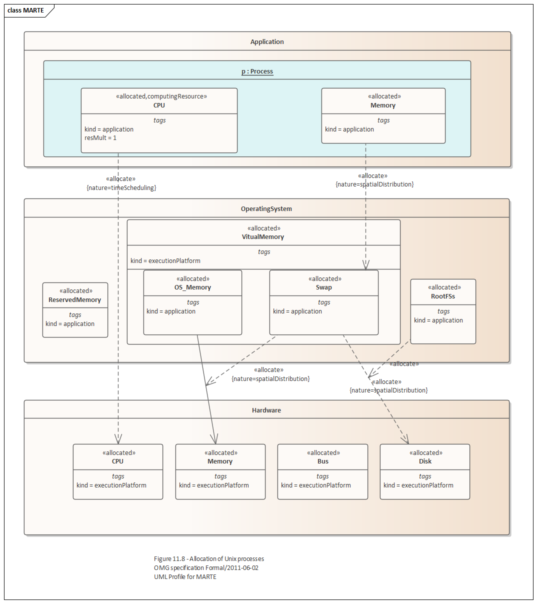

# <a href="https://sparxsystems.com/enterprise_architect_user_guide/15.1/model_domains/marte.html" target="_blank">Modeling and Analysis of Real Time Embedded Systems (MARTE)</a> Моделирование и анализ встроенных систем реального времени (MARTE)

The OMG Modeling for Real Time Embedded Systems (MARTE) UML profile adds capabilities to UML for model driven development of real time and embedded systems (RTESs) including their software and hardware aspects.

Профиль UML OMG Modeling for Real Time Embedded Systems (MARTE) добавляет возможности UML для управляемой моделями разработки систем реального времени и встроенных систем (RTES), включая их программные и аппаратные аспекты.

RTESs are mainly  used in critical domains where high system dependability is required and expected. The behavior of RTESs is driven by their environment and is used in critical domains where unsafe conditions, posing threat to human life or environment, can be caused by failures of the RTES being tested.

RTES в основном используются в критических областях, где требуется и ожидается высокая надежность системы. Поведение RTES определяется окружающей средой и используется в критических областях, где небезопасные условия, представляющие угрозу для жизни человека или окружающей среды, могут быть вызваны отказами тестируемого RTES.

These systems typically work in environments with large numbers of interacting components.

Эти системы обычно работают в средах с большим количеством взаимодействующих компонентов.

Enterprise Architect 15.0 delivers support for the OMG's MARTE profile. It:

* Provides a foundation for transformation from UML models into a variety of analysis models
* Addresses the modeling of real-time and embedded systems (RTES) software or hardware and their shared relationships and the annotation of application models for analysis of system properties
* Provides qualitative and quantitative modeling constructs for the  development of RTESs and both high and low-level modeling constructs; for example, specification purposes and implementation purposes respectively
* Allows choice of styles that best suit the modeler's present needs, and does not enforce methodologies for modeling RTESs
* Is amenable to adoption by modelers as it does not require expertise or a steep learning curve in model analysis techniques or their inner workings
* Supports current mainstream real-time technologies, design paradigms, and model analysis techniques

The MARTE profile is available in the Unified and Ultimate editions of Enterprise Architect.

Enterprise Architect 15.0 обеспечивает поддержку профиля OMG MARTE. Это:

* Обеспечивает основу для преобразования моделей UML в различные модели анализа.
* Адресовано моделирование программного или аппаратного обеспечения в реальном времени и встроенных систем (RTES) и их общих взаимосвязей, а также аннотации моделей приложений для анализа свойств системы.
* Предоставляет качественные и количественные конструкции моделирования для разработки RTES, а также конструкции моделирования высокого и низкого уровня; например, цели спецификации и цели реализации соответственно
* Позволяет выбирать стили, которые наилучшим образом соответствуют текущим потребностям моделировщика, и не требует применения методологий для моделирования RTES.
* Поддается внедрению разработчиками моделей, поскольку не требует опыта или крутого обучения методам анализа моделей или их внутренней работе.
* Поддерживает текущие основные технологии реального времени, парадигмы проектирования и методы анализа моделей

Профиль MARTE доступен в редакциях Unified и Ultimate Enterprise Architect.