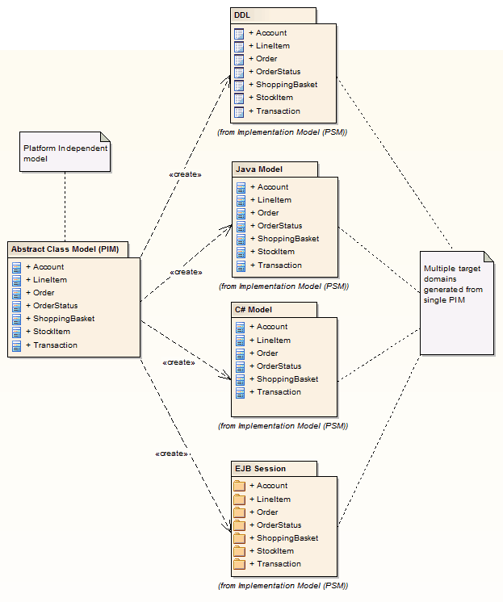

# <a href="https://sparxsystems.com/enterprise_architect_user_guide/15.1/model_domains/mdastyletransforms.html" target="_blank">Model Transformation</a>  Преобразование модели

One of the great advantages of creating models is the ability to manipulate them to produce outputs, thus saving time and reducing the possibility of errors. Enterprise Architect implements Model Driven Architecture (MDA) transformations using a flexible and fully configurable template system. The templates act as instructions to a machine that takes a model as input and transforms it to a more resolved model as output. The input could be a large and complex model or a single element and one input model could be transformed to a variety of output models.

Одним из больших преимуществ создания моделей является возможность манипулировать ими для получения выходных данных, что экономит время и снижает вероятность ошибок. Enterprise Architect реализует преобразования архитектуры на основе моделей (MDA), используя гибкую и полностью настраиваемую систему шаблонов. Шаблоны действуют как инструкции для машины, которая принимает модель на входе и преобразует ее в более детализированную модель на выходе. Входными данными может быть большая и сложная модель или отдельный элемент, и одна входная модель может быть преобразована в множество выходных моделей.

The transformations are commonly unidirectional and take a Platform Independent Model (PIM) and transform it to one or more Platform Specific Models (PSM). A good example of where this is useful is where a system must be implemented in a number of different relational database systems. A single platform independent conceptual model (the PIM) could be transformed to a number of platform specific models, say Oracle, MySQL and SQLite. As a further productivity boost, once the output models are produced they can also be converted to programming code, database definition language or schemas. Enterprise Architect automatically creates traceability that can be used to visualize how elements in the input model have been transformed to elements in the output model.

Преобразования обычно являются однонаправленными и принимают платформо-независимую модель (PIM) и преобразуют ее в одну или несколько платформенно-зависимых моделей (PSM). Хорошим примером того, где это полезно, является ситуация, когда система должна быть реализована в нескольких различных системах реляционных баз данных. Единая платформо-независимая концептуальная модель (PIM) может быть преобразована в несколько моделей для конкретных платформ, например Oracle, MySQL и SQLite. В качестве дополнительного повышения производительности после создания выходных моделей их также можно преобразовать в программный код, язык определения базы данных или схемы. Enterprise Architect автоматически создает отслеживаемость, которую можно использовать для визуализации того, как элементы входной модели были преобразованы в элементы выходной модели.

Facilities оборудование

| объект                                   | Описание                                 |
|------------------------------------------|------------------------------------------|
| 
Преобразовать элементы
 | 
Узнайте, как преобразовывать элементы на диаграмме или из пакета окна браузера .
 |
| 
Встроенные преобразования
 | 
Enterprise Architect предоставляет ряд встроенных преобразований, которые поддерживают широкий спектр целевых языков. Каждый полностью настраивается под ваши нужды.
 |
| 
Редактировать шаблоны трансформации
 | 
Узнайте, как настроить шаблоны преобразований для создания преобразований, специфичных для вашей системы.
 |
| 
Написать преобразования
 | 
Вся информация, которая понадобится вам для создания собственных преобразований.
 |

| объект                                   | Описание                                 |
|------------------------------------------|------------------------------------------|
| 
Преобразовать элементы
 | 
Узнайте, как преобразовывать элементы на диаграмме или из пакета окна браузера .
 |
| 
Встроенные преобразования
 | 
Enterprise Architect предоставляет ряд встроенных преобразований, которые поддерживают широкий спектр целевых языков. Каждый полностью настраивается под ваши нужды.
 |
| 
Редактировать шаблоны трансформации
 | 
Узнайте, как настроить шаблоны преобразований для создания преобразований, специфичных для вашей системы.
 |
| 
Написать преобразования
 | 
Вся информация, которая понадобится вам для создания собственных преобразований.
 |

Ready-built Transformations

The Enterprise Architect installer includes a number of basic built-in transformations, including:

* PIM to:
     -  C#
     -  C++
     -  DDL table elements
     -  EJB Entity Bean
     -  EJB Session Bean
     -  Java
     -  PHP
     -  VB.Net
     -  XSD
* Data Model to Entity Relationship diagram (ERD)
* Entity Relationship diagram (ERD) to Data Model
* Sequence diagram to Communication diagram
* Communication diagram to Sequence diagram
* Java model to JUnit test model
* .NET model to NUnit test model
* WSDL interface model to WSDL

Further transformations will become available over time, either built in or as downloadable modules from the Sparx Systems website.

Готовые трансформации
Программа установки Enterprise Architect включает ряд основных встроенных преобразований, в том числе:

* PIM для:
     - C #
     - C ++
     - элементов таблицы DDL
     - EJB Entity Bean
     - EJB Session Bean
     - Java
     - PHP
     - VB.Net
     -  XSD
* Схема отношений между моделью данных и сущностью (ERD)
* Диаграмма связи сущностей (ERD) с моделью данных
* От диаграммы последовательности к диаграмме связи
* Схема связи с диаграммой последовательности
* Модель Java для тестовой модели JUnit
* Модель .NET в тестовую модель NUnit
* Модель интерфейса WSDL к WSDL

Дальнейшие преобразования станут доступны со временем в виде встроенных или загружаемых модулей с веб-сайта Sparx Systems.

Customized Transformations

You can modify the built-in transformations or define your own, using Enterprise Architect's simple code generation template language. This involves little more than writing templates to create a simple intermediary source file; the system reads the source file and binds that to the new PSM.

Зависимости трансформации

Когда вы выполняете преобразование, система создает внутренние привязки (зависимости преобразования) между каждым созданным PSM и исходным PIM. Это важно, поскольку дает возможность многократно пересылать синхронизацию из PIM в PSM, добавляя или удаляя функции по мере продвижения; например, добавление нового атрибута в класс PIM может быть синхронизировано с новым столбцом в модели данных.

Transformation Dependencies

When you execute a transformation, the system creates internal bindings (Transformation Dependencies) between each PSM created and the original PIM. This is essential, providing the ability to forward synchronize from the PIM to the PSM many times, adding or deleting features as you go; for example, adding a new attribute to a PIM Class can be forward synchronized to a new column in the Data Model.

Зависимости трансформации

Когда вы выполняете преобразование, система создает внутренние привязки (зависимости преобразования) между каждым созданным PSM и исходным PIM. Это важно, поскольку дает возможность многократно пересылать синхронизацию из PIM в PSM, добавляя или удаляя функции по мере продвижения; например, добавление нового атрибута в класс PIM может быть синхронизировано с новым столбцом в модели данных.

You can observe the Transformation Dependencies for a Package using the Traceability window, to check the impact of changes to a PIM element on the corresponding elements in each generated PSM, or to verify where a change required in a PSM should be initiated in the PIM (and also to reflect back in other PSMs). The Transformation Dependencies are a valuable tool in managing the traceability of your models.

Вы можете наблюдать за зависимостями преобразования для пакета с помощью окна Traceability , чтобы проверить влияние изменений элемента PIM на соответствующие элементы в каждом сгенерированном PSM или проверить, где изменение, необходимое в PSM, должно быть инициировано в PIM ( а также для отражения в других PSM). Зависимости преобразования - ценный инструмент в управлении отслеживаемостью ваших моделей.

Enterprise Architect does not delete or overwrite any element features that were not originally generated by the transform; therefore, you can add new methods to your elements, and Enterprise Architect does not act on them during the forward generation process.

Enterprise Architect не удаляет и не перезаписывает какие-либо функции элементов, которые изначально не были созданы преобразованием; следовательно, вы можете добавлять новые методы к своим элементам, и Enterprise Architect не воздействует на них в процессе прямой генерации

Example of a Transformation

This diagram highlights how transformations work and how they can significantly boost your productivity.

Пример трансформации

На этой диаграмме показано, как работают преобразования и как они могут значительно повысить вашу производительность.

Notes

* If you are using the Corporate, Unified or Ultimate edition, if security is enabled you must have 'Transform Package' access permission to perform an MDA Transformation on the elements of a Package

Ноты

* Если вы используете корпоративную, унифицированную или максимальную редакцию, если включена безопасность, у вас должно быть разрешение на доступ к пакету преобразования для выполнения преобразования MDA в элементах пакета.

Learn more

<ul><li><a href="../model_navigation/traceability.html">Traceability</a> </li><li><a href="../model_domains/importingtransforms.html">Import Code Generation and Transformation Templates</a> </li><li><a href="../model_domains/export_templates.html">Export Code Generation and Transformation Templates</a> </li><li><a href="../team_support/permissionlist.html">Permission List</a> </li></ul>

Выучить больше

* прослеживаемость
* Импорт шаблонов создания и преобразования кода
* Экспорт шаблонов создания и преобразования кода
* Список разрешений

