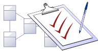
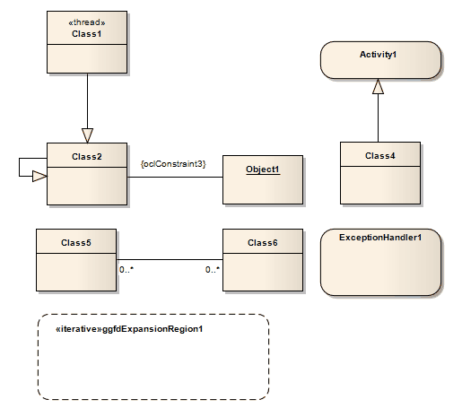

# <a href="https://sparxsystems.com/enterprise_architect_user_guide/15.1/model_domains/model_validation.html" target="_blank">Model Validation</a> Проверка модели

You use Model Validation to check UML models against known UML rules (which you identify when configuring validation) as well as any constraints defined within the model using the Object Constraint Language (OCL). You can run Model Validation against a single UML element, a diagram or an entire Package.

Проверка модели используется для проверки моделей UML на соответствие известным правилам UML (которые вы указываете при настройке проверки), а также любым ограничениям, определенным в модели с использованием языка объектных ограничений (OCL). Вы можете запустить проверку модели для одного элемента UML, диаграммы или всего пакета.

You can add to the system-provided validation rules by using an Add-In or an MDG Technology (such as BPMN) that contains its own rules.

Вы можете добавить к системным правилам проверки, используя надстройку или технологию MDG (например, BPMN), которая содержит свои собственные правила.

Access

| лента | Дизайн&gt; Модель&gt; Управление&gt; Проверить&gt; Проверить текущий пакет |
|-------|------------------------------------------|

Validation Concepts

| Concept                                  | Detail                                   | See also |
|------------------------------------------|------------------------------------------|----------|
|  			
 				Validating Objects 			
 		 |  			
Validating a UML: 
 <ul><li>Element validates the element and its children, its features (attributes and operations) and its relationships (connectors) </li><li>Diagram validates the diagram itself (for correctness) as well as any elements and connectors within the diagram </li><li>Package validates the Package and all sub-Packages, elements, connectors and diagrams within it </li></ul> 		 |  		   |
|  			
 				Example - Model Violation 			
 		 |  			
This UML diagram contains several basic violations of the UML rules: 
 			

 			
 
 			

 			
If you run Model Validation on this diagram, these violations are identified in the System Output window: 
 <ul> 	<li>A UML ExpansionRegion (ExpansionRegion1) is missing its child input ExpansionNode</li> 	<li>An invalid self-generalization exists on Class2 (UML elements cannot be self-generalized)</li> 	<li>An OCL violation exists for the anonymous Association (between Class2 and Object1)</li> 	<li>A UML ExceptionHandler (ExceptionHandler1) is missing its child input ObjectNode</li> </ul> 		 |  		   |

Концепции валидации

| концепция                                | подробность                              | Смотрите также |
|------------------------------------------|------------------------------------------|----------------|
|  			
 				Проверка объектов 			
 		 |  			
Проверка UML: 
 <ul><li>Элемент проверяет элемент и его дочерние элементы, его функции (атрибуты и операции) и его отношения (соединители) </li><li>Диаграмма проверяет саму диаграмму (на правильность), а также любые элементы и соединители внутри диаграммы. </li><li>Пакет проверяет пакет и все вложенные пакеты, элементы, соединители и схемы в нем. </li></ul> 		 |  		         |
|  			
 				Пример - нарушение модели 			
 		 |  			
Эта диаграмма UML содержит несколько основных нарушений правил UML: 
 			

 			
 
 			

 			
Если вы запустите проверку модели на этой диаграмме, эти нарушения будут идентифицированы в окне вывода системы :
 <ul> 	<li>UML ExpansionRegion (ExpansionRegion1) отсутствует его дочерний вход ExpansionNode</li> 	<li>На Class2 существует недопустимое самообобщение (элементы UML не могут быть самообобщены)</li> 	<li>Нарушение OCL существует для анонимной ассоциации (между Class2 и Object1)</li> 	<li>UML ExceptionHandler (ExceptionHandler1) отсутствует его дочерний вход ObjectNode</li> </ul> 		 |  		         |

Learn more

<ul>
	<li><a href="../model_domains/run_validation.html">Run Validation</a></li>
	<li><a href="../model_domains/configuring_model_validation.html">Configure Model Validation</a></li>
	<li><a href="../model_domains/rules_reference.html">Rules Reference</a></li>
	<li><a href="../automation/model_validation_broadcasts.html">Model Validation Events</a> (Add-Ins)</li>
	<li><a href="../modeling/model_validation_2.html">Define Validation Configuration</a> (MDG Technologies)</li>
</ul>

Выучить больше
* Выполнить проверку
* Настроить проверку модели
* Справочник правил
* События проверки модели (надстройки)
* Определить конфигурацию проверки (технологии ЦРТ)

