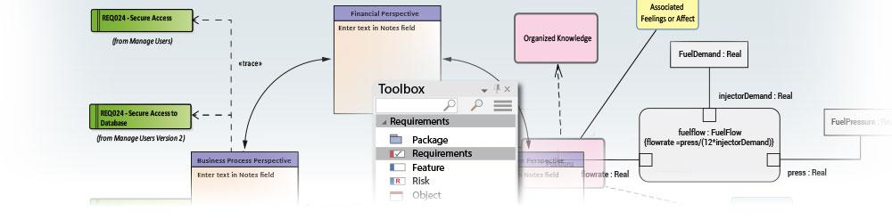

# [Model Domains](https://sparxsystems.com/enterprise_architect_user_guide/15.1/model_domains/modeling_with_uml.html)

## File Catalog

<ul>
					<li class="plus"><a href='https://sparxsystems.com/enterprise_architect_user_guide/15.1/model_domains/whatisuml.html'>UML Models</a></li>
					<li class="plus"><a href='https://sparxsystems.com/enterprise_architect_user_guide/15.1/model_domains/requirements_engineering.html'>Requirement Models</a></li>
					<li class="noplus"><a href='https://sparxsystems.com/enterprise_architect_user_guide/15.1/model_domains/tracking_changes.html'>Tracking Changes</a></li>
					<li class="plus"><a href='https://sparxsystems.com/enterprise_architect_user_guide/15.1/model_domains/business_analysis_topics.html'>Business Models</a></li>
					<li class="plus"><a href='https://sparxsystems.com/enterprise_architect_user_guide/15.1/model_domains/bpmn_1_4.html'>BPMN Models</a></li>
					<li class="plus"><a href='https://sparxsystems.com/enterprise_architect_user_guide/15.1/model_domains/dmn_modeling_and_simulation.html'>DMN Modeling and Simulation</a></li>
					<li class="plus"><a href='https://sparxsystems.com/enterprise_architect_user_guide/15.1/model_domains/database_engineering.html'>Database Models</a></li>
					<li class="plus"><a href='https://sparxsystems.com/enterprise_architect_user_guide/15.1/model_domains/codeengineering.html'>Software Models</a></li>
					<li class="noplus"><a href='https://sparxsystems.com/enterprise_architect_user_guide/15.1/model_domains/systems_engineering_modeling.html'>Model Based Systems Engineering</a></li>
					<li class="plus"><a href='https://sparxsystems.com/enterprise_architect_user_guide/15.1/model_domains/sysml.html'>Systems Modeling Language (SysML)</a></li>
					<li class="noplus"><a href='https://sparxsystems.com/enterprise_architect_user_guide/15.1/model_domains/marte.html'>Modeling and Analysis of Real Time Embedded Systems (MARTE)</a></li>
					<li class="plus"><a href='https://sparxsystems.com/enterprise_architect_user_guide/15.1/model_domains/schema_engineering.html'>Schema Models</a></li>
					<li class="plus"><a href='https://sparxsystems.com/enterprise_architect_user_guide/15.1/model_domains/time_aware_models.html'>Time Aware Models</a></li>
					<li class="plus"><a href='https://sparxsystems.com/enterprise_architect_user_guide/15.1/model_domains/geospatial_modeling.html'>Geospatial Models</a></li>
					<li class="plus"><a href='https://sparxsystems.com/enterprise_architect_user_guide/15.1/model_domains/wireframe_for_website_modeling.html'>Wireframe Models</a></li>
					<li class="plus"><a href='https://sparxsystems.com/enterprise_architect_user_guide/15.1/model_domains/roadmap_diagram.html'>Roadmap Diagrams</a></li>
					<li class="noplus"><a href='https://sparxsystems.com/enterprise_architect_user_guide/15.1/model_domains/aws_arch_icons.html'>AWS Architecture Icons</a></li>
					<li class="noplus"><a href='https://sparxsystems.com/enterprise_architect_user_guide/15.1/model_domains/googlecloudplatform_icons.html'>Google Cloud Platform (GCP) Icons</a></li>
					<li class="plus"><a href='https://sparxsystems.com/enterprise_architect_user_guide/15.1/model_domains/enterprise_architecture.html'>Architecture Frameworks</a></li>
					<li class="plus"><a href='https://sparxsystems.com/enterprise_architect_user_guide/15.1/model_domains/specialized_models.html'>Domain Models</a></li>
					<li class="plus"><a href='https://sparxsystems.com/enterprise_architect_user_guide/15.1/model_domains/model_validation.html'>Model Validation</a></li>
					<li class="plus"><a href='https://sparxsystems.com/enterprise_architect_user_guide/15.1/model_domains/mdastyletransforms.html'>Model Transformation</a></li></ul>
					
Enterprise Architect is a powerful and comprehensive analysis and design, execution and testing tool that helps you to create models of enterprise, business, engineering, real-time and software systems. Its feature set is so rich that no matter what you want to do there is almost always a tool feature that will help you achieve the task. Enterprise Architect supports a wide range of frameworks, modeling languages and technology platforms and languages. Every discipline will benefit from using the tool, and when an entire team is using the tool the models created by each group can be seamlessly integrated into a whole that will bring great clarity and efficiency to the project or program of work and substantially reduce the risk of failure.

Enterprise Architect - это мощный и всесторонний инструмент для анализа и проектирования, выполнения и тестирования, который помогает создавать модели предприятий, бизнеса, инженерных систем, систем реального времени и программных систем. Его набор функций настолько богат, что независимо от того, что вы хотите сделать, почти всегда есть инструмент, который поможет вам в достижении этой задачи. Enterprise Architect поддерживает широкий спектр фреймворков, языков моделирования, технологических платформ и языков. Каждая дисциплина выиграет от использования инструмента, и когда вся команда использует инструмент, модели, созданные каждой группой, могут быть легко интегрированы в единое целое, что внесет большую ясность и эффективность в проект или программу работы и существенно снизит риск неудачи.

High level managers can create Mind Maps, and strategic thinkers can create stakeholder profiles and define business goals and drivers; Enterprise Architects can create road maps and application inventories, Analysts can describe current and future process models, and Requirements Analysts can create requirement models. On the solution side of the model, a Solutions Architect can detail the interfaces between applications, developers can create code stubs, and Testers can define test cases, just to detail a few possibilities.

Менеджеры высокого уровня могут создавать интеллектуальные карты, а стратеги могут создавать профили заинтересованных сторон и определять бизнес-цели и движущие факторы; Корпоративные архитекторы могут создавать дорожные карты и инвентаризацию приложений, аналитики могут описывать текущие и будущие модели процессов, а аналитики требований могут создавать модели требований. На стороне решения модели архитектор решений может детализировать интерфейсы между приложениями, разработчики могут создавать заглушки кода, а тестировщики могут определять контрольные примеры, просто чтобы детализировать несколько возможностей.

Enterprise Architect allows you to follow any project methodology, whether it is an Agile process or a formal military process or one of the standard frameworks such as TOGAF or Zachman. You are also free to set up your own modeling process, and Enterprise Architect has built in features for defining software development processes. Modeling can start at any point and in real projects it typically doesn’t follow the sequences described in text books; Enterprise Architect allows you to work in a flexible way but supports you with a versatile set of tools.

Enterprise Architect позволяет вам следовать любой методологии проекта, будь то Agile-процесс, формальный военный процесс или одна из стандартных структур, таких как TOGAF или Zachman. Вы также можете настроить свой собственный процесс моделирования, а Enterprise Architect имеет встроенные функции для определения процессов разработки программного обеспечения. Моделирование может начаться в любой момент, и в реальных проектах оно обычно не следует последовательностям, описанным в учебниках; Enterprise Architect позволяет гибко работать, но поддерживает универсальный набор инструментов.

Enterprise Architect has a flexible feature that helps you to create Profiles of the UML so even if you cannot find a suitable modeling solution built into the core product, you can extend the tool by creating your own profile.

Enterprise Architect имеет гибкую функцию, которая помогает вам создавать профили UML, поэтому, даже если вы не можете найти подходящее решение для моделирования, встроенное в основной продукт, вы можете расширить инструмент, создав свой собственный профиль.

Learn more

<ul>
	<li><a href="https://sparxsystems.com/enterprise_architect_user_guide/15.1/user_interface/thestartpage.html">The Start Page</a></li>
	<li><a href="https://sparxsystems.com/enterprise_architect_user_guide/15.1/modeling/model_wizard.html">Model Wizard</a></li>
	<li><a href="https://sparxsystems.com/enterprise_architect_user_guide/15.1/user_interface/workspacetoolbars.html">Toolbars</a></li>
	<li><a href="https://sparxsystems.com/enterprise_architect_user_guide/15.1/modeling/objecttoolbar.html">Diagram Toolbox</a></li>
	<li><a href="https://sparxsystems.com/enterprise_architect_user_guide/15.1/model_navigation/projectexplorer.html">Browser Window</a></li>
	<li><a href="https://sparxsystems.com/enterprise_architect_user_guide/15.1/user_interface/model_views.html">Model Views</a></li>
	<li><a href="https://sparxsystems.com/enterprise_architect_user_guide/15.1/model_navigation/reportview.html">Package Browser</a></li>
	<li><a href="https://sparxsystems.com/enterprise_architect_user_guide/15.1/model_navigation/search_view.html">Model Search</a></li>
	<li><a href="https://sparxsystems.com/enterprise_architect_user_guide/15.1/model_navigation/elementrelationshipmatrix.html">Relationship Matrix</a></li>
	<li><a href="https://sparxsystems.com/enterprise_architect_user_guide/15.1/modeling/extending_uml.html">Defining a Modeling Language</a></li>
	<li><a href="https://sparxsystems.com/enterprise_architect_user_guide/15.1/model_domains/requirementsmanagement.html">Requirements</a></li>
	<li><a href="https://sparxsystems.com/enterprise_architect_user_guide/15.1/model_domains/whatisuml.html">UML Models</a></li>
	<li><a href="https://sparxsystems.com/enterprise_architect_user_guide/15.1/model_domains/extended_uml_models.html">Extending UML</a></li>
</ul>

Выучить больше

* Стартовая страница
* Мастер моделей
* Панели инструментов
* Панель инструментов диаграммы
* Окно браузера
* Виды модели
* Браузер пакетов
* Поиск модели
* Матрица отношений
* Определение языка моделирования
* Требования
* UML-модели
* Расширение UML
