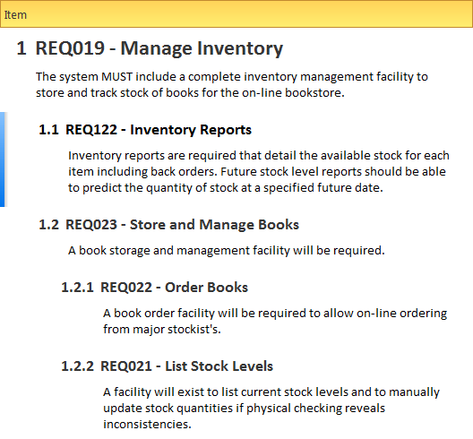
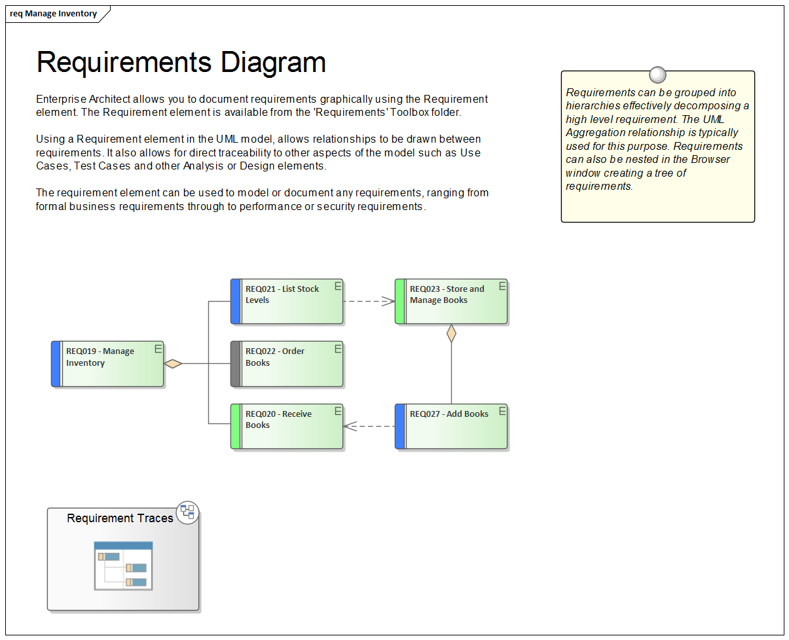
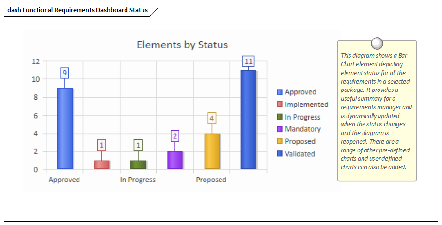
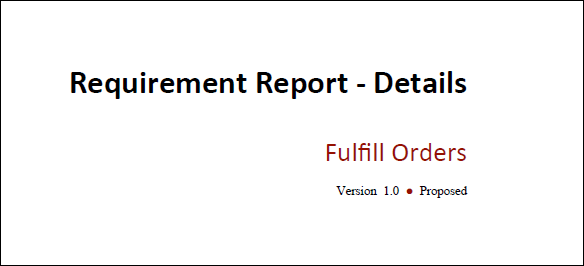
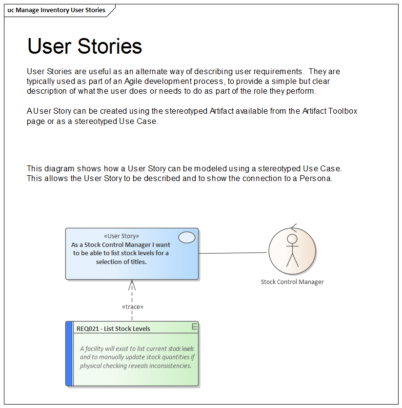

# <a href="https://sparxsystems.com/enterprise_architect_user_guide/15.1/model_domains/requirements_engineering.html" target="_blank">Requirement Models</a> Модели требований

The field of requirements engineering is one of the most critical disciplines in the solution development lifecycle and has a documented impact on the success of projects.

Область разработки требований - одна из наиболее важных дисциплин в жизненном цикле разработки решений, которая документально влияет на успех проектов.

Requirements Development

Requirements Development consists of all the activities and tasks associated with discovering, evaluating, recording, documenting and validating the requirements for a particular project. Requirements are discovered, analyzed, specified and verified. Enterprise Architect has a wide range of tools and features to assist the Analyst as they develop requirements. The center piece for requirements development is the Specification Manager, through which the requirements Analyst can enter, view and manage requirements in textual form as if in a spread sheet. Requirement properties such as Status, Priority and Author can be edited in-line, and filters can be applied to restrict the display to particular requirements.

Разработка требований

Разработка требований состоит из всех действий и задач, связанных с обнаружением, оценкой, записью, документированием и проверкой требований для конкретного проекта. Требования обнаруживаются, анализируются, уточняются и проверяются. Enterprise Architect имеет широкий спектр инструментов и функций, чтобы помочь аналитикам в разработке требований. Центральным элементом разработки требований является Менеджер спецификаций, с помощью которого аналитик требований может вводить, просматривать и управлять требованиями в текстовой форме, как в электронной таблице. Свойства требований, такие как Статус, Приоритет и Автор, можно редактировать в режиме реального времени, а фильтры можно применять, чтобы ограничить отображение определенными требованиями.

The Specification Manager can be used in conjunction with a platform of other tools such as diagrams, the Traceability window and the Element Discussions facility.

Диспетчер спецификаций может использоваться вместе с платформой других инструментов, таких как диаграммы, окно трассировки и средство обсуждения элементов .

Requirements Management

This comprises the activities to maintain a set of requirements that represent an accord or agreement between the project team and the customer. It also has a focus on ensuring that the requirements are acceptable to the design and development teams, and that they are sufficiently specific to be implemented into working business, software or hardware systems. Enterprise Architect is a sophisticated platform for managing requirements, and regardless of the domain, the size of the project or the method being followed it provides tools that make it straightforward to manage even large repositories of requirements in complex projects.

Управление требованиями

Сюда входят действия по поддержанию набора требований, которые представляют собой договоренность или соглашение между командой проекта и заказчиком. Он также направлен на обеспечение того, чтобы требования были приемлемы для групп проектирования и разработки, и чтобы они были достаточно конкретными, чтобы их можно было внедрить в действующие коммерческие, программные или аппаратные системы. Enterprise Architect - это сложная платформа для управления требованиями, и независимо от области, размера проекта или применяемого метода она предоставляет инструменты, которые упрощают управление даже большими репозиториями требований в сложных проектах.

Requirement Documentation

There are a number of documents that are commonly produced as part of the requirements engineering discipline such as the Software (System) Requirements Specification and Use Case Reports and these can be generated automatically from a requirements model using built-in templates. In addition a wide range of other documents can be produced using built-in or customized templates.

Документация по требованиям

Существует ряд документов, которые обычно создаются в рамках дисциплины инжиниринга требований, таких как Спецификация требований к программному обеспечению (системе) и отчеты о вариантах использования, и они могут быть автоматически созданы из модели требований с использованием встроенных шаблонов. Кроме того, можно создать широкий спектр других документов с использованием встроенных или настраиваемых шаблонов.

Requirement Processes and Standards

Enterprise Architect is an open platform that supports any requirements engineering process. The tool has a rich feature set and is highly configurable, and its flexible design means that whatever method is being used the modeler will find features to help. So whether the team is using Formal requirements, Use Cases, User Stories or Story-Boards in any combination, Enterprise Architect can be used to develop, manage and document the requirements. The implementation of the UML extension mechanisms means that any type of requirement can be created and managed using built-in types or by using stereotyped elements and Tagged Values.

Процессы требований и стандарты

Enterprise Architect - это открытая платформа, которая поддерживает любой процесс разработки требований. Этот инструмент имеет богатый набор функций и широкие возможности настройки, а его гибкий дизайн означает, что какой бы метод ни использовался, разработчик моделей найдет полезные функции. Таким образом, независимо от того, использует ли команда формальные требования, сценарии использования, пользовательские истории или раскадровки в любой комбинации, Enterprise Architect можно использовать для разработки, управления и документирования требований. Реализация механизмов расширения UML означает, что любой тип требований может создаваться и управляться с использованием встроенных типов или стереотипных элементов и значений с тегами.

