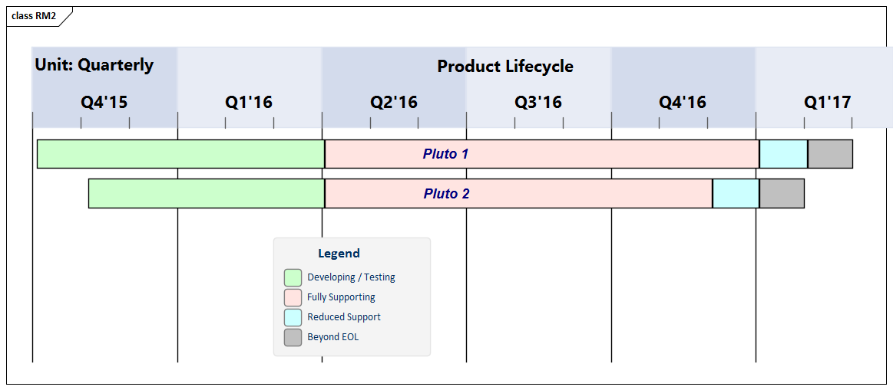
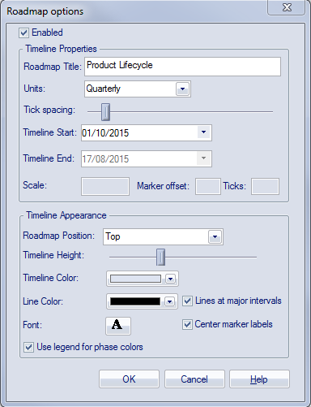
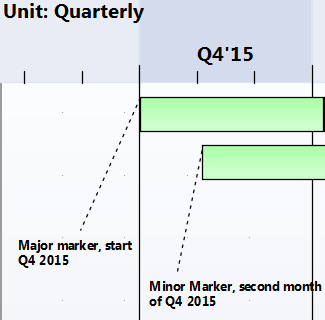
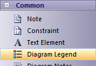
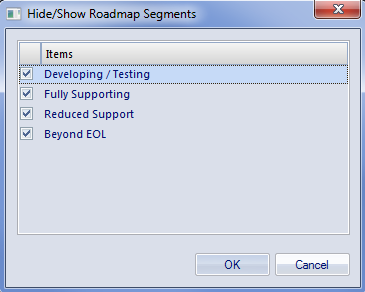

# <a href="https://sparxsystems.com/enterprise_architect_user_guide/15.1/model_domains/roadmap_diagram.html" target="_blank">Roadmap Diagrams</a>  Диаграммы дорожной карты

Roadmap diagrams help you to map existing elements against a Timeline. This is useful for visualizing how a system changes over time, planning a migration of responsibility between two teams, documenting the concurrent support for multiple platforms or representing just about any time based data. To ensure the modeler and viewer always have appropriate context, the Timeline is always displayed on screen, on any saved images and when printed.

Диаграммы дорожных карт помогают сопоставить существующие элементы с временной шкалой. Это полезно для визуализации того, как система изменяется с течением времени, планирования миграции ответственности между двумя командами, документирования одновременной поддержки нескольких платформ или представления данных практически в любое время. Чтобы разработчик моделей и наблюдатель всегда имели соответствующий контекст, шкала времени всегда отображается на экране, на любых сохраненных изображениях и при печати.

Changes of phase or state of each element can be represented in Roadmap diagrams using a dedicated notation of a bar divided into colored segments representing each state. The states available, the order they appear in and the colors used are controlled by a Diagram Legend. Each element displayed then shows the length of each segment (and hence duration of each state), and also provides the ability to hide individual segments on that element.

Изменения фазы или состояния каждого элемента могут быть представлены на схемах дорожной карты с использованием специального обозначения полосы, разделенной на цветные сегменты, представляющие каждое состояние. Доступные состояния, порядок их появления и используемые цвета контролируются условными обозначениями диаграммы. Каждый отображаемый элемент затем показывает длину каждого сегмента (и, следовательно, продолжительность каждого состояния), а также предоставляет возможность скрыть отдельные сегменты этого элемента.

Creating a Roadmap Diagram

This diagram shows an example Roadmap that documents the planned lifecycle for two products through development, release, support and retirement, by quarter over a period of one and a half years.

Создание диаграммы дорожной карты

На этой диаграмме показан пример дорожной карты, в которой задокументирован запланированный жизненный цикл двух продуктов, включая разработку, выпуск, поддержку и вывод из эксплуатации, по кварталам в течение полутора лет.

You can develop this diagram as the example for the guided procedure in the 'Setting up a Roadmap Diagram' table. To create the initial, basic diagram:

Вы можете разработать эту диаграмму в качестве примера для пошаговой процедуры в таблице «Настройка схемы дорожной карты». Чтобы создать исходную базовую схему:

1. Right-click on its parent Package and select the 'Add Diagram' option.
2. On the 'New Diagram' dialog, in the 'Diagram' field type in the diagram name, such as 'Example Roadmap'.
3. Click on the 'Select From' header and select the 'Construction > Project Roadmap' Perspective group, and then click on 'Project Management' in the panel beneath the header.
4. The 'Diagram Types' panel list two diagram types - Project Management and Roadmap. Click on the Roadmap diagram type.
5. Click on the OK button. The system opens the diagram in the central work area.

= 

1. Щелкните его родительский пакет правой кнопкой мыши и выберите параметр «Добавить диаграмму».
2. В диалоговом окне «Новая диаграмма» в поле «Диаграмма» введите имя диаграммы, например «Пример дорожной карты».
3. Щелкните заголовок «Выбрать из» и выберите группу перспектив «Строительство> Дорожная карта проекта», а затем щелкните «Управление проектом» на панели под заголовком.
4. На панели «Типы диаграмм» перечислены два типа диаграмм - «Управление проектом» и «Дорожная карта». Щелкните тип диаграммы Roadmap.
5. Щелкните по кнопке ОК . Система откроет диаграмму в центральной рабочей области.

You can also generate one of the pre-designed Roadmap diagrams from the Patterns provided by Enterprise Architect, to tailor the Roadmap for any of a range of areas of work. To access these Patterns, select the 'Design > Model > Add > Model Wizard' ribbon option, then select the 'Construction > Project Roadmap' Perspective. If necessary, expand the 'Roadmaps' group.

Вы также можете сгенерировать одну из предварительно разработанных диаграмм дорожной карты из шаблонов, предоставленных Enterprise Architect, чтобы адаптировать дорожную карту для любой из областей работы. Чтобы получить доступ к этим шаблонам, выберите параметр ленты «Дизайн> Модель> Добавить> Мастер моделей », затем выберите перспективу «Строительство> Дорожная карта проекта». При необходимости разверните группу «Дорожные карты».

Select the required Roadmap(s) and click on the Create Pattern(s) button. Each Roadmap is automatically created within its own Package.

Выберите необходимые дорожные карты и нажмите кнопку « Создать шаблон (ы)» . Каждая дорожная карта автоматически создается в собственном пакете.

Access

On an open diagram, display the 'Roadmap Options' dialog using one of the methods described here.

доступ

На открытой диаграмме отобразите диалоговое окно «Параметры дорожной карты» одним из описанных здесь методов.

| Ribbon                                   | Design &gt; Diagram &gt; Manage &gt; Roadmap |
|------------------------------------------|------------------------------------------|
| 
Context Menu
 | 
In a diagram, right-click on the background> Roadmap
 |

Setting up a Roadmap Diagram

Starting with the 'Roadmap options' dialog, follow these steps to set up the Roadmap diagram. The fields are described in greater detail in the Roadmap Diagram Options topic. This procedure includes using a Diagram Legend to automatically divide an element into phase segments in different colors. The steps lead you to create the diagram shown at the start of this topic.

Настройка схемы дорожной карты

Начиная с диалогового окна «Параметры дорожной карты», выполните следующие действия, чтобы настроить схему дорожной карты. Поля описаны более подробно в разделе « Параметры схемы дорожной карты» . Эта процедура включает использование легенды диаграммы для автоматического разделения элемента на фазовые сегменты разного цвета. Эти шаги приведут вас к созданию диаграммы, показанной в начале этого раздела.

| Step                                     | Action                                   | See also                                 |
|------------------------------------------|------------------------------------------|------------------------------------------|
|  			
 				1 			
 		 |  			
Select the 'Enabled' checkbox, to enable the timeline on the diagram.
 		 |  		                                   |
|  			
 				2 			
 		 |  			
In the 'Roadmap Title' field, type a title for the diagram such as 'Product Lifecycle'. (The title is optional, and you can leave the field blank if you prefer.)
 		 |  		                                   |
|  			
 				3 			
 		 |  			
In the 'Units' field, click on the drop-down arrow and select 'Quarterly'. The major sections are displayed in alternating light/dark shades to make it easy to distinguish between adjacent sections.
 			
The 'Units' field offers a wide range of pre-defined units for the scale of the Timeline, and you can define your own customized units. You can also change the section display color using the 'Timeline color' field in the 'Timeline Appearance' panel.
 		 |  			<a href="../model_domains/roadmapdiag_options.html">Roadmap Diagram Options</a> 		 |
|  			
 				4 			
 		 |  			
Click on the 'Tick Spacing' slider and drag it left or right to scale the timeline to a size that is appropriate for your diagram. 
 		 |  		                                   |
|  			
 				5 			
 		 |  			
In the 'Timeline Start' field, click on the drop-down arrow and click on the date on which the Roadmap Timeline is to start. (For the example, select October 1st 2016; the exact value doesn't matter, as long as it is within the quarter you want to start in.)
 			
The 'Timeline End' field is disabled for date unit scales (that is, years, quarterly, months and days).
 		 |  		                                   |
|  			
 				6 			
 		 |  			
Adjust the appearance settings:
 <ul> 	<li>In the 'Roadmap Position' field, select the 'Top' option to position the roadmap timeline headers at the top of the diagram</li> 	<li>Drag the 'Timeline Height' slider about half way across the bar</li> 	<li>In the 'Line Color' field click on the drop-down arrow and select a dark color such as charcoal</li> 	<li>Select the 'Lines at major intervals' checkbox</li> 	<li>Select the 'Use legend for phase colors' checkbox</li> </ul> 		 |  		                                   |
|  			
 				7 			
 		 |  			
Click on the OK button to save the settings and close the dialog.
 		 |  		                                   |
|  			
 				8 			
 		 |  			
From the Diagram Toolbox drag two Class elements onto the diagram. Give them the names 'Pluto 1' and 'Pluto 2'. 
 			
Move and resize 'Pluto 1' so that its left edge is on the Q4'15 major marker line (the start of October 2015), and its right edge is just under the second Q1'17 minor marker (the end of February 2017). 
 			
Move and resize 'Pluto 2' so that its left edge is under the first Q4'15 minor marker (November 2015) and its right edge is under the first Q1'17 minor marker (the end of January 2017).
 			

 		 |  		                                   |
|  			
 				9 			
 		 |  			
From the 'Common' page of the Diagram Toolbox, drag a 'Diagram Legend' icon onto the diagram. 
 			

 			
You will use this to add and format the phase segments on the two elements.
 			
Double-click on the Diagram Legend to display its 'Properties' dialog, and define how the Legend element itself will be displayed and how the phase segments will be applied. In the example, you will define these four phases:
 <ul> 	<li>Developing/Testing</li> 	<li>Fully Supporting</li> 	<li>Reduced Support</li> 	<li>Beyond EOL</li> </ul> 			
For each phase, type the name in the 'Value' field, select a display color in the 'Fill color' field and click on the Save button to save the phase definition.
 			
Select the 'Apply auto color' and 'Apply Fill' checkboxes, and then click on the OK button to save the settings and close the dialog.
 		 |  			<a href="../modeling/add_a_legend.html">Legend Key</a> 			<a href="../modeling/style_options.html">Legend Properties</a> 			<a href="../modeling/legends.html">Create Legends</a> 		 |
|  			
 				10 			
 		 |  			
You now have two elements on the Timeline, each with four colored segments of equal length that represent the product lifecycle phases as indicated in the Diagram Legend.
 			
To set the duration of each phase, click on the dividing line between two phases and drag it to the appropriate point relative to the scale on the Timeline.
 			
You have now created a Roadmap diagram resembling the example shown at the start of this topic.
 		 |  		                                   |

| шаг                                      | действие                                 | Смотрите также                           |
|------------------------------------------|------------------------------------------|------------------------------------------|
|  			
 				1 			
 		 |  			
Установите флажок «Включено», чтобы включить временную шкалу на диаграмме.
 		 |  		                                   |
|  			
 				2 			
 		 |  			
В поле «Заголовок дорожной карты» введите заголовок для диаграммы, например «Жизненный цикл продукта». (Заголовок не является обязательным, и вы можете оставить поле пустым, если хотите.)
 		 |  		                                   |
|  			
 				3 			
 		 |  			
В поле «Единицы» щелкните стрелку раскрывающегося списка и выберите «Ежеквартально». Основные разделы отображаются чередующимися светлыми / темными оттенками, чтобы было легче различать соседние разделы.
 			
Поле «Единицы» предлагает широкий спектр предопределенных единиц для масштаба временной шкалы, и вы можете определить свои собственные индивидуальные единицы. Вы также можете изменить цвет отображения раздела, используя поле «Цвет временной шкалы» на панели «Внешний вид временной шкалы».
 		 |  			<a href="../model_domains/roadmapdiag_options.html">Варианты схемы дорожной карты</a> 		 |
|  			
 				4 			
 		 |  			
Щелкните ползунок «Расстояние между отметками» и перетащите его влево или вправо, чтобы масштабировать шкалу времени до размера, подходящего для вашей диаграммы. 
 		 |  		                                   |
|  			
 				5 			
 		 |  			
В поле «Начало временной шкалы» щелкните стрелку раскрывающегося списка и выберите дату, когда должна начаться временная шкала дорожной карты. (Для примера выберите 1 октября 2016 г .; точное значение не имеет значения, если оно находится в пределах квартала, в котором вы хотите начать.)
 			
Поле «Конец шкалы времени» отключено для шкал единиц даты (то есть лет, кварталов, месяцев и дней).
 		 |  		                                   |
|  			
 				6 			
 		 |  			
Настройте параметры внешнего вида:
 <ul> 	<li>В поле «Положение дорожной карты» выберите параметр «Сверху», чтобы расположить заголовки временной шкалы дорожной карты в верхней части диаграммы.</li> 	<li>Перетащите ползунок «Высота временной шкалы» примерно наполовину поперек полосы.</li> 	<li>В поле "Цвет линии" щелкните стрелку раскрывающегося списка и выберите темный цвет, например уголь.</li> 	<li>Установите флажок "Строки через большие интервалы".</li> 	<li>Установите флажок "Использовать легенду для цветов фаз".</li> </ul> 		 |  		                                   |
|  			
 				7 			
 		 |  			
Нажмите кнопку ОК, чтобы сохранить настройки и закрыть диалоговое окно.
 		 |  		                                   |
|  			
 				8 			
 		 |  			
Из панели инструментов диаграммы перетащите два элемента класса на диаграмму. Дайте им имена «Плутон 1» и «Плутон 2».
 			
Переместите и измените размер Плутона 1 так, чтобы его левый край находился на линии основного маркера Q4'15 (начало октября 2015 г.), а его правый край находился чуть ниже второго второстепенного маркера Q1'17 (конец февраля 2017 г.). , 
 			
Переместите и измените размер «Плутона 2» так, чтобы его левый край находился под первым второстепенным маркером Q4'15 (ноябрь 2015 г.), а его правый край - под второстепенным маркером первого Q1'17 (конец января 2017 г.).
 			

 		 |  		                                   |
|  			
 				9 			
 		 |  			
На странице «Общие» панели инструментов диаграммы перетащите значок «Легенда диаграммы» на диаграмму.
 			

 			
Вы будете использовать это для добавления и форматирования фазовых сегментов на двух элементах.
 			
Дважды щелкните легенду диаграммы, чтобы отобразить ее диалоговое окно «Свойства», и определите, как будет отображаться сам элемент легенды и как будут применяться сегменты фазы. В этом примере вы определите эти четыре фазы:
 <ul> 	<li>Разработка / Тестирование</li> 	<li>Полностью поддерживающий</li> 	<li>Сниженная поддержка</li> 	<li>За пределами EOL</li> </ul> 			
Для каждой фазы введите имя в поле «Значение», выберите цвет отображения в поле «Цвет заливки» и нажмите кнопку « Сохранить», чтобы сохранить определение фазы.
 			
Установите флажки «Применить автоматический цвет» и «Применить заливку», а затем нажмите кнопку « ОК», чтобы сохранить настройки и закрыть диалоговое окно.
 		 |  			<a href="../modeling/add_a_legend.html">Ключ легенды</a> 			<a href="../modeling/style_options.html">Свойства легенды</a> 			<a href="../modeling/legends.html">Создавайте легенды</a> 		 |
|  			
 				10 			
 		 |  			
Теперь у вас есть два элемента на временной шкале, каждый с четырьмя цветными сегментами одинаковой длины, которые представляют фазы жизненного цикла продукта, как указано в легенде диаграммы.
 			
Чтобы установить продолжительность каждой фазы, щелкните разделительную линию между двумя фазами и перетащите ее в соответствующую точку относительно шкалы на временной шкале.
 			
Вы создали схему Roadmap, аналогичную примеру, приведенному в начале этого раздела.
 		 |  		                                   |

Hide and Show Segments

When you set up a Legend to apply segments to the elements on a Roadmap, every element on the Roadmap has all the defined segments. However, certain segments might not be relevant to particular elements, in which case you can hide those segments on those elements. Should a hidden segment be relevant to an element, you can show it.

Скрыть и показать сегменты

Когда вы настраиваете легенду для применения сегментов к элементам дорожной карты, каждый элемент дорожной карты имеет все определенные сегменты. Однако определенные сегменты могут не иметь отношения к определенным элементам, и в этом случае вы можете скрыть эти сегменты на этих элементах. Если скрытый сегмент имеет отношение к элементу, вы можете его показать.

A new element added to the diagram will show all the segments. However, if you add a new segment to an existing element, that segment is automatically hidden and - if it is to be displayed - should be set as described here.

Новый элемент, добавленный к диаграмме, покажет все сегменты. Однако, если вы добавляете новый сегмент к существующему элементу, этот сегмент автоматически скрывается и - если он должен отображаться - должен быть установлен, как описано здесь.

To hide or redisplay segments on an element:

To hide or redisplay segments on an element:

1. Right-click on the element and select the 'Hide/Show Roadmap Segments' option. The 'Hide/Show Roadmap Segments' dialog displays, listing the segments defined in the Legend. Each segment has a checkbox.

2. The Hide/Show Roadmap Segments dialog in Sparx Systems Enterprise Architect.
3. For each segment to show on the element, select the checkbox. For each segment to hide on the element, deselect the checkbox.
4. Click on the OK button. The selected segments on the element display on the diagram.

Чтобы скрыть или повторно отобразить сегменты элемента:

1. Щелкните элемент правой кнопкой мыши и выберите параметр «Скрыть / отобразить сегменты дорожной карты». Откроется диалоговое окно «Скрыть / отобразить сегменты дорожной карты» со списком сегментов, определенных в легенде. У каждого сегмента есть флажок.

2. Диалоговое окно «Скрыть / отобразить сегменты дорожной карты» в Sparx Systems Enterprise Architect.
3. Установите флажок для каждого сегмента, отображаемого в элементе. Снимите флажок для каждого сегмента, который необходимо скрыть на элементе.
4. Щелкните по кнопке ОК . Выбранные сегменты на элементе отображаются на диаграмме.

When a segment is hidden, the most directly-affected visible segment automatically occupies the space of the hidden segment. This is generally the segment immediately to the right (the chronologically later segment) except where the final segment in the element is hidden, when the segment to the left extends to fill the space. The overall length of the element does not change, and neither do the lengths of the remaining segments in the element; if they do need to be adjusted, drag the separator lines to the appropriate time line.

Когда сегмент скрыт, наиболее непосредственно затронутый видимый сегмент автоматически занимает пространство скрытого сегмента. Как правило, это сегмент, расположенный непосредственно справа (хронологически более поздний сегмент), за исключением тех случаев, когда последний сегмент в элементе скрыт, когда сегмент слева расширяется, чтобы заполнить пространство. Общая длина элемента не изменяется, как и длина остальных сегментов в элементе; если их нужно отрегулировать, перетащите разделительные линии на соответствующую временную шкалу.

When a hidden segment is made visible, it occupies the first time unit of the next segment in the chronological sequence (or, if it has been added to the end of the element, the final time unit of the previous segment). Again, the total length of the element is not affected, not are the lengths of the other segments in the element. You can make manual adjustments to set the length of the new segment and any other segments that need to be adjusted to accommodate it.

Когда скрытый сегмент становится видимым, он занимает первую единицу времени следующего сегмента в хронологической последовательности (или, если он был добавлен в конец элемента, последнюю единицу времени предыдущего сегмента). Опять же, общая длина элемента не изменяется, как и длины других сегментов элемента. Вы можете вручную отрегулировать длину нового сегмента и любых других сегментов, которые необходимо отрегулировать, чтобы приспособить его.

Notes

* The Timeline and the text displayed on it are always shown, as you scroll the diagram up or down
* You can apply further grouping or categorization of the elements on the Roadmap, by defining horizontal Swimlanes for the diagram

Ноты
* Временная шкала и отображаемый на ней текст всегда отображаются при прокрутке диаграммы вверх или вниз.
* Вы можете применить дальнейшую группировку или категоризацию элементов на дорожной карте, определив горизонтальные дорожки для диаграммы.

Learn more
<a href="https://sparxsystems.com/enterprise_architect_user_guide/15.1/model_domains/roadmapdiag_options.html" target="_blank">Roadmap Diagram Options</a>

Выучить больше
* Варианты схемы дорожной карты

