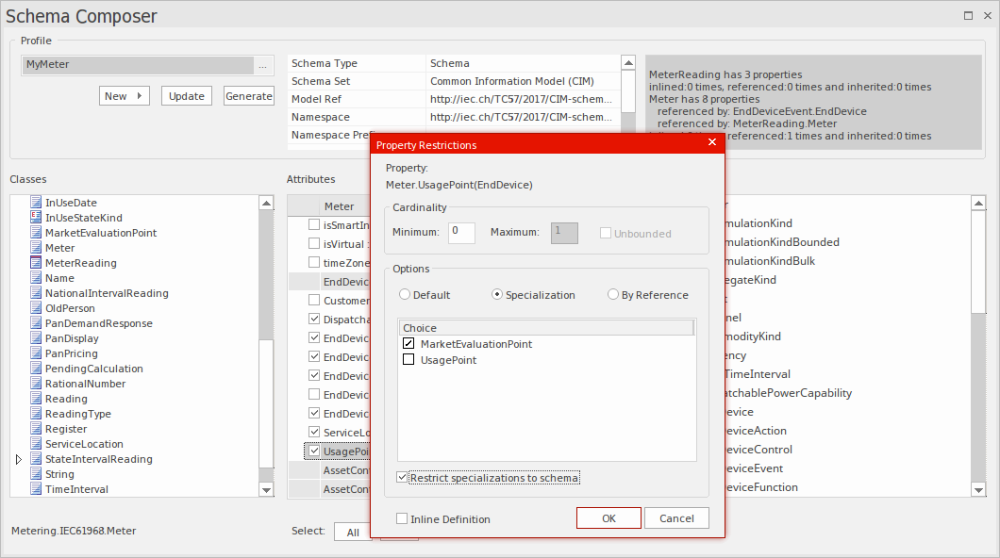

# <a href="https://sparxsystems.com/enterprise_architect_user_guide/15.1/model_domains/schema_engineering.html" target="_blank">Schema Models</a> Схемы модели

<ul>
					<li class="plus"><a href="schema_composer.html">The Schema Composer</a></li>
					<li class="plus"><a href="xml_schema_xsd.html">XSD Models</a></li>
					<li class="plus"><a href="xml_to_html_transformation.html">XSL Transforms</a></li>
					<li class="noplus"><a href="xml_validation.html">XML Validation</a></li>
					<li class="plus"><a href="xsd_engineering.html">Service Oriented Architecture</a></li>
					<li class="plus"><a href="mof.html">MOF</a></li>
					<li class="plus"><a href="mdg_technology_for_odm.html">ODM</a></li>
					<li class="noplus"><a href="niem.html">NIEM 2.1</a></li>
					<li class="plus"><a href="niem_four.html">NIEM 4.0</a></li>
					<li class="noplus"><a href="importniemxsd.html">Import NIEM XML Schema</a></li></ul>
					

Structural models in Enterprise Architect, especially Class models, are frequently used to define the meta-model of some domain of interest. For example a meta-model can be defined using a Class model to rigidly define the objects, data, relationships and types that make up the domain of Geospatial information. Likewise, models can be (and are) built to describe domains such as Water Management, Health, Retail, Insurance, Car Registration, Entertainment and many more.

Структурные модели в Enterprise Architect, особенно модели классов, часто используются для определения метамодели некоторой интересующей области. Например, метамодель может быть определена с использованием модели класса, чтобы жестко определить объекты, данные, отношения и типы, которые составляют область геопространственной информации. Точно так же модели могут быть (и строятся) для описания таких областей, как управление водными ресурсами, здравоохранение, розничная торговля, страхование, регистрация автомобилей, развлечения и многие другие.

These models are extremely valuable and frequently represent a significant investment in time and money by either commercial or standards based organizations. An important part of realizing the benefit of these models, in particular where information must be exchanged between multiple parties, is in the definition of schema (often XSD based) that codify how a message should be formed to be conformant to the underlying meta-model. Traditionally, such message schema are written by hand, based on the meta-model. This is generally a laborious and error prone exercise.

Эти модели чрезвычайно ценны и часто требуют значительных затрат времени и денег со стороны коммерческих или основанных на стандартах организаций. Важная часть реализации преимуществ этих моделей, в частности, когда информация должна обмениваться между несколькими сторонами, заключается в определении схемы (часто на основе XSD ), которая кодифицирует, как сообщение должно быть сформировано, чтобы соответствовать базовой метамодели. , Традиционно такие схемы сообщений пишутся вручную на основе метамодели. Как правило, это трудоемкое и подверженное ошибкам упражнение.

Enterprise Architect has a long history of being associated with the development of both commercial and standards based meta-models, and there are many examples of models defined in Enterprise Architect model files that are used to specify the exact construction of an information domain of interest.

Enterprise Architect имеет долгую историю участия в разработке как коммерческих, так и основанных на стандартах метамоделей, и существует множество примеров моделей, определенных в файлах модели Enterprise Architect, которые используются для определения точного построения интересующей информационной области.

The Schema Composer in Enterprise Architect has been built to take maximum advantage of models stored in an Enterprise Architect model file or repository (or Cloud based server) by streamlining the conversion of model information into schemas that comply with the naming standards and format of a variety of popular industry meta-models. This approach drastically reduces the time taken to form a valid schema and eliminates human error in transcribing model information into schema text.

Schema Composer в Enterprise Architect был создан для максимального использования преимуществ моделей, хранящихся в файле модели Enterprise Architect или репозитории (или на облачном сервере), путем упрощения преобразования информации о модели в схемы, которые соответствуют стандартам именования и формату множества популярных отраслевых метамоделей. Такой подход значительно сокращает время, необходимое для формирования действительной схемы, и исключает человеческую ошибку при преобразовании информации модели в текст схемы.

The current version of the Schema Composer supports XSD generation for a number of technologies, and in addition supports the customization of output by integrating tightly with both the Automation Interface and the Add-In framework. In this manner it is possible to use one of the schema generators supplied 'As-Is' or to write a custom generator using JavaScript, or to go further and fully customize the process by writing a suitable Add-In in a language of choice.

Текущая версия Schema Composer поддерживает создание XSD для ряда технологий и, кроме того, поддерживает настройку вывода за счет тесной интеграции как с интерфейсом автоматизации, так и с платформой надстроек. Таким образом, можно использовать один из генераторов схемы, поставляемых «как есть», или написать собственный генератор с использованием JavaScript, или пойти дальше и полностью настроить процесс, написав подходящую надстройку на любом языке по выбору.

In addition to the new Schema Composer, Enterprise Architect also supports the modeling of XSD and WSDL definitions using UML Profiles that support explicit modeling of the relevant types. This is sometimes necessary when building a complex XSD or WSDL from scratch and needing to have a fully worked out visual model of the final schema. Note that as Enterprise Architect also supports the import of XSD documents, it is possible to produce a schema using the Schema Composer, and then for documentation and visualization purposes (or even for further customization), import that schema back into either the current or a different model.

Помимо нового Schema Composer, Enterprise Architect также поддерживает моделирование определений XSD и WSDL с использованием профилей UML, которые поддерживают явное моделирование соответствующих типов. Иногда это необходимо при создании сложного XSD или WSDL с нуля и необходимости иметь полностью проработанную визуальную модель окончательной схемы. Обратите внимание, что поскольку Enterprise Architect также поддерживает импорт документов XSD, можно создать схему с помощью Schema Composer, а затем для целей документации и визуализации (или даже для дальнейшей настройки) импортировать эту схему обратно в текущую или другая модель.

Additional topics included in the Schema Engineering section are devoted to MOF (the Meta Object Facility), ODM and NIEM. The section on NIEM is quite extensive as Enterprise Architect includes many features necessary to model and work with NIEM domains and schema. As with some of the other technologies, there is in addition a downloadable version of the NIEM core as an Enterprise Architect model.

Дополнительные темы, включенные в раздел «Разработка схем», посвящены MOF (средство метаобъектов), ODM и NIEM. Раздел о NIEM довольно обширен, поскольку Enterprise Architect включает множество функций, необходимых для моделирования и работы с доменами и схемой NIEM. Как и в случае с некоторыми другими технологиями, существует также загружаемая версия ядра NIEM в качестве модели Enterprise Architect.