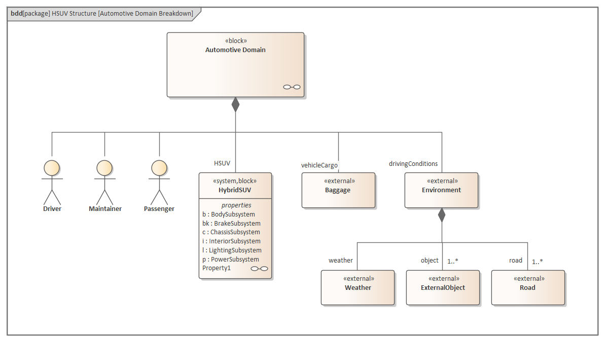

# <a href="https://sparxsystems.com/enterprise_architect_user_guide/15.1/model_domains/sysml.html" target="_blank">Systems Modeling Language (SysML)</a> Язык моделирования систем (SysML)

Enterprise Architect's implementation of SysML 1.5 delivers a powerful and rigorous modeling solution for Systems Engineering professionals. This integrated modeling environment helps you to:

Реализация SysML 1.5 в Enterprise Architect предоставляет профессиональным системным инженерам мощное и надежное решение для моделирования. Эта интегрированная среда моделирования поможет вам:

* Specify system requirements with powerful requirements modeling support
* Design deeply-nested structures of systems and subsystems using Blocks and Block diagrams
* Analyze system-to-system behavior using Interaction diagrams, Activity diagrams and State Charts

=

* Укажите системные требования с мощной поддержкой моделирования требований
* Создавайте глубоко вложенные структуры систем и подсистем с помощью блоков и блок-схем.
* Анализируйте межсистемное поведение с помощью диаграмм взаимодействия, диаграмм действий и диаграмм состояний
* Определите динамику системы и обеспечьте корректность с помощью параметрических и ограничительных блоков.

Define system dynamics and enforce correctness with Parametric and Constraint Blocks.
This example SysML Block diagram can be found in the Enterprise Architect Example model under Systems Engineering > SysML 1.5 Example: HSUV > Modeling Domain > HSUV Model > HSUV Structure.

Этот пример блок- схемы SysML можно найти в модели Enterprise Architect Example в разделе Системное проектирование> Пример SysML 1.5: HSUV> Домен моделирования> Модель HSUV> Структура HSUV.

Using SysML with Enterprise Architect, you can quickly and efficiently specify, design and analyze complex system models and:

Используя SysML с Enterprise Architect, вы можете быстро и эффективно определять, проектировать и анализировать сложные системные модели, а также:

* Model with all SysML 1.5 diagrams
* Conduct MDA (Model Driven Architecture) Style Transformations
* Perform simulation of SysML Parametric diagrams with OpenModelica, which supports engineering analysis of critical system parameters including the evaluation of key metrics such as performance, reliability and other physical characteristics
* Visualize and trace Requirements through to model elements throughout the entire development lifecycle
* Use the built-in Discussion Forum to create posts, access discussions and manage threads for team communication
* Use the custom Search Facility to perform complex searches, view SysML Allocations and generate reports from the results

==

* Модель со всеми диаграммами SysML 1.5
* Проведение преобразований стиля MDA (архитектура, управляемая моделями)
* Выполняйте моделирование параметрических диаграмм SysML с помощью OpenModelica, который поддерживает технический анализ критических параметров системы, включая оценку таких ключевых показателей, как производительность, надежность и другие физические характеристики
* Визуализация и отслеживание требований до элементов модели на протяжении всего жизненного цикла разработки
* Используйте встроенный дискуссионный форум для создания сообщений, доступа к обсуждениям и управления цепочками для группового общения.
* Используйте настраиваемую функцию поиска для выполнения сложного поиска, просмотра распределений SysML и создания отчетов по результатам.

Enterprise Architect supports all versions of SysML, from SysML 1.1 to SysML 1.5.

Enterprise Architect поддерживает все версии SysML, от SysML 1.1 до SysML 1.5.

Access

| Ribbon                                   | Design &gt; Model &gt; Perspectives &gt; Model Wizard &gt;  Model Patterns &gt; https://sparxsystems.com/enterprise_architect_user_guide/15.1. Perspective &gt; Systems Engineering &gt; SysML --&gt; SysML Perspective |
|------------------------------------------|------------------------------------------|
| 
Context Menu
 | 
Right-click on a Package &gt; Add a Model using Wizard &gt;  Model Patterns &gt; https://sparxsystems.com/enterprise_architect_user_guide/15.1. Perspective &gt; Systems Engineering &gt; SysML --&gt; SysML Perspective
 |
| 
Keyboard
 | 
Ctrl+Shift+M &gt;  Model Patterns &gt; https://sparxsystems.com/enterprise_architect_user_guide/15.1. Perspective &gt; Systems Engineering &gt; SysML --&gt; SysML Perspective
 |
| 
Other
 | 
Click on the  button in the top right corner of the screen, and select the 'Systems Engineering | SysML' Perspective
 |

| лента                                    | Проектирование&gt; Модель&gt; Перспективы&gt; Мастер моделей &gt; Шаблоны модели&gt; https://sparxsystems.com/enterprise_architect_user_guide/15.1. Перспектива&gt; Системное проектирование&gt; SysML -&gt; Перспектива SysML |
|------------------------------------------|------------------------------------------|
| 
Контекстное меню
 | 
Щелкните правой кнопкой мыши пакет&gt; Добавить модель с помощью мастера&gt; Шаблоны моделей&gt; https://sparxsystems.com/enterprise_architect_user_guide/15.1. Перспектива&gt; Системное проектирование&gt; SysML -&gt; Перспектива SysML
 |
| 
клавиатура
 | 
Ctrl + Shift + M &gt; Шаблоны моделей&gt; https://sparxsystems.com/enterprise_architect_user_guide/15.1. Перспектива&gt; Системное проектирование&gt; SysML -&gt; Перспектива SysML
 |
| 
Другой
 | 
Нажмите кнопку в правом верхнем углу экрана и выберите «Системное проектирование | Перспектива SysML
 |

SysML Integration

| Facilities                               | Detail                                   | See also                                 |
|------------------------------------------|------------------------------------------|------------------------------------------|
| 
SysML In Enterprise Architect
 | 
Enterprise Architect's support for SysML provides:
<ul style="box-sizing: border-box; font-family: &quot;Pragmata Pro Mono Regular&quot;; margin-bottom: 3px; margin-top: 10px;"><li style="box-sizing: border-box; font-family: &quot;Pragmata Pro Mono Regular&quot;;">A range of Perspectives and Patterns to generate SysML models, in the Model Wizard</li><li style="box-sizing: border-box; font-family: &quot;Pragmata Pro Mono Regular&quot;;">Patterns for each of the nine SysML diagram types, accessed through the 'New Diagram' dialog</li><li style="box-sizing: border-box; font-family: &quot;Pragmata Pro Mono Regular&quot;;">A collection of SysML pages in the Diagram Toolbox that contain the SysML elements and relationships for each of the diagram types</li><li style="box-sizing: border-box; font-family: &quot;Pragmata Pro Mono Regular&quot;;">SysML element and relationship entries in the 'Toolbox Shortcut Menu' and Quick Linker</li><li style="box-sizing: border-box; font-family: &quot;Pragmata Pro Mono Regular&quot;;">A SysML-specific Glossary for the Technology</li></ul> | <a href="https://sparxsystems.com/enterprise_architect_user_guide/15.1/modeling/newdiagrams.html" style="box-sizing: border-box; font-family: &quot;Pragmata Pro Mono Regular&quot;; text-decoration: none; color: rgb(0, 102, 221); outline: none; display: block; line-height: normal; margin: 0px; padding: 10px 0px;">Add New Diagrams</a><a href="https://sparxsystems.com/enterprise_architect_user_guide/15.1/modeling/umltoolboxshortcutmenu.html" style="box-sizing: border-box; font-family: &quot;Pragmata Pro Mono Regular&quot;; text-decoration: none; color: rgb(0, 102, 221); outline: none; display: block; line-height: normal; margin: 0px; padding: 10px 0px;">Toolbox Shortcut Menu</a><a href="https://sparxsystems.com/enterprise_architect_user_guide/15.1/modeling/quick_links.html" style="box-sizing: border-box; font-family: &quot;Pragmata Pro Mono Regular&quot;; text-decoration: none; color: rgb(0, 102, 221); outline: none; display: block; line-height: normal; margin: 0px; padding: 10px 0px;">The Quick Linker</a><a href="https://sparxsystems.com/enterprise_architect_user_guide/15.1/model_domains/simulating_a_sysml_model_2.html" style="box-sizing: border-box; font-family: &quot;Pragmata Pro Mono Regular&quot;; text-decoration: none; color: rgb(0, 102, 221); outline: none; display: block; line-height: normal; margin: 0px; padding: 10px 0px;">Simple Parametric Simulation (Legacy)</a> |
| 
SysML Toolboxes
 | 
Enterprise Architect's support for SysML provides Diagram Toolbox pages for the nine types of SysML diagram, which you can access through the 'Find Toolbox Item' dialog. If you enable SysML as the active technology, you can also open the SysML Toolbox pages by default. See the <i style="box-sizing: border-box; font-family: &quot;Pragmata Pro Mono Regular&quot;;">SysML Toolboxes* Help topic.
 | <a href="https://sparxsystems.com/enterprise_architect_user_guide/15.1/model_domains/systoolb.html" style="box-sizing: border-box; font-family: &quot;Pragmata Pro Mono Regular&quot;; text-decoration: none; color: rgb(0, 102, 221); outline: none; display: block; line-height: normal; margin: 0px; padding: 10px 0px;">SysML Toolboxes</a> |
| 
Working with SysML Versions
 | 
Enterprise Architect supports these SysML versions:
<ul style="box-sizing: border-box; font-family: &quot;Pragmata Pro Mono Regular&quot;; margin-bottom: 3px; margin-top: 10px;"><li style="box-sizing: border-box; font-family: &quot;Pragmata Pro Mono Regular&quot;;">1.1</li><li style="box-sizing: border-box; font-family: &quot;Pragmata Pro Mono Regular&quot;;">1.2</li><li style="box-sizing: border-box; font-family: &quot;Pragmata Pro Mono Regular&quot;;">1.3</li><li style="box-sizing: border-box; font-family: &quot;Pragmata Pro Mono Regular&quot;;">1.4</li><li style="box-sizing: border-box; font-family: &quot;Pragmata Pro Mono Regular&quot;;">1.5</li></ul>
However, SysML 1.5 is virtually identical to SysML 1.4 so the versions are supported and processed as the same thing.

You can maintain your models under any of these versions, as necessary, but it is recommended that you only work with one version at a time and disable the others, using the 'MDG Technologies' dialog (select the 'Specialize &gt; Technologies &gt; Manage' ribbon option). You might enable two consecutive versions if you are upgrading your models from the earlier one to the later one.
 | <a href="https://sparxsystems.com/enterprise_architect_user_guide/15.1/modeling/manage_mdg_technologies.html" style="box-sizing: border-box; font-family: &quot;Pragmata Pro Mono Regular&quot;; text-decoration: none; color: rgb(0, 102, 221); outline: none; display: block; line-height: normal; margin: 0px; padding: 10px 0px;">Manage MDG Technologies</a><a href="https://sparxsystems.com/enterprise_architect_user_guide/15.1/model_domains/migrate_sysml_1_1_model_to_sys.html" style="box-sizing: border-box; font-family: &quot;Pragmata Pro Mono Regular&quot;; text-decoration: none; color: rgb(0, 102, 221); outline: none; display: block; line-height: normal; margin: 0px; padding: 10px 0px;">Migrate SysML Model to Later SysML Version</a> |
| 
Upgrade SysML Models
 | 
You can migrate a SysML model (or part of a model) to a later SysML version, using the Automation Interface. See the <i style="box-sizing: border-box; font-family: &quot;Pragmata Pro Mono Regular&quot;;">Migrate SysML Model to Later SysML Version* Help topic.
 | <a href="https://sparxsystems.com/enterprise_architect_user_guide/15.1/model_domains/migrate_sysml_1_1_model_to_sys.html" style="box-sizing: border-box; font-family: &quot;Pragmata Pro Mono Regular&quot;; text-decoration: none; color: rgb(239, 128, 0); outline: none; display: block; line-height: normal; margin: 0px; padding: 10px 0px;">Migrate SysML Model to Later SysML Version</a> |

Интеграция SysML

| оборудование                             | подробность                              | Смотрите также                           |
|------------------------------------------|------------------------------------------|------------------------------------------|
| 
SysML в Enterprise Architect
 | 
Поддержка SysML Enterprise Architect обеспечивает:
<ul style="box-sizing: border-box; font-family: &quot;Pragmata Pro Mono Regular&quot;; margin-bottom: 3px; margin-top: 10px;"><li style="box-sizing: border-box; font-family: &quot;Pragmata Pro Mono Regular&quot;;">Диапазон перспектив и шаблонов для создания моделей SysML в мастере моделей</li><li style="box-sizing: border-box; font-family: &quot;Pragmata Pro Mono Regular&quot;;">Шаблоны для каждого из девяти типов диаграмм SysML, доступные через диалоговое окно «Новая диаграмма».</li><li style="box-sizing: border-box; font-family: &quot;Pragmata Pro Mono Regular&quot;;">Коллекция страниц SysML в панели инструментов диаграммы, которые содержат элементы SysML и отношения для каждого из типов диаграмм.</li><li style="box-sizing: border-box; font-family: &quot;Pragmata Pro Mono Regular&quot;;">Элемент SysML и записи отношений в контекстном меню панели инструментов и в Quick Linker</li><li style="box-sizing: border-box; font-family: &quot;Pragmata Pro Mono Regular&quot;;">Глоссарий по технологиям, относящийся к SysML</li></ul> | <a href="https://sparxsystems.com/enterprise_architect_user_guide/15.1/modeling/newdiagrams.html" style="box-sizing: border-box; font-family: &quot;Pragmata Pro Mono Regular&quot;; text-decoration: none; color: rgb(0, 102, 221); outline: none; display: block; line-height: normal; margin: 0px; padding: 10px 0px;">Добавить новые диаграммы</a><a href="https://sparxsystems.com/enterprise_architect_user_guide/15.1/modeling/umltoolboxshortcutmenu.html" style="box-sizing: border-box; font-family: &quot;Pragmata Pro Mono Regular&quot;; text-decoration: none; color: rgb(0, 102, 221); outline: none; display: block; line-height: normal; margin: 0px; padding: 10px 0px;">Контекстное меню панели инструментов</a><a href="https://sparxsystems.com/enterprise_architect_user_guide/15.1/modeling/quick_links.html" style="box-sizing: border-box; font-family: &quot;Pragmata Pro Mono Regular&quot;; text-decoration: none; color: rgb(0, 102, 221); outline: none; display: block; line-height: normal; margin: 0px; padding: 10px 0px;">Быстрый компоновщик</a><a href="https://sparxsystems.com/enterprise_architect_user_guide/15.1/model_domains/simulating_a_sysml_model_2.html" style="box-sizing: border-box; font-family: &quot;Pragmata Pro Mono Regular&quot;; text-decoration: none; color: rgb(0, 102, 221); outline: none; display: block; line-height: normal; margin: 0px; padding: 10px 0px;">Простое параметрическое моделирование (устаревшая версия)</a> |
| 
Наборы инструментов SysML
 | 
Поддержка Enterprise Architect для SysML предоставляет страницы Diagram Toolbox для девяти типов SysML-диаграмм, к которым вы можете получить доступ через диалоговое окно «Find Toolbox Item». Если вы включите SysML в качестве активной технологии, вы также можете открывать страницы SysML Toolbox по умолчанию. См. Раздел справки <i style="box-sizing: border-box; font-family: &quot;Pragmata Pro Mono Regular&quot;;">SysML Toolboxes* .
 | <a href="https://sparxsystems.com/enterprise_architect_user_guide/15.1/model_domains/systoolb.html" style="box-sizing: border-box; font-family: &quot;Pragmata Pro Mono Regular&quot;; text-decoration: none; color: rgb(0, 102, 221); outline: none; display: block; line-height: normal; margin: 0px; padding: 10px 0px;">Наборы инструментов SysML</a> |
| 
Работа с версиями SysML
 | 
Enterprise Architect поддерживает следующие версии SysML:
<ul style="box-sizing: border-box; font-family: &quot;Pragmata Pro Mono Regular&quot;; margin-bottom: 3px; margin-top: 10px;"><li style="box-sizing: border-box; font-family: &quot;Pragmata Pro Mono Regular&quot;;">1,1</li><li style="box-sizing: border-box; font-family: &quot;Pragmata Pro Mono Regular&quot;;">1.2</li><li style="box-sizing: border-box; font-family: &quot;Pragmata Pro Mono Regular&quot;;">1,3</li><li style="box-sizing: border-box; font-family: &quot;Pragmata Pro Mono Regular&quot;;">1.4</li><li style="box-sizing: border-box; font-family: &quot;Pragmata Pro Mono Regular&quot;;">1,5</li></ul>
Однако SysML 1.5 практически идентичен SysML 1.4, поэтому версии поддерживаются и обрабатываются как одно и то же.

При необходимости вы можете поддерживать свои модели под любой из этих версий, но рекомендуется работать только с одной версией за раз и отключать другие, используя диалоговое окно «Технологии ЦРТ» (выберите «Специализация&gt; Технологии&gt; Управление». вариант ленты). Вы можете включить две последовательные версии, если вы обновляете свои модели с более ранней до более поздней.
 | <a href="https://sparxsystems.com/enterprise_architect_user_guide/15.1/modeling/manage_mdg_technologies.html" style="box-sizing: border-box; font-family: &quot;Pragmata Pro Mono Regular&quot;; text-decoration: none; color: rgb(0, 102, 221); outline: none; display: block; line-height: normal; margin: 0px; padding: 10px 0px;">Управление технологиями ЦРТ</a><a href="https://sparxsystems.com/enterprise_architect_user_guide/15.1/model_domains/migrate_sysml_1_1_model_to_sys.html" style="box-sizing: border-box; font-family: &quot;Pragmata Pro Mono Regular&quot;; text-decoration: none; color: rgb(0, 102, 221); outline: none; display: block; line-height: normal; margin: 0px; padding: 10px 0px;">Перенести модель SysML в более позднюю версию SysML</a> |
| 
Обновление моделей SysML
 | 
Вы можете перенести модель SysML (или часть модели) в более позднюю версию SysML с помощью интерфейса автоматизации. См. Раздел справки « <i style="box-sizing: border-box; font-family: &quot;Pragmata Pro Mono Regular&quot;;">Миграция модели SysML в более позднюю версию SysML»* .
 | <a href="https://sparxsystems.com/enterprise_architect_user_guide/15.1/model_domains/migrate_sysml_1_1_model_to_sys.html" style="box-sizing: border-box; font-family: &quot;Pragmata Pro Mono Regular&quot;; text-decoration: none; color: rgb(0, 102, 221); outline: none; display: block; line-height: normal; margin: 0px; padding: 10px 0px;">Перенести модель SysML в более позднюю версию SysML</a> |

Notes

* Support for SysML is built in to the Corporate, Unified and Ultimate editions of Enterprise Architect
* You can purchase an MDG Technology for SysML under separate licence to use with the Professional edition of Enterprise Architect
* Support for SysML is provided on Enterprise Architect version 12.1 or higher
* As SysML 1.5 is virtually identical to SysML 1.4, you do not need to upgrade your SysML 1.4 models; references to the latest version of SysML have, however, been updated to '1.5'

Ноты
* Поддержка SysML встроена в корпоративную, унифицированную и максимальную редакции Enterprise Architect.
* Вы можете приобрести технологию MDG для SysML по отдельной лицензии для использования с профессиональной версией Enterprise Architect.
* Поддержка SysML предоставляется в Enterprise Architect версии 12.1 или выше.
* Поскольку SysML 1.5 практически идентичен SysML 1.4, вам не нужно обновлять модели SysML 1.4; ссылки на последнюю версию SysML, однако, были обновлены до 1.5.

Learn more

<ul>
	<li><a href="http://www.omgsysml.org/">OMG SysML</a> (Online Resource)</li>
	<li><a href="https://sparxsystems.com/enterprise_architect_user_guide/15.1/model_domains/requirements_management.html">Requirements Management</a></li>
	<li><a href="https://sparxsystems.com/enterprise_architect_user_guide/15.1/model_domains/mdastyletransforms.html">Model Transformations</a></li>
	<li><a href="https://sparxsystems.com/enterprise_architect_user_guide/15.1/model_simulation/sysml_parametric_models_2.html">Parametric Simulation Using OpenModelica</a></li>
	<li><a href="https://sparxsystems.com/enterprise_architect_user_guide/15.1/model_navigation/creating_search_filters.html">Define and Modify Searches</a></li>
	<li><a href="https://sparxsystems.com/enterprise_architect_user_guide/15.1/team_support/element_discussions.html">Discussions</a></li>
</ul>

Выучить больше
* OMG SysML (Интернет-ресурс)
* Управление требованиями
* Преобразования модели
* Параметрическое моделирование с использованием OpenModelica
* Определить и изменить поиск
* Обсуждение

