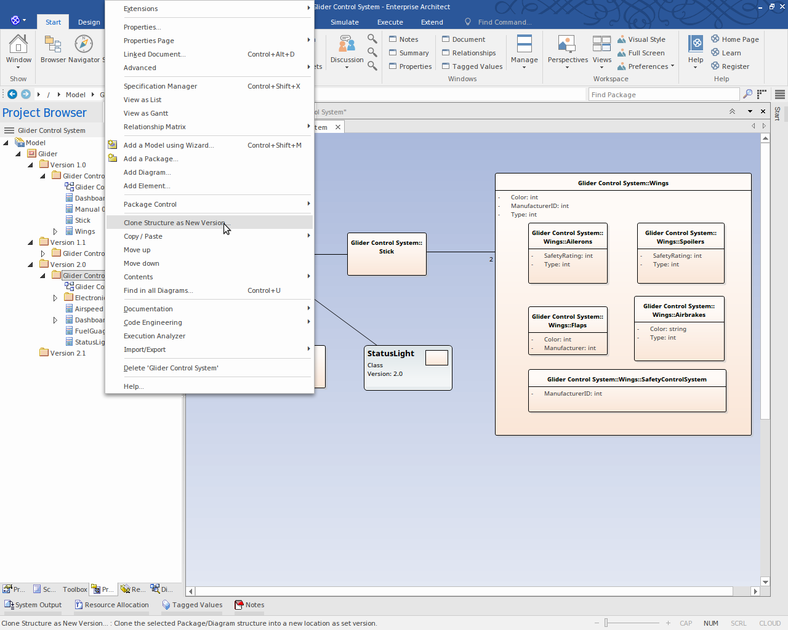
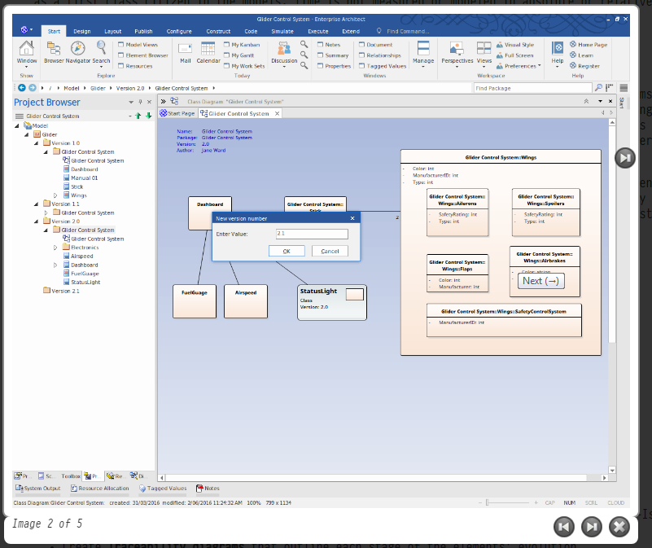
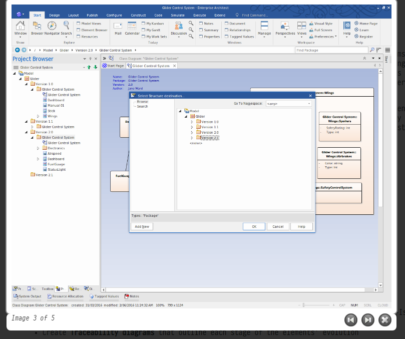
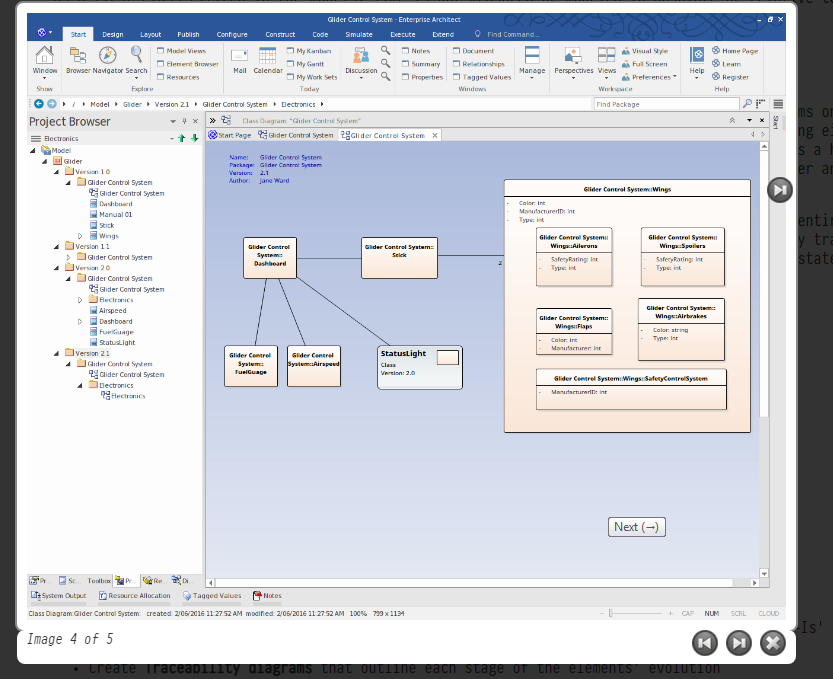
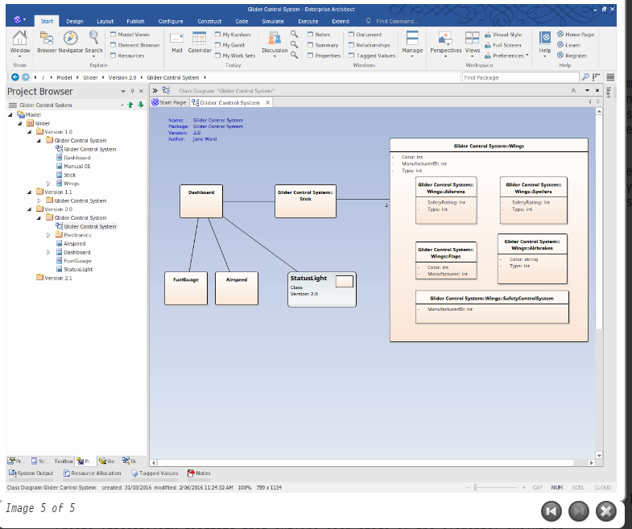
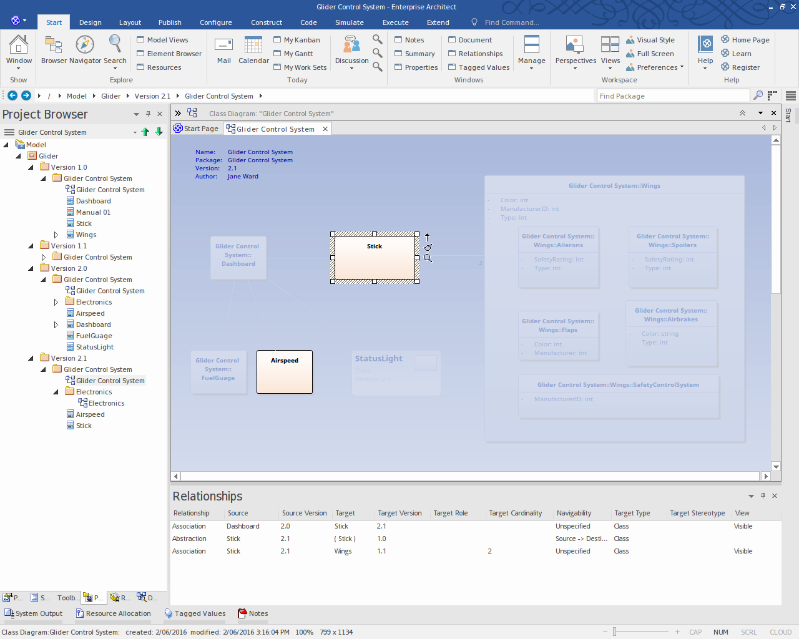

# <a href="https://sparxsystems.com/enterprise_architect_user_guide/15.1/model_domains/time_aware_models.html" target="_blank">Time Aware Models</a> Временные модели

The Time Aware Modeling feature allows analysts to create incremental versions of their models by providing easy access to tools that facilitate the migration of elements through multiple versions. It is now easy to see the evolution of a model over different versions, and create new versions of model elements automatically without altering the underlying structure of the 'As-Is' model.

Функция Time Aware Modeling позволяет аналитикам создавать инкрементные версии своих моделей, обеспечивая легкий доступ к инструментам, которые облегчают миграцию элементов через несколько версий. Теперь легко увидеть эволюцию модели по разным версиям и автоматически создавать новые версии элементов модели без изменения базовой структуры модели «как есть».

Задний план

Background

Models by definition are an abstraction of things that exist in the real world. Just as time is an important dimension in the physical world, it is also an important concern with models that represent that world. These are some common situations where time and the evolution of versions is important in modeling:

Модели по определению - это абстракция вещей, существующих в реальном мире. Так же, как время является важным измерением в физическом мире, оно также имеет большое значение для моделей, которые представляют этот мир. Вот некоторые распространенные ситуации, когда время и эволюция версий важны при моделировании:

* Architects use models to document the current state and then move on to the more challenging and rewarding task of defining what the future state will look like, often in a series of transitions
* When new customers are acquired, a Business Analyst is often challenged with describing how a base product should be configured for these different customer groups, resulting in different versions of the same product
* Business Strategists typically prescribe what a Capability model will look like for the organization of the future, resulting in at least two versions of the Capability model
* During mergers and acquisitions, Business Architects are tasked with describing the possible states of the enterprise after the takeover is complete
* Engineers are required to develop better or more efficient solutions to meet the challenges of the future, so define newer and better versions of the solution
* Testers need to be aware of different versions of a product when designing and running test cases
* Infrastructure engineers have to define future environments in response to performance or security concerns, creating multiple versions of servers, devices and even whole facilities

= 

* Архитекторы используют модели для документирования текущего состояния, а затем переходят к более сложной и полезной задаче определения того, как будет выглядеть будущее состояние, часто в виде серии переходов.
* Когда появляются новые клиенты, бизнес-аналитик часто сталкивается с проблемой описания того, как базовый продукт должен быть настроен для этих различных групп клиентов, что приводит к созданию разных версий одного и того же продукта.
* Бизнес-стратеги обычно предписывают, как будет выглядеть модель возможностей для организации будущего, в результате чего получается как минимум две версии модели возможностей.
* Во время слияний и поглощений бизнес-архитекторам поручено описать возможные состояния предприятия после завершения поглощения.
* От инженеров требуется разработать лучшие или более эффективные решения для решения задач будущего, поэтому определите новые и лучшие версии решения.
* Тестировщикам необходимо знать о разных версиях продукта при разработке и выполнении тестовых примеров.
* Инженеры по инфраструктуре должны определять будущие среды в ответ на проблемы производительности или безопасности, создавая несколько версий серверов, устройств и даже целых объектов.

All of these situations require that time is incorporated into the models so that it can be reasoned and made explicit. Enterprise Architect's Time Aware modeling facilities can be used in all these situations, to ensure that time is included as a first class citizen in the models. Time is not measured or modeled in absolute or relative terms, but by representing any number of future states or differences in the form of versions.

Все эти ситуации требуют, чтобы время было включено в модели, чтобы его можно было обосновать и сделать явным. Во всех этих ситуациях можно использовать средства моделирования Enterprise Architect с учетом времени, чтобы гарантировать, что время включено в модели как первоклассный гражданин. Время не измеряется и не моделируется в абсолютных или относительных величинах, а представляет собой любое количество будущих состояний или различий в форме версий.

Introduction

Time Aware modeling is based on using tools to clone a Package structure (Packages and diagrams only) as a new version, and then selectively over-riding parts of the old version with new elements and relationships using either the 'Clone as New Version' capability or simply adding new material to the model as required. This method allows a highly selective and incremental revision or development of a model, whilst maintaining traceability to both earlier and later development.

Моделирование с учетом времени основано на использовании инструментов для клонирования структуры пакета (только для пакетов и диаграмм) в качестве новой версии с последующим выборочным замещением частей старой версии новыми элементами и связями с использованием либо возможности «Клонировать как новую версию». или просто добавив новый материал к модели по мере необходимости. Этот метод позволяет очень избирательно и постепенно пересматривать или развивать модель, сохраняя при этом прослеживаемость как до более ранних, так и более поздних разработок.

Time Aware modeling is not dependent on Version Control or Baseline functionality, but is an entirely separate capability that helps analysts manage multiple versions or revisions of a model in a consistent and fully traceable manner. Conceptually it is analogous to the branching and merging in a Version Control system but as stated it is a separate and unrelated mechanism.

Моделирование с учетом времени не зависит от функций управления версиями или базовой линии, а представляет собой полностью отдельную возможность, которая помогает аналитикам управлять несколькими версиями или редакциями модели согласованным и полностью отслеживаемым образом. Концептуально это аналог ветвления и слияния в системе управления версиями, но, как уже говорилось, это отдельный и не связанный механизм.

Overview

This collection of images illustrates the basic process of working with cloned structures and elements in a Time Aware model.

обзор

Эта коллекция изображений иллюстрирует основной процесс работы с клонированными структурами и элементами в модели Time Aware.

Benefits

* Easily compare 'As-Is' and 'To-Be' models
* Make changes to subsequent versions without altering the underlying structure of the 'As-Is' diagram
* Get greater control over the evolution and traceability of your overall model
* Create Traceability diagrams that outline each stage of the elements' evolution

Преимущества

* Легко сравнивайте модели "как есть" и "как есть"
* Вносите изменения в последующие версии без изменения базовой структуры диаграммы «Как есть».
* Получите больший контроль над развитием и отслеживаемостью вашей модели в целом
* Создавайте диаграммы прослеживаемости , описывающие каждый этап эволюции элементов

Time Aware Model

Learn more

<ul>
	<li><a href="../model_domains/clone_structure_as_new_version.html">Clone Structure as New Version</a> </li>
	<li><a href="../model_domains/clone_diagram_as_new_version.html">Clone Diagram as New Version</a> </li>
	<li><a href="../model_domains/clone_element_as_new_version.html">Clone Element as New Version</a> </li>
	<li><a href="../model_domains/tam-traceability.html">Traceability</a> </li>
</ul>

Выучить больше

* Клонировать структуру как новую версию
* Клонировать диаграмму как новую версию
* Клонировать элемент как новую версию
* прослеживаемость

