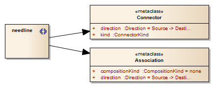

### [Add Stereotypes and Metaclasses](https://sparxsystems.com/enterprise_architect_user_guide/15.1/modeling/addingelementsandmetaclass.html) Добавить стереотипы и метаклассы

When you are extending the UML to develop a domain-specific toolset, you start by creating a Profile Package for the stereotypes you intend to customize. This Package has at least one child Class diagram, and it is on this child diagram that you specify:

* The types of object that you are extending, represented by Metaclass elements, and
* The way in which each object is extended, represented by Stereotype elements

You can qualify the effect of a Stereotype on a Metaclass using a range of other tools, including:

Когда вы расширяете UML для разработки набора инструментов для конкретной предметной области, вы начинаете с создания пакета профиля для стереотипов, которые вы собираетесь настраивать. Этот пакет имеет по крайней мере одну диаграмму дочерних классов, и именно на этой диаграмме вы указываете:

* Типы расширяемых объектов, представленные элементами Metaclass, и
* Способ расширения каждого объекта, представленный элементами стереотипа

Вы можете оценить влияние стереотипа на метакласс, используя ряд других инструментов, включая:

* Shape Scripts in the Stereotype
* Tagged Values, defined by attributes in the Stereotype element
* Structured Tagged Value Classes, defined using attributes in the Stereotype element
* Enumerations, defined using attributes in the Stereotype element
* Tagged Value connectors, to identify possible values for a Tagged Value in an element generated with a Stereotype
* Constraints on the Stereotype element
* Special attributes, that define specific default behavior of stereotyped elements, such as the initial size and color of the element
* Modifying the default appearance of the Stereotype element

Add Metaclasses and Stereotypes to a Profile

Вы можете оценить влияние стереотипа на метакласс, используя ряд других инструментов, включая:

* Скрипты формы в стереотипе
* Значения с тегами, определяемые атрибутами в элементе Stereotype
* Структурированные классы значений с тегами, определенные с помощью атрибутов в элементе Stereotype
* Перечисления, определенные с помощью атрибутов в элементе Stereotype
* Коннекторы Tagged Value, для определения возможных значений Tagged Value в элементе, созданном с помощью стереотипа.
* Ограничения на элемент Stereotype
* Специальные атрибуты, которые определяют конкретное поведение по умолчанию стереотипных элементов, например начальный размер и цвет элемента.
* Изменение внешнего вида элемента стереотипа по умолчанию

Добавить метаклассы и стереотипы в профиль

| Step                                     | Description                              | See also                                 |
|------------------------------------------|------------------------------------------|------------------------------------------|
| 
1
 | 
Open the child diagram of the Profile Package.
 | <a href="https://sparxsystems.com/enterprise_architect_user_guide/15.1/modeling/createprofile.html" style="box-sizing: border-box; text-decoration: none; cursor: url(&quot;data:image/png;base64,iVBORw0KGgoAAAANSUhEUgAAABAAAAAQCAYAAAAf8/9hAAABaUlEQVQ4T2NkwAZY1f9DhP+lM/y+PQurGqggI6akisytj+ceg8TVREwZGH7fxKIGoQtTkk1F69brc1cpMEBV89brs9eoaMB/TQaGWzcYGKS4GBiefUP3MhYvqGncen3mOrJCZ5NAhr1n1jPs3LKbITc6H2jQk+8weaIMgCn++OEDw+H9xxmERAQZEgJyDjP8uWXHyMCqdiU+PVJ74cwVkBBnV1e/9eo00MmY4M+fPwwvX7wASzgaBILVAw1Q/3/rzWmwIDjamBg0cBkAUvP0yRPcBoBkvG3CGbYeWYk17fz5/Zvh5cuXaAaAuEiuwJfq3rx5w/Dzxw8sBhBpCMz5qGGAbCUel/z69Yvh9atXcNWOBgEXGH7fMsSMRqAh+y+sZ+AXEGDg4eEBa3j29CnD///Q/AXkBzjEM3x8fRqsF3tGYVF7Ud1eJO7iZYcRJPGBuQyPbl0BmvzyK24DYNpY1X+BghjFFLTcCQDviqMRO9+fjwAAAABJRU5ErkJggg==&quot;) 14 0, auto !important; color: rgb(0, 102, 221); outline: none; display: block; line-height: normal; margin: 0px; padding: 10px 0px;">Create a Profile Package</a> |
| 
2
 | 
Drag the Metaclass element from the 'Profile' page of the Toolbox onto the diagram.

The 'Extend Metaclass' dialog displays, listing the types of object you can extend, namely:
<ul style="box-sizing: border-box; margin-bottom: 3px; margin-top: 10px;"><li style="box-sizing: border-box;">Core UML elements, and attributes and operations</li><li style="box-sizing: border-box;">Core connectors</li><li style="box-sizing: border-box;">Abstract metatypes such as Action types, ConnectorEnd and Gate, and</li><li style="box-sizing: border-box;">Stereotypes</li></ul>
On the 'Core Elements' tab, you can include the set of system-defined extended elements such as ActivityRegion, Change and User, by selecting the 'Include Extended' checkbox.

On the 'Stereotypes' tab, to specify the technology containing the stereotypes that you want to extend, click on the drop-down arrow in the top field and select the technology name.
 | <a href="https://sparxsystems.com/enterprise_architect_user_guide/15.1/modeling/non-uml_metatypes.html" style="box-sizing: border-box; text-decoration: none; cursor: url(&quot;data:image/png;base64,iVBORw0KGgoAAAANSUhEUgAAABAAAAAQCAYAAAAf8/9hAAABaUlEQVQ4T2NkwAZY1f9DhP+lM/y+PQurGqggI6akisytj+ceg8TVREwZGH7fxKIGoQtTkk1F69brc1cpMEBV89brs9eoaMB/TQaGWzcYGKS4GBiefUP3MhYvqGncen3mOrJCZ5NAhr1n1jPs3LKbITc6H2jQk+8weaIMgCn++OEDw+H9xxmERAQZEgJyDjP8uWXHyMCqdiU+PVJ74cwVkBBnV1e/9eo00MmY4M+fPwwvX7wASzgaBILVAw1Q/3/rzWmwIDjamBg0cBkAUvP0yRPcBoBkvG3CGbYeWYk17fz5/Zvh5cuXaAaAuEiuwJfq3rx5w/Dzxw8sBhBpCMz5qGGAbCUel/z69Yvh9atXcNWOBgEXGH7fMsSMRqAh+y+sZ+AXEGDg4eEBa3j29CnD///Q/AXkBzjEM3x8fRqsF3tGYVF7Ud1eJO7iZYcRJPGBuQyPbl0BmvzyK24DYNpY1X+BghjFFLTcCQDviqMRO9+fjwAAAABJRU5ErkJggg==&quot;) 14 0, auto !important; color: rgb(0, 102, 221); outline: none; display: block; line-height: normal; margin: 0px; padding: 10px 0px;">Create Stereotypes Extending non-UML Objects</a> |
| 
3
 | 
Scroll through the selected list and tick one or more object types to extend.

If you want to select all objects on a tab, click on the All button.
 |                                          |
| 
4
 | 
Click on the OK button.

For each checkbox that you have selected, a new Metaclass element is created on the diagram.
 |                                          |
| 
5
 | 
Drag a Stereotype element from the Toolbox onto the diagram.

If the 'Properties' dialog does not display, double-click on the element on the diagram.
 |                                          |
| 
6
 | 
In the Name field, type a name for the stereotype.
 |                                          |
| 
7
 | 
Click on the OK button.
 |                                          |
| 
8
 | 
Click on the Extension relationship in the Toolbox and drag the connection from the Stereotype element to the Metaclass element that it will extend.
 |                                          |
| 
9
 | 
Your diagram now resembles this example:

 |                                          |
| 
10
 | 
Optionally, you can now add to your Stereotype element:
<ul style="box-sizing: border-box; margin-bottom: 3px; margin-top: 10px;"><li style="box-sizing: border-box;">Stereotype tags</li><li style="box-sizing: border-box;">Enumeration tags</li><li style="box-sizing: border-box;">Structured Tagged Values</li><li style="box-sizing: border-box;">Tagged Value connectors</li><li style="box-sizing: border-box;">Special attributes</li><li style="box-sizing: border-box;">Constraints and/or</li><li style="box-sizing: border-box;">Shape Scripts </li></ul>
You can also define the default appearance of the element or connector as required.
 | <a href="https://sparxsystems.com/enterprise_architect_user_guide/15.1/modeling/definestereotypetags.html" style="box-sizing: border-box; text-decoration: none; cursor: url(&quot;data:image/png;base64,iVBORw0KGgoAAAANSUhEUgAAABAAAAAQCAYAAAAf8/9hAAABaUlEQVQ4T2NkwAZY1f9DhP+lM/y+PQurGqggI6akisytj+ceg8TVREwZGH7fxKIGoQtTkk1F69brc1cpMEBV89brs9eoaMB/TQaGWzcYGKS4GBiefUP3MhYvqGncen3mOrJCZ5NAhr1n1jPs3LKbITc6H2jQk+8weaIMgCn++OEDw+H9xxmERAQZEgJyDjP8uWXHyMCqdiU+PVJ74cwVkBBnV1e/9eo00MmY4M+fPwwvX7wASzgaBILVAw1Q/3/rzWmwIDjamBg0cBkAUvP0yRPcBoBkvG3CGbYeWYk17fz5/Zvh5cuXaAaAuEiuwJfq3rx5w/Dzxw8sBhBpCMz5qGGAbCUel/z69Yvh9atXcNWOBgEXGH7fMsSMRqAh+y+sZ+AXEGDg4eEBa3j29CnD///Q/AXkBzjEM3x8fRqsF3tGYVF7Ud1eJO7iZYcRJPGBuQyPbl0BmvzyK24DYNpY1X+BghjFFLTcCQDviqMRO9+fjwAAAABJRU5ErkJggg==&quot;) 14 0, auto !important; color: rgb(0, 102, 221); outline: none; display: block; line-height: normal; margin: 0px; padding: 10px 0px;">Define Stereotype Tagged Values</a><a href="https://sparxsystems.com/enterprise_architect_user_guide/15.1/modeling/addingenumerationstagstost.html" style="box-sizing: border-box; text-decoration: none; cursor: url(&quot;data:image/png;base64,iVBORw0KGgoAAAANSUhEUgAAABAAAAAQCAYAAAAf8/9hAAABaUlEQVQ4T2NkwAZY1f9DhP+lM/y+PQurGqggI6akisytj+ceg8TVREwZGH7fxKIGoQtTkk1F69brc1cpMEBV89brs9eoaMB/TQaGWzcYGKS4GBiefUP3MhYvqGncen3mOrJCZ5NAhr1n1jPs3LKbITc6H2jQk+8weaIMgCn++OEDw+H9xxmERAQZEgJyDjP8uWXHyMCqdiU+PVJ74cwVkBBnV1e/9eo00MmY4M+fPwwvX7wASzgaBILVAw1Q/3/rzWmwIDjamBg0cBkAUvP0yRPcBoBkvG3CGbYeWYk17fz5/Zvh5cuXaAaAuEiuwJfq3rx5w/Dzxw8sBhBpCMz5qGGAbCUel/z69Yvh9atXcNWOBgEXGH7fMsSMRqAh+y+sZ+AXEGDg4eEBa3j29CnD///Q/AXkBzjEM3x8fRqsF3tGYVF7Ud1eJO7iZYcRJPGBuQyPbl0BmvzyK24DYNpY1X+BghjFFLTcCQDviqMRO9+fjwAAAABJRU5ErkJggg==&quot;) 14 0, auto !important; color: rgb(0, 102, 221); outline: none; display: block; line-height: normal; margin: 0px; padding: 10px 0px;">Add An Enumeration to a Stereotype</a><a href="https://sparxsystems.com/enterprise_architect_user_guide/15.1/modeling/add_structured_tagged_value_cl.html" style="box-sizing: border-box; text-decoration: none; cursor: url(&quot;data:image/png;base64,iVBORw0KGgoAAAANSUhEUgAAABAAAAAQCAYAAAAf8/9hAAABaUlEQVQ4T2NkwAZY1f9DhP+lM/y+PQurGqggI6akisytj+ceg8TVREwZGH7fxKIGoQtTkk1F69brc1cpMEBV89brs9eoaMB/TQaGWzcYGKS4GBiefUP3MhYvqGncen3mOrJCZ5NAhr1n1jPs3LKbITc6H2jQk+8weaIMgCn++OEDw+H9xxmERAQZEgJyDjP8uWXHyMCqdiU+PVJ74cwVkBBnV1e/9eo00MmY4M+fPwwvX7wASzgaBILVAw1Q/3/rzWmwIDjamBg0cBkAUvP0yRPcBoBkvG3CGbYeWYk17fz5/Zvh5cuXaAaAuEiuwJfq3rx5w/Dzxw8sBhBpCMz5qGGAbCUel/z69Yvh9atXcNWOBgEXGH7fMsSMRqAh+y+sZ+AXEGDg4eEBa3j29CnD///Q/AXkBzjEM3x8fRqsF3tGYVF7Ud1eJO7iZYcRJPGBuQyPbl0BmvzyK24DYNpY1X+BghjFFLTcCQDviqMRO9+fjwAAAABJRU5ErkJggg==&quot;) 14 0, auto !important; color: rgb(0, 102, 221); outline: none; display: block; line-height: normal; margin: 0px; padding: 10px 0px;">Define a Structured Tagged Value</a><a href="https://sparxsystems.com/enterprise_architect_user_guide/15.1/modeling/usingthetaggedvalueconnect.html" style="box-sizing: border-box; text-decoration: none; cursor: url(&quot;data:image/png;base64,iVBORw0KGgoAAAANSUhEUgAAABAAAAAQCAYAAAAf8/9hAAABaUlEQVQ4T2NkwAZY1f9DhP+lM/y+PQurGqggI6akisytj+ceg8TVREwZGH7fxKIGoQtTkk1F69brc1cpMEBV89brs9eoaMB/TQaGWzcYGKS4GBiefUP3MhYvqGncen3mOrJCZ5NAhr1n1jPs3LKbITc6H2jQk+8weaIMgCn++OEDw+H9xxmERAQZEgJyDjP8uWXHyMCqdiU+PVJ74cwVkBBnV1e/9eo00MmY4M+fPwwvX7wASzgaBILVAw1Q/3/rzWmwIDjamBg0cBkAUvP0yRPcBoBkvG3CGbYeWYk17fz5/Zvh5cuXaAaAuEiuwJfq3rx5w/Dzxw8sBhBpCMz5qGGAbCUel/z69Yvh9atXcNWOBgEXGH7fMsSMRqAh+y+sZ+AXEGDg4eEBa3j29CnD///Q/AXkBzjEM3x8fRqsF3tGYVF7Ud1eJO7iZYcRJPGBuQyPbl0BmvzyK24DYNpY1X+BghjFFLTcCQDviqMRO9+fjwAAAABJRU5ErkJggg==&quot;) 14 0, auto !important; color: rgb(0, 102, 221); outline: none; display: block; line-height: normal; margin: 0px; padding: 10px 0px;">Use the Tagged Value Connector</a><a href="https://sparxsystems.com/enterprise_architect_user_guide/15.1/modeling/supportedattributes_2.html" style="box-sizing: border-box; text-decoration: none; cursor: url(&quot;data:image/png;base64,iVBORw0KGgoAAAANSUhEUgAAABAAAAAQCAYAAAAf8/9hAAABaUlEQVQ4T2NkwAZY1f9DhP+lM/y+PQurGqggI6akisytj+ceg8TVREwZGH7fxKIGoQtTkk1F69brc1cpMEBV89brs9eoaMB/TQaGWzcYGKS4GBiefUP3MhYvqGncen3mOrJCZ5NAhr1n1jPs3LKbITc6H2jQk+8weaIMgCn++OEDw+H9xxmERAQZEgJyDjP8uWXHyMCqdiU+PVJ74cwVkBBnV1e/9eo00MmY4M+fPwwvX7wASzgaBILVAw1Q/3/rzWmwIDjamBg0cBkAUvP0yRPcBoBkvG3CGbYeWYk17fz5/Zvh5cuXaAaAuEiuwJfq3rx5w/Dzxw8sBhBpCMz5qGGAbCUel/z69Yvh9atXcNWOBgEXGH7fMsSMRqAh+y+sZ+AXEGDg4eEBa3j29CnD///Q/AXkBzjEM3x8fRqsF3tGYVF7Ud1eJO7iZYcRJPGBuQyPbl0BmvzyK24DYNpY1X+BghjFFLTcCQDviqMRO9+fjwAAAABJRU5ErkJggg==&quot;) 14 0, auto !important; color: rgb(0, 102, 221); outline: none; display: block; line-height: normal; margin: 0px; padding: 10px 0px;">Special Attributes</a><a href="https://sparxsystems.com/enterprise_architect_user_guide/15.1/modeling/definestereotypeconstraints.html" style="box-sizing: border-box; text-decoration: none; cursor: url(&quot;data:image/png;base64,iVBORw0KGgoAAAANSUhEUgAAABAAAAAQCAYAAAAf8/9hAAABaUlEQVQ4T2NkwAZY1f9DhP+lM/y+PQurGqggI6akisytj+ceg8TVREwZGH7fxKIGoQtTkk1F69brc1cpMEBV89brs9eoaMB/TQaGWzcYGKS4GBiefUP3MhYvqGncen3mOrJCZ5NAhr1n1jPs3LKbITc6H2jQk+8weaIMgCn++OEDw+H9xxmERAQZEgJyDjP8uWXHyMCqdiU+PVJ74cwVkBBnV1e/9eo00MmY4M+fPwwvX7wASzgaBILVAw1Q/3/rzWmwIDjamBg0cBkAUvP0yRPcBoBkvG3CGbYeWYk17fz5/Zvh5cuXaAaAuEiuwJfq3rx5w/Dzxw8sBhBpCMz5qGGAbCUel/z69Yvh9atXcNWOBgEXGH7fMsSMRqAh+y+sZ+AXEGDg4eEBa3j29CnD///Q/AXkBzjEM3x8fRqsF3tGYVF7Ud1eJO7iZYcRJPGBuQyPbl0BmvzyK24DYNpY1X+BghjFFLTcCQDviqMRO9+fjwAAAABJRU5ErkJggg==&quot;) 14 0, auto !important; color: rgb(0, 102, 221); outline: none; display: block; line-height: normal; margin: 0px; padding: 10px 0px;">Define Stereotype Constraints</a><a href="https://sparxsystems.com/enterprise_architect_user_guide/15.1/modeling/add_shape_scripts_to_uml_profi.html" style="box-sizing: border-box; text-decoration: none; cursor: url(&quot;data:image/png;base64,iVBORw0KGgoAAAANSUhEUgAAABAAAAAQCAYAAAAf8/9hAAABaUlEQVQ4T2NkwAZY1f9DhP+lM/y+PQurGqggI6akisytj+ceg8TVREwZGH7fxKIGoQtTkk1F69brc1cpMEBV89brs9eoaMB/TQaGWzcYGKS4GBiefUP3MhYvqGncen3mOrJCZ5NAhr1n1jPs3LKbITc6H2jQk+8weaIMgCn++OEDw+H9xxmERAQZEgJyDjP8uWXHyMCqdiU+PVJ74cwVkBBnV1e/9eo00MmY4M+fPwwvX7wASzgaBILVAw1Q/3/rzWmwIDjamBg0cBkAUvP0yRPcBoBkvG3CGbYeWYk17fz5/Zvh5cuXaAaAuEiuwJfq3rx5w/Dzxw8sBhBpCMz5qGGAbCUel/z69Yvh9atXcNWOBgEXGH7fMsSMRqAh+y+sZ+AXEGDg4eEBa3j29CnD///Q/AXkBzjEM3x8fRqsF3tGYVF7Ud1eJO7iZYcRJPGBuQyPbl0BmvzyK24DYNpY1X+BghjFFLTcCQDviqMRO9+fjwAAAABJRU5ErkJggg==&quot;) 14 0, auto !important; color: rgb(0, 102, 221); outline: none; display: block; line-height: normal; margin: 0px; padding: 10px 0px;">Add Shape Scripts</a><a href="https://sparxsystems.com/enterprise_architect_user_guide/15.1/modeling/set_default_appearance.html" style="box-sizing: border-box; text-decoration: none; cursor: url(&quot;data:image/png;base64,iVBORw0KGgoAAAANSUhEUgAAABAAAAAQCAYAAAAf8/9hAAABaUlEQVQ4T2NkwAZY1f9DhP+lM/y+PQurGqggI6akisytj+ceg8TVREwZGH7fxKIGoQtTkk1F69brc1cpMEBV89brs9eoaMB/TQaGWzcYGKS4GBiefUP3MhYvqGncen3mOrJCZ5NAhr1n1jPs3LKbITc6H2jQk+8weaIMgCn++OEDw+H9xxmERAQZEgJyDjP8uWXHyMCqdiU+PVJ74cwVkBBnV1e/9eo00MmY4M+fPwwvX7wASzgaBILVAw1Q/3/rzWmwIDjamBg0cBkAUvP0yRPcBoBkvG3CGbYeWYk17fz5/Zvh5cuXaAaAuEiuwJfq3rx5w/Dzxw8sBhBpCMz5qGGAbCUel/z69Yvh9atXcNWOBgEXGH7fMsSMRqAh+y+sZ+AXEGDg4eEBa3j29CnD///Q/AXkBzjEM3x8fRqsF3tGYVF7Ud1eJO7iZYcRJPGBuQyPbl0BmvzyK24DYNpY1X+BghjFFLTcCQDviqMRO9+fjwAAAABJRU5ErkJggg==&quot;) 14 0, auto !important; color: rgb(239, 128, 0); outline: none; display: block; line-height: normal; margin: 0px; padding: 10px 0px;">Set Default Appearance</a> |

| шаг                                      | Описание                                 | Смотрите также                           |
|------------------------------------------|------------------------------------------|------------------------------------------|
| 
1
 | 
Откройте дочернюю диаграмму пакета профиля.
 | <a href="https://sparxsystems.com/enterprise_architect_user_guide/15.1/modeling/createprofile.html" style="box-sizing: border-box; text-decoration: none; cursor: url(&quot;data:image/png;base64,iVBORw0KGgoAAAANSUhEUgAAABAAAAAQCAYAAAAf8/9hAAABaUlEQVQ4T2NkwAZY1f9DhP+lM/y+PQurGqggI6akisytj+ceg8TVREwZGH7fxKIGoQtTkk1F69brc1cpMEBV89brs9eoaMB/TQaGWzcYGKS4GBiefUP3MhYvqGncen3mOrJCZ5NAhr1n1jPs3LKbITc6H2jQk+8weaIMgCn++OEDw+H9xxmERAQZEgJyDjP8uWXHyMCqdiU+PVJ74cwVkBBnV1e/9eo00MmY4M+fPwwvX7wASzgaBILVAw1Q/3/rzWmwIDjamBg0cBkAUvP0yRPcBoBkvG3CGbYeWYk17fz5/Zvh5cuXaAaAuEiuwJfq3rx5w/Dzxw8sBhBpCMz5qGGAbCUel/z69Yvh9atXcNWOBgEXGH7fMsSMRqAh+y+sZ+AXEGDg4eEBa3j29CnD///Q/AXkBzjEM3x8fRqsF3tGYVF7Ud1eJO7iZYcRJPGBuQyPbl0BmvzyK24DYNpY1X+BghjFFLTcCQDviqMRO9+fjwAAAABJRU5ErkJggg==&quot;) 14 0, auto !important; color: rgb(0, 102, 221); outline: none; display: block; line-height: normal; margin: 0px; padding: 10px 0px;">Создать пакет профиля</a> |
| 
2
 | 
Перетащите элемент Metaclass со страницы «Профиль» панели инструментов на диаграмму.

Откроется диалоговое окно «Расширить метакласс», в котором перечислены типы объектов, которые вы можете расширить, а именно:
<ul style="box-sizing: border-box; margin-bottom: 3px; margin-top: 10px;"><li style="box-sizing: border-box;">Основные элементы UML, атрибуты и операции</li><li style="box-sizing: border-box;">Основные разъемы</li><li style="box-sizing: border-box;">Абстрактные метатипы, такие как типы действий, ConnectorEnd и Gate, и</li><li style="box-sizing: border-box;">Стереотипы</li></ul>
На вкладке «Основные элементы» вы можете включить набор системных расширенных элементов, таких как ActivityRegion, Change и User, установив флажок «Включить расширенные».

На вкладке «Стереотипы», чтобы указать технологию, содержащую стереотипы, которые вы хотите расширить, щелкните стрелку раскрывающегося списка в верхнем поле и выберите название технологии.
 | <a href="https://sparxsystems.com/enterprise_architect_user_guide/15.1/modeling/non-uml_metatypes.html" style="box-sizing: border-box; text-decoration: none; cursor: url(&quot;data:image/png;base64,iVBORw0KGgoAAAANSUhEUgAAABAAAAAQCAYAAAAf8/9hAAABaUlEQVQ4T2NkwAZY1f9DhP+lM/y+PQurGqggI6akisytj+ceg8TVREwZGH7fxKIGoQtTkk1F69brc1cpMEBV89brs9eoaMB/TQaGWzcYGKS4GBiefUP3MhYvqGncen3mOrJCZ5NAhr1n1jPs3LKbITc6H2jQk+8weaIMgCn++OEDw+H9xxmERAQZEgJyDjP8uWXHyMCqdiU+PVJ74cwVkBBnV1e/9eo00MmY4M+fPwwvX7wASzgaBILVAw1Q/3/rzWmwIDjamBg0cBkAUvP0yRPcBoBkvG3CGbYeWYk17fz5/Zvh5cuXaAaAuEiuwJfq3rx5w/Dzxw8sBhBpCMz5qGGAbCUel/z69Yvh9atXcNWOBgEXGH7fMsSMRqAh+y+sZ+AXEGDg4eEBa3j29CnD///Q/AXkBzjEM3x8fRqsF3tGYVF7Ud1eJO7iZYcRJPGBuQyPbl0BmvzyK24DYNpY1X+BghjFFLTcCQDviqMRO9+fjwAAAABJRU5ErkJggg==&quot;) 14 0, auto !important; color: rgb(0, 102, 221); outline: none; display: block; line-height: normal; margin: 0px; padding: 10px 0px;">Создавайте стереотипы, расширяя объекты, не относящиеся к UML</a> |
| 
3
 | 
Прокрутите выбранный список и отметьте один или несколько типов объектов, которые нужно расширить.

Если вы хотите выбрать все объекты на вкладке, нажмите кнопку « Все» .
 |                                          |
| 
4
 | 
Щелкните по кнопке ОК .

Для каждого установленного флажка на диаграмме создается новый элемент Метакласса.
 |                                          |
| 
5
 | 
Перетащите элемент стереотипа из панели инструментов на диаграмму.

Если диалоговое окно «Свойства» не отображается, дважды щелкните элемент на диаграмме.
 |                                          |
| 
6
 | 
В поле «Имя» введите имя стереотипа.
 |                                          |
| 
7
 | 
Щелкните по кнопке ОК .
 |                                          |
| 
8
 | 
Щелкните отношение «Расширение» на панели инструментов и перетащите соединение из элемента стереотипа в элемент метакласса, который он будет расширять.
 |                                          |
| 
9
 | 
Ваша диаграмма теперь похожа на этот пример:

 |                                          |
| 
10
 | 
При желании теперь вы можете добавить к своему элементу Stereotype:
<ul style="box-sizing: border-box; margin-bottom: 3px; margin-top: 10px;"><li style="box-sizing: border-box;">Теги стереотипов</li><li style="box-sizing: border-box;">Теги перечисления</li><li style="box-sizing: border-box;">Структурированные значения с тегами</li><li style="box-sizing: border-box;">Разъемы Tagged Value</li><li style="box-sizing: border-box;">Особые атрибуты</li><li style="box-sizing: border-box;">Ограничения и / или</li><li style="box-sizing: border-box;">Сценарии фигур </li></ul>
При необходимости вы также можете определить внешний вид элемента или соединителя по умолчанию.
 | <a href="https://sparxsystems.com/enterprise_architect_user_guide/15.1/modeling/definestereotypetags.html" style="box-sizing: border-box; text-decoration: none; cursor: url(&quot;data:image/png;base64,iVBORw0KGgoAAAANSUhEUgAAABAAAAAQCAYAAAAf8/9hAAABaUlEQVQ4T2NkwAZY1f9DhP+lM/y+PQurGqggI6akisytj+ceg8TVREwZGH7fxKIGoQtTkk1F69brc1cpMEBV89brs9eoaMB/TQaGWzcYGKS4GBiefUP3MhYvqGncen3mOrJCZ5NAhr1n1jPs3LKbITc6H2jQk+8weaIMgCn++OEDw+H9xxmERAQZEgJyDjP8uWXHyMCqdiU+PVJ74cwVkBBnV1e/9eo00MmY4M+fPwwvX7wASzgaBILVAw1Q/3/rzWmwIDjamBg0cBkAUvP0yRPcBoBkvG3CGbYeWYk17fz5/Zvh5cuXaAaAuEiuwJfq3rx5w/Dzxw8sBhBpCMz5qGGAbCUel/z69Yvh9atXcNWOBgEXGH7fMsSMRqAh+y+sZ+AXEGDg4eEBa3j29CnD///Q/AXkBzjEM3x8fRqsF3tGYVF7Ud1eJO7iZYcRJPGBuQyPbl0BmvzyK24DYNpY1X+BghjFFLTcCQDviqMRO9+fjwAAAABJRU5ErkJggg==&quot;) 14 0, auto !important; color: rgb(0, 102, 221); outline: none; display: block; line-height: normal; margin: 0px; padding: 10px 0px;">Определение значений с тегами стереотипов</a><a href="https://sparxsystems.com/enterprise_architect_user_guide/15.1/modeling/addingenumerationstagstost.html" style="box-sizing: border-box; text-decoration: none; cursor: url(&quot;data:image/png;base64,iVBORw0KGgoAAAANSUhEUgAAABAAAAAQCAYAAAAf8/9hAAABaUlEQVQ4T2NkwAZY1f9DhP+lM/y+PQurGqggI6akisytj+ceg8TVREwZGH7fxKIGoQtTkk1F69brc1cpMEBV89brs9eoaMB/TQaGWzcYGKS4GBiefUP3MhYvqGncen3mOrJCZ5NAhr1n1jPs3LKbITc6H2jQk+8weaIMgCn++OEDw+H9xxmERAQZEgJyDjP8uWXHyMCqdiU+PVJ74cwVkBBnV1e/9eo00MmY4M+fPwwvX7wASzgaBILVAw1Q/3/rzWmwIDjamBg0cBkAUvP0yRPcBoBkvG3CGbYeWYk17fz5/Zvh5cuXaAaAuEiuwJfq3rx5w/Dzxw8sBhBpCMz5qGGAbCUel/z69Yvh9atXcNWOBgEXGH7fMsSMRqAh+y+sZ+AXEGDg4eEBa3j29CnD///Q/AXkBzjEM3x8fRqsF3tGYVF7Ud1eJO7iZYcRJPGBuQyPbl0BmvzyK24DYNpY1X+BghjFFLTcCQDviqMRO9+fjwAAAABJRU5ErkJggg==&quot;) 14 0, auto !important; color: rgb(0, 102, 221); outline: none; display: block; line-height: normal; margin: 0px; padding: 10px 0px;">Добавить перечисление к стереотипу</a><a href="https://sparxsystems.com/enterprise_architect_user_guide/15.1/modeling/add_structured_tagged_value_cl.html" style="box-sizing: border-box; text-decoration: none; cursor: url(&quot;data:image/png;base64,iVBORw0KGgoAAAANSUhEUgAAABAAAAAQCAYAAAAf8/9hAAABaUlEQVQ4T2NkwAZY1f9DhP+lM/y+PQurGqggI6akisytj+ceg8TVREwZGH7fxKIGoQtTkk1F69brc1cpMEBV89brs9eoaMB/TQaGWzcYGKS4GBiefUP3MhYvqGncen3mOrJCZ5NAhr1n1jPs3LKbITc6H2jQk+8weaIMgCn++OEDw+H9xxmERAQZEgJyDjP8uWXHyMCqdiU+PVJ74cwVkBBnV1e/9eo00MmY4M+fPwwvX7wASzgaBILVAw1Q/3/rzWmwIDjamBg0cBkAUvP0yRPcBoBkvG3CGbYeWYk17fz5/Zvh5cuXaAaAuEiuwJfq3rx5w/Dzxw8sBhBpCMz5qGGAbCUel/z69Yvh9atXcNWOBgEXGH7fMsSMRqAh+y+sZ+AXEGDg4eEBa3j29CnD///Q/AXkBzjEM3x8fRqsF3tGYVF7Ud1eJO7iZYcRJPGBuQyPbl0BmvzyK24DYNpY1X+BghjFFLTcCQDviqMRO9+fjwAAAABJRU5ErkJggg==&quot;) 14 0, auto !important; color: rgb(0, 102, 221); outline: none; display: block; line-height: normal; margin: 0px; padding: 10px 0px;">Определение значения структурированного тега</a><a href="https://sparxsystems.com/enterprise_architect_user_guide/15.1/modeling/usingthetaggedvalueconnect.html" style="box-sizing: border-box; text-decoration: none; cursor: url(&quot;data:image/png;base64,iVBORw0KGgoAAAANSUhEUgAAABAAAAAQCAYAAAAf8/9hAAABaUlEQVQ4T2NkwAZY1f9DhP+lM/y+PQurGqggI6akisytj+ceg8TVREwZGH7fxKIGoQtTkk1F69brc1cpMEBV89brs9eoaMB/TQaGWzcYGKS4GBiefUP3MhYvqGncen3mOrJCZ5NAhr1n1jPs3LKbITc6H2jQk+8weaIMgCn++OEDw+H9xxmERAQZEgJyDjP8uWXHyMCqdiU+PVJ74cwVkBBnV1e/9eo00MmY4M+fPwwvX7wASzgaBILVAw1Q/3/rzWmwIDjamBg0cBkAUvP0yRPcBoBkvG3CGbYeWYk17fz5/Zvh5cuXaAaAuEiuwJfq3rx5w/Dzxw8sBhBpCMz5qGGAbCUel/z69Yvh9atXcNWOBgEXGH7fMsSMRqAh+y+sZ+AXEGDg4eEBa3j29CnD///Q/AXkBzjEM3x8fRqsF3tGYVF7Ud1eJO7iZYcRJPGBuQyPbl0BmvzyK24DYNpY1X+BghjFFLTcCQDviqMRO9+fjwAAAABJRU5ErkJggg==&quot;) 14 0, auto !important; color: rgb(0, 102, 221); outline: none; display: block; line-height: normal; margin: 0px; padding: 10px 0px;">Используйте коннектор значений с тегами</a><a href="https://sparxsystems.com/enterprise_architect_user_guide/15.1/modeling/supportedattributes_2.html" style="box-sizing: border-box; text-decoration: none; cursor: url(&quot;data:image/png;base64,iVBORw0KGgoAAAANSUhEUgAAABAAAAAQCAYAAAAf8/9hAAABaUlEQVQ4T2NkwAZY1f9DhP+lM/y+PQurGqggI6akisytj+ceg8TVREwZGH7fxKIGoQtTkk1F69brc1cpMEBV89brs9eoaMB/TQaGWzcYGKS4GBiefUP3MhYvqGncen3mOrJCZ5NAhr1n1jPs3LKbITc6H2jQk+8weaIMgCn++OEDw+H9xxmERAQZEgJyDjP8uWXHyMCqdiU+PVJ74cwVkBBnV1e/9eo00MmY4M+fPwwvX7wASzgaBILVAw1Q/3/rzWmwIDjamBg0cBkAUvP0yRPcBoBkvG3CGbYeWYk17fz5/Zvh5cuXaAaAuEiuwJfq3rx5w/Dzxw8sBhBpCMz5qGGAbCUel/z69Yvh9atXcNWOBgEXGH7fMsSMRqAh+y+sZ+AXEGDg4eEBa3j29CnD///Q/AXkBzjEM3x8fRqsF3tGYVF7Ud1eJO7iZYcRJPGBuQyPbl0BmvzyK24DYNpY1X+BghjFFLTcCQDviqMRO9+fjwAAAABJRU5ErkJggg==&quot;) 14 0, auto !important; color: rgb(0, 102, 221); outline: none; display: block; line-height: normal; margin: 0px; padding: 10px 0px;">Особые атрибуты</a><a href="https://sparxsystems.com/enterprise_architect_user_guide/15.1/modeling/definestereotypeconstraints.html" style="box-sizing: border-box; text-decoration: none; cursor: url(&quot;data:image/png;base64,iVBORw0KGgoAAAANSUhEUgAAABAAAAAQCAYAAAAf8/9hAAABaUlEQVQ4T2NkwAZY1f9DhP+lM/y+PQurGqggI6akisytj+ceg8TVREwZGH7fxKIGoQtTkk1F69brc1cpMEBV89brs9eoaMB/TQaGWzcYGKS4GBiefUP3MhYvqGncen3mOrJCZ5NAhr1n1jPs3LKbITc6H2jQk+8weaIMgCn++OEDw+H9xxmERAQZEgJyDjP8uWXHyMCqdiU+PVJ74cwVkBBnV1e/9eo00MmY4M+fPwwvX7wASzgaBILVAw1Q/3/rzWmwIDjamBg0cBkAUvP0yRPcBoBkvG3CGbYeWYk17fz5/Zvh5cuXaAaAuEiuwJfq3rx5w/Dzxw8sBhBpCMz5qGGAbCUel/z69Yvh9atXcNWOBgEXGH7fMsSMRqAh+y+sZ+AXEGDg4eEBa3j29CnD///Q/AXkBzjEM3x8fRqsF3tGYVF7Ud1eJO7iZYcRJPGBuQyPbl0BmvzyK24DYNpY1X+BghjFFLTcCQDviqMRO9+fjwAAAABJRU5ErkJggg==&quot;) 14 0, auto !important; color: rgb(0, 102, 221); outline: none; display: block; line-height: normal; margin: 0px; padding: 10px 0px;">Определить стереотипные ограничения</a><a href="https://sparxsystems.com/enterprise_architect_user_guide/15.1/modeling/add_shape_scripts_to_uml_profi.html" style="box-sizing: border-box; text-decoration: none; cursor: url(&quot;data:image/png;base64,iVBORw0KGgoAAAANSUhEUgAAABAAAAAQCAYAAAAf8/9hAAABaUlEQVQ4T2NkwAZY1f9DhP+lM/y+PQurGqggI6akisytj+ceg8TVREwZGH7fxKIGoQtTkk1F69brc1cpMEBV89brs9eoaMB/TQaGWzcYGKS4GBiefUP3MhYvqGncen3mOrJCZ5NAhr1n1jPs3LKbITc6H2jQk+8weaIMgCn++OEDw+H9xxmERAQZEgJyDjP8uWXHyMCqdiU+PVJ74cwVkBBnV1e/9eo00MmY4M+fPwwvX7wASzgaBILVAw1Q/3/rzWmwIDjamBg0cBkAUvP0yRPcBoBkvG3CGbYeWYk17fz5/Zvh5cuXaAaAuEiuwJfq3rx5w/Dzxw8sBhBpCMz5qGGAbCUel/z69Yvh9atXcNWOBgEXGH7fMsSMRqAh+y+sZ+AXEGDg4eEBa3j29CnD///Q/AXkBzjEM3x8fRqsF3tGYVF7Ud1eJO7iZYcRJPGBuQyPbl0BmvzyK24DYNpY1X+BghjFFLTcCQDviqMRO9+fjwAAAABJRU5ErkJggg==&quot;) 14 0, auto !important; color: rgb(0, 102, 221); outline: none; display: block; line-height: normal; margin: 0px; padding: 10px 0px;">Добавить скрипты формы</a><a href="https://sparxsystems.com/enterprise_architect_user_guide/15.1/modeling/set_default_appearance.html" style="box-sizing: border-box; text-decoration: none; cursor: url(&quot;data:image/png;base64,iVBORw0KGgoAAAANSUhEUgAAABAAAAAQCAYAAAAf8/9hAAABaUlEQVQ4T2NkwAZY1f9DhP+lM/y+PQurGqggI6akisytj+ceg8TVREwZGH7fxKIGoQtTkk1F69brc1cpMEBV89brs9eoaMB/TQaGWzcYGKS4GBiefUP3MhYvqGncen3mOrJCZ5NAhr1n1jPs3LKbITc6H2jQk+8weaIMgCn++OEDw+H9xxmERAQZEgJyDjP8uWXHyMCqdiU+PVJ74cwVkBBnV1e/9eo00MmY4M+fPwwvX7wASzgaBILVAw1Q/3/rzWmwIDjamBg0cBkAUvP0yRPcBoBkvG3CGbYeWYk17fz5/Zvh5cuXaAaAuEiuwJfq3rx5w/Dzxw8sBhBpCMz5qGGAbCUel/z69Yvh9atXcNWOBgEXGH7fMsSMRqAh+y+sZ+AXEGDg4eEBa3j29CnD///Q/AXkBzjEM3x8fRqsF3tGYVF7Ud1eJO7iZYcRJPGBuQyPbl0BmvzyK24DYNpY1X+BghjFFLTcCQDviqMRO9+fjwAAAABJRU5ErkJggg==&quot;) 14 0, auto !important; color: rgb(239, 128, 0); outline: none; display: block; line-height: normal; margin: 0px; padding: 10px 0px;">Установить внешний вид по умолчанию</a> |

Notes
* If you intend to extend a large number of model elements, rather than putting all of them on one diagram you can create additional child Class diagrams under the Profile Package and add different types of Metaclass element to different diagrams; in this case you save the Package as the Profile, not the individual diagrams
* If you want to have a stereotype extending more than one metaclass, create one Stereotype element with an Extension connector to each of the Metaclass elements, as shown:

Ноты
* Если вы намереваетесь расширить большое количество элементов модели, вместо того, чтобы помещать их все на одну диаграмму, вы можете создать дополнительные диаграммы дочерних классов в пакете профиля и добавить различные типы элементов метакласса в разные диаграммы; в этом случае вы сохраняете пакет как профиль, а не отдельные диаграммы
* Если вы хотите иметь стереотип, расширяющий более одного метакласса, создайте один элемент Stereotype с соединителем расширения для каждого из элементов метакласса, как показано:

* Stereotype elements must have unique names, but Metaclass elements can have the same name (for example, there can be several Action Metaclasses, each with a different ActionKind attribute)

* Элементы стереотипа должны иметь уникальные имена, но элементы метакласса могут иметь одно и то же имя (например, может быть несколько метаклассов действий, каждый с различным атрибутом ActionKind)

Элементы стереотипа должны иметь уникальные имена, но элементы метакласса могут иметь одно и то же имя (например, может быть несколько метаклассов действий, каждый с различным атрибутом ActionKind)

Learn more
* <a href="https://sparxsystems.com/enterprise_architect_user_guide/15.1/modeling/newdiagrams.html" target="_blank">Add New Diagrams</a>

