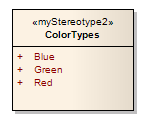
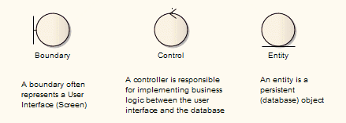

## [Стереотипы UML  UML Stereotypes ](https://sparxsystems.com/enterprise_architect_user_guide/15.1/model_domains/stereotypedlg.html)

The UML supports stereotypes, which are an inbuilt mechanism for logically extending or altering the meaning, display, characteristics or syntax of basic UML model elements. You can apply stereotypes to a range of model element types, including:

UML поддерживает стереотипы, которые представляют собой встроенный механизм для логического расширения или изменения значения, отображения, характеристик или синтаксиса основных элементов модели UML. Вы можете применять стереотипы к ряду типов элементов модели, включая:

* Elements (such as Classes and Objects)
* Relationships (such as Dependencies and Associations)
* Association Ends
* Attributes and Operations
* Operation Parameters

=

* Элементы (например, классы и объекты)
* Отношения (например, зависимости и ассоциации)
* Окончание ассоциации
* Атрибуты и операции
* Параметры работы

Different model elements have different stereotypes associated with them. You can create and use your own stereotypes in three different ways:

С разными элементами модели связаны разные стереотипы. Вы можете создавать и использовать свои собственные стереотипы тремя разными способами:

* To create a new object type based on a basic UML model element type, to be imported as part of a Profile into any model and made available for use through the Diagram Toolbox; examples of extended element types already provided in Enterprise Architect include a Table element (which is a stereotyped Class element) and Boundary, Control and Entity elements (which are stereotyped Object elements)
* To customize the appearance or property of an instance of a model element of a specific type; these stereotypes are applied only through the 'Properties' dialog of the object, within the model in which they are created, although you can transport custom stereotype definitions between models as Reference Data
* As a simple label on an element, to identify the role or nature of the object that the element represents

* Для создания нового типа объекта на основе базового типа элемента модели UML, который будет импортирован как часть профиля в любую модель и доступен для использования через панель инструментов диаграммы ; Примеры расширенных типов элементов, уже представленных в Enterprise Architect, включают элемент Table (который является стереотипным элементом Class) и элементы Boundary, Control и Entity (которые являются стереотипными элементами Object)
* Чтобы настроить внешний вид или свойство экземпляра элемента модели определенного типа; эти стереотипы применяются только через диалоговое окно «Свойства» объекта в модели, в которой они созданы, хотя вы можете переносить пользовательские определения стереотипов между моделями как справочные данные
* Как простая метка на элементе, чтобы определить роль или природу объекта, который представляет элемент.

For further definitions of stereotypes, see the OMG UML specification (UML Superstructure Specification, v2.1.1, section 18.3.8, pp. 667-672).

Дополнительные определения стереотипов см. В спецификации OMG UML ( Спецификация надстройки UML , v2.1.1, раздел 18.3.8, стр. 667-672).

Where a stereotype does not affect appearance, it is generally indicated by name on the base UML object shape. In this example, «myStereotype2» is the stereotype name. Some of the built-in stereotypes are also represented by icons; see Stereotype Visibility.

Если стереотип не влияет на внешний вид, он обычно обозначается именем в базовой форме объекта UML. В этом примере «myStereotype2» - это название стереотипа. Некоторые из встроенных стереотипов также представлены значками; см. Видимость стереотипов .

Where the stereotype causes the element to be drawn differently or is used to define a new type of object, the element shape can be quite different, as illustrated by the three Robustness diagram stereotypes:

В тех случаях, когда стереотип приводит к тому, что элемент отображается по-другому или используется для определения нового типа объекта, форма элемента может быть совершенно иной, как показано на трех стереотипах диаграммы устойчивости:

You apply a new appearance or shape by associating the stereotype with either a metafile (image file) and fill, border and text colors, or a Shape Script that defines the shape, dimensions and text of the object.

Вы применяете новый внешний вид или форму, связывая стереотип либо с метафайлом (файлом изображения) и цветами заливки, границы и текста, либо со сценарием формы, который определяет форму, размеры и текст объекта.

* [Apply Stereotypes](https://sparxsystems.com/enterprise_architect_user_guide/15.1/model_domains/applying_stereotypes.html)
* [Stereotype Selector](https://sparxsystems.com/enterprise_architect_user_guide/15.1/model_domains/stereotype_picker.html)
* [Stereotype Visibility](https://sparxsystems.com/enterprise_architect_user_guide/15.1/model_domains/stereotype_visibility.html)
* [Standard Stereotypes](https://sparxsystems.com/enterprise_architect_user_guide/15.1/model_domains/standardelementstereotypes_2.html)
* [Custom Stereotypes](https://sparxsystems.com/enterprise_architect_user_guide/15.1/model_domains/creatingcustomstereotypes.html)
* [Stereotypes with Alternative Images](https://sparxsystems.com/enterprise_architect_user_guide/15.1/model_domains/stereotypeswithalternateima.html)
* [MDG Technology SDK](https://sparxsystems.com/enterprise_architect_user_guide/15.1/modeling/introduction_2.html)
* [Add Stereotypes and Metaclasses](https://sparxsystems.com/enterprise_architect_user_guide/15.1/modeling/addingelementsandmetaclass.html) (in an MDG Technology Profile)
* [Shape Scripts](https://sparxsystems.com/enterprise_architect_user_guide/15.1/modeling/shape_editor_2.html)

Выучить больше
* Применяйте стереотипы
* Селектор стереотипов
* Видимость стереотипов
* Стандартные стереотипы
* Собственные стереотипы
* Стереотипы с альтернативными образами
* SDK технологии ЦРТ
* Добавить стереотипы и метаклассы (в профиль технологии ЦРТ)
* Сценарии фигур

