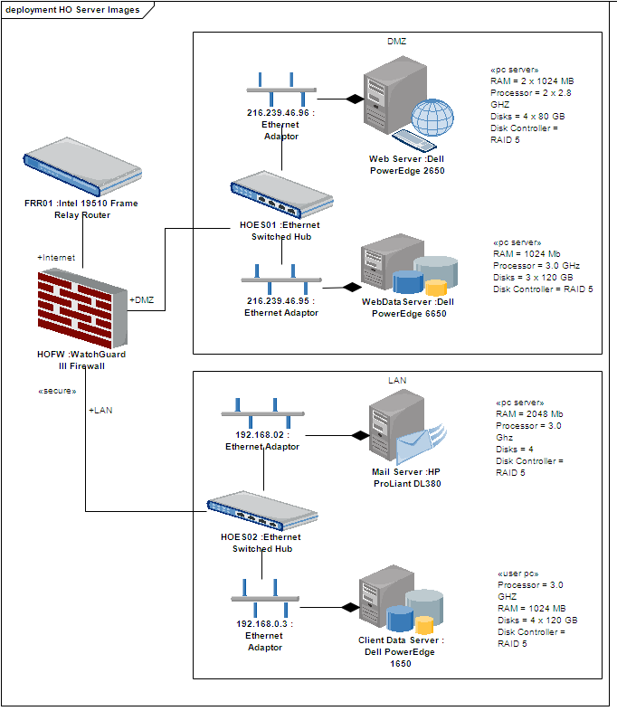

### [Stereotypes with Alternative Images](https://sparxsystems.com/enterprise_architect_user_guide/15.1/model_domains/stereotypeswithalternateima.html) Стереотипы с альтернативными образами
If you want to represent an element using an image (for example, depict a hardware component using a 3-D box, or even using an image of the unit itself), you can do so using a stereotype that has been associated with a metafile. When the stereotype is applied to a Class or other element that supports alternative graphical format, the element is drawn using the image instead of the standard UML shape. For example, in this Deployment diagram, the Component elements all have alternative images.

Если вы хотите представить элемент с помощью изображения (например, изобразить аппаратный компонент с помощью трехмерного блока или даже с использованием изображения самого устройства), вы можете сделать это, используя стереотип, связанный с метафайлом. , Когда стереотип применяется к классу или другому элементу, который поддерживает альтернативный графический формат, элемент рисуется с использованием изображения вместо стандартной формы UML. Например, на этой диаграмме развертывания все элементы Component имеют альтернативные изображения.

Notes
* You cannot change the representation of elements that include Lifelines, such as those in Sequence diagrams; the standard representation is important in the use and function of those elements

Ноты
* Вы не можете изменить представление элементов, которые включают линии жизни, например, в диаграммах последовательности; стандартное представление важно для использования и функции этих элементов

Learn more
* <a href="https://sparxsystems.com/enterprise_architect_user_guide/15.1/model_domains/creatingcustomstereotypes.html" target="_blank">Custom Stereotypes</a>

