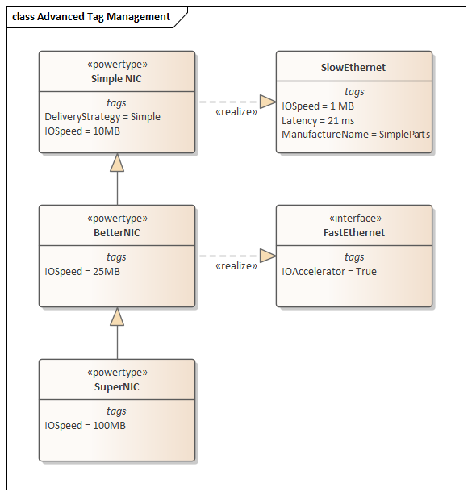
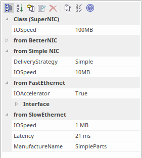

### [Advanced Tag Management](https://sparxsystems.com/enterprise_architect_user_guide/15.1/modeling/advancedtagmanagement.html) Расширенное управление тегами

Tagged Values can also be managed within a type hierarchy and with respect to element instances, using the 'Tags' tab of the Properties window. It is possible to:

* View Tagged Values inherited from parent Classes or realized interfaces or applied stereotypes
* Override Tagged Values derived from parents or applied stereotypes with a unique value for the current element
* Delete Tagged Values from the current element (if a parent version of the Tagged Value exists, it re-appears in the list after the override is deleted)

Помеченными значениями также можно управлять в иерархии типов и по отношению к экземплярам элементов, используя вкладку «Теги» в окне «Свойства» . Есть возможность:

* Просмотр значений с тегами, унаследованных от родительских классов, реализованных интерфейсов или применяемых стереотипов
* Заменить отмеченные значения, полученные от родителей или примененных стереотипов, уникальным значением для текущего элемента
* Удалить значения с тегами из текущего элемента (если существует родительская версия значения с тегами, она снова появляется в списке после удаления переопределения)

For a reference Tagged Value (of type RefGUID), it is also possible to locate and select the object that the Tagged Value refers to, in the Browser window. Simply right-click on the Tagged Value name in the 'Tags' tab and select the 'Find in Project Browser' option.

Для справочного значения с тегами (типа RefGUID) также можно найти и выбрать объект, на который ссылается значение с тегами, в окне браузера . Просто щелкните правой кнопкой мыши имя значения с тегами на вкладке «Теги» и выберите параметр «Найти в браузере проекта».

Tag Hierarchy

This diagram illustrates a complex tag hierarchy and the way Tagged Values can be either inherited or overridden in specialized Classes to create the final tagged property set for an element. A similar concept applies to instances, where the full tag set is created from the directly owned tags, plus all of those merged in from the classifier's type hierarchy, additional stereotypes and realized interfaces.

Иерархия тегов

Эта диаграмма иллюстрирует сложную иерархию тегов и способ наследования или переопределения значений с тегами в специализированных классах для создания окончательного набора свойств с тегами для элемента. Аналогичная концепция применяется к экземплярам, ​​где полный набор тегов создается из тегов, принадлежащих непосредственно, плюс все те, которые объединены из иерархии типов классификатора, дополнительных стереотипов и реализованных интерфейсов.

Learn more
* <a href="https://sparxsystems.com/enterprise_architect_user_guide/15.1/modeling/thetaggedvaluestab.html" target="_blank">Tagged Values</a>

