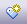

### [Assign a Tagged Value to an Item](https://sparxsystems.com/enterprise_architect_user_guide/15.1/modeling/assigningdefinedtaggedvalue.html) Присвойте элементу значение с тегом

You can assign Tagged Values to a range of model objects, including elements, object instances, connectors, attributes and operations, using the 'Tags' tab of the Properties window. You would probably have the window open already as a docked window, and any object you select becomes the focus of the window; you can then review and add or delete Tagged Values for that object.

Вы можете назначить значения с тегами ряду объектов модели, включая элементы, экземпляры объектов, соединители, атрибуты и операции, с помощью вкладки «Теги» в окне «Свойства» . Вы, вероятно, уже открыли бы окно как закрепленное окно, и любой выбранный вами объект становится фокусом окна; затем вы можете просмотреть и добавить или удалить значения с тегами для этого объекта.

Access

| Ribbon | Start &gt; Desktop &gt; Design &gt; Properties &gt; TagsDesign &gt; Element &gt; Editors &gt; Tagged Values |
|--------|------------------------------------------|

| лента | Пуск&gt; Рабочий стол&gt; Дизайн&gt; Свойства&gt; ТегиДизайн&gt; Элемент&gt; Редакторы&gt; Значения с тегами |
|-------|------------------------------------------|

Assign a Tagged Value to an item

| Step                                     | Action                                   | See also |
|------------------------------------------|------------------------------------------|----------|
|  			
 				1 			
 		 |  			
Select the model feature to which to assign a Tagged Value. This feature becomes the focus of the window.
 		 |  		   |
|  			
 				2 			
 		 |  			
In the 'Tags' tab of the Properties window, either click on the  icon or press Ctrl+N.
 			
The 'Tagged Value' dialog displays.
 		 |  		   |
|  			
 				3 			
 		 |  			
In the 'Tag' field type the tag name, or click on the drop-down arrow and select the appropriate tag to assign to the item. The list of tags to select from is filtered by the Perspective that is currently set for the model.
 		 |  		   |
|  			
 				4 			
 		 |  			
If appropriate, type a specific value for the tag in the 'Value' field.
 		 |  		   |
|  			
 				5 			
 		 |  			
To confirm selection of the Tagged Value, click on the OK button.
 		 |  		   |

Присвойте элементу значение с тегом

| шаг                                      | действие                                 | Смотрите также |
|------------------------------------------|------------------------------------------|----------------|
|  			
 				1 			
 		 |  			
Выберите элемент модели, которому нужно присвоить значение с тегом. Эта функция становится фокусом окна.
 		 |  		         |
|  			
 				2 			
 		 |  			
На вкладке «Теги» в окне свойств , либо нажмите на значок или нажмите Ctrl + N .
 			
Откроется диалоговое окно «Tagged Value».
 		 |  		         |
|  			
 				3 			
 		 |  			
В поле «Тег» введите имя тега или щелкните стрелку раскрывающегося списка и выберите соответствующий тег, который нужно назначить элементу. Список тегов для выбора фильтруется по Перспективе, которая в настоящее время установлена ​​для модели.
 		 |  		         |
|  			
 				4 			
 		 |  			
При необходимости введите конкретное значение для тега в поле «Значение».
 		 |  		         |
|  			
 				5 			
 		 |  			
Чтобы подтвердить выбор значения с тегами, нажмите кнопку ОК .
 		 |  		         |

Learn more
* [Quick Start - Add Tagged Value to Elements](https://sparxsystems.com/enterprise_architect_user_guide/15.1/modeling/addtaggedvalues.html)
* [Predefined Tagged Value Types](https://sparxsystems.com/enterprise_architect_user_guide/15.1/modeling/tagged_value_types.html)
* [Assign Notes to a Tagged Value](https://sparxsystems.com/enterprise_architect_user_guide/15.1/modeling/assigninginformationtoatag.html)
* [Modify Tagged Values](https://sparxsystems.com/enterprise_architect_user_guide/15.1/modeling/modify_tagged_values.html)
* [Model Elements and Features with Tagged Values](https://sparxsystems.com/enterprise_architect_user_guide/15.1/modeling/thetaggedvaluestab.html)

Выучить больше
* Быстрый старт - добавление значений с тегами к элементам
* Предопределенные типы значений с тегами
* Назначьте примечания к значению с тегом
* Изменить значения с тегами
* Элементы и функции модели с помеченными значениями

