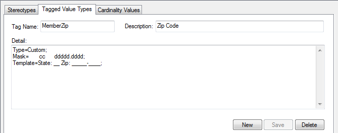

### [Create Custom Masked Tagged Value Type](https://sparxsystems.com/enterprise_architect_user_guide/15.1/modeling/creatingacustomtaggedvalue.html) Создать настраиваемый тип значения с тегами с маской

If you are creating a custom predefined Tagged Value type, you can achieve great flexibility in designing model components to accept data entries, by defining a mask that formats the data into a template.

Если вы создаете пользовательский предопределенный тип значения с тегами, вы можете добиться большой гибкости в разработке компонентов модели для приема записей данных, задав маску, которая форматирует данные в шаблон.

Access

| Ribbon | Configure &gt; Reference Data &gt; UML Types &gt; Tagged Value Types |
|--------|------------------------------------------|

| лента | Настроить&gt; Справочные данные&gt; Типы UML&gt; Типы значений с тегами |
|-------|------------------------------------------|

Create a masked Tagged Value Type

| Field                                    | Action                                   | See also |
|------------------------------------------|------------------------------------------|----------|
|  			
 				Tag Name 			
 		 |  			
Type an appropriate name for the masked Tagged Value Type.
 		 |  		   |
|  			
 				Description 			
 		 |  			
Optionally, type a description or the purpose of the Tagged Value Type.
 		 |  		   |
|  			
 				Detail 			
 		 |  			
Type or copy-and-paste the Tagged Value structure:
 			
Type=Custom;
 			
Mask=&lt;mask values&gt;;
 			
Template=&lt;template text&gt;;
 			
The mask values are explained in the next table, with an example to demonstrate how to use the template.
 			
The template text defines information to be displayed in every use of this custom Tagged Value, such as field names and prompts for data.
 		 |  		   |
|  			
 				Save 			
 		 |  			
Click on this button to save the new masked Tagged Value type. 
 			
The Tagged Value type displays in the Defined Tag Types list.
 		 |  		   |
|  			
 				New 			
 		 |  			
Optionally, click on this button to clear the fields so that you can enter information for another new Tagged Value type.
 		 |  		   |

| поле                                     | действие                                 | Смотрите также |
|------------------------------------------|------------------------------------------|----------------|
|  			
 				Название тэга 			
 		 |  			
Введите соответствующее имя для замаскированного типа значения с тегами .
 		 |  		         |
|  			
 				Описание 			
 		 |  			
При желании введите описание или назначение типа значения с тегами .
 		 |  		         |
|  			
 				подробность 			
 		 |  			
Введите или скопируйте и вставьте структуру Tagged Value:
 			
Тип = Пользовательские;
 			
Маска = &lt;значения маски&gt;;
 			
Шаблон = &lt;текст шаблона&gt;;
 			
Значения масок объяснены в следующей таблице с примером, демонстрирующим, как использовать шаблон.
 			
Текст шаблона определяет информацию, которая будет отображаться при каждом использовании этого настраиваемого значения тега, например имена полей и запросы данных.
 		 |  		         |
|  			
 				Сохранить 			
 		 |  			
Нажмите эту кнопку, чтобы сохранить новый тип значения с тегами в маске. 
 			
Тип Tagged Value отображается в списке Defined Tag Types.
 		 |  		         |
|  			
 				новый 			
 		 |  			
При желании нажмите эту кнопку, чтобы очистить поля, чтобы можно было ввести информацию для другого нового типа Tagged Value.
 		 |  		         |

Mask Values

When defining the format of the mask in a masked Tagged Value type, use these characters:

| Mask                                     | Action                                   |
|------------------------------------------|------------------------------------------|
|  			
 				D 			
 		 |  			
Display a digit only in this character space.
 		 |
|  			
 				d 			
 		 |  			
Display a digit or space only in this character space.
 		 |
|  			
 				+ 			
 		 |  			
Display +, - or a space in this character space.
 		 |
|  			
 				C 			
 		 |  			
Display a letter of the alphabet only in this character space.
 		 |
|  			
 				c 			
 		 |  			
Display a letter of the alphabet or a space only in this character space.
 		 |
|  			
 				A 			
 		 |  			
Display any alphanumeric character in this character space.
 		 |
|  			
 				a 			
 		 |  			
Display any alphanumeric character or a space in this character space.
 		 |
|  			
 				. or <space></space> 			
 		 |  			
Leave a character space, to be filled by text from the Template parameter. Using dots might make it easier to see how many spaces you have set.
 		 |

Значения маски

При определении формата маски в типе замаскированного значения тега используйте следующие символы:

| маскировать                              | действие                                 |
|------------------------------------------|------------------------------------------|
|  			
 				D 			
 		 |  			
Отображать цифру только в этом символьном пространстве.
 		 |
|  			
 				d 			
 		 |  			
Отображать цифру или пробел только в этом символьном пространстве.
 		 |
|  			
 				+ 			
 		 |  			
Отобразите +, - или пробел в этом символе.
 		 |
|  			
 				С 			
 		 |  			
Отображать букву алфавита только в этом пространстве символов.
 		 |
|  			
 				с 			
 		 |  			
Отображать букву алфавита или пробел только в этом символьном пространстве.
 		 |
|  			
 				A 			
 		 |  			
Отобразите любой буквенно-цифровой символ в этом символьном пространстве.
 		 |
|  			
 				a 			
 		 |  			
Отобразите любой буквенно-цифровой символ или пробел в этом символьном пространстве.
 		 |
|  			
 				, или<space></space> 			
 		 |  			
Оставьте пробел, который будет заполнен текстом из параметра Template. Использование точек может помочь увидеть, сколько пробелов вы установили.
 		 |

Example

In the diagram, the Mask parameter first defines seven blank spaces, which are occupied by characters defined by the Template parameter.

На схеме параметр Mask сначала определяет семь пробелов, которые занимают символы, определенные параметром Template.

The first two visible characters in the Mask are each represented by a lower case c, indicating that the user can enter information as either an alphabetic character or a space.

Первые два видимых символа в маске представлены строчными буквами c, что указывает на то, что пользователь может вводить информацию в виде буквенного символа или пробела.

The next six blank spaces again indicate characters defined by the Template, followed by five characters each represented by a d, which indicates that the user can input data in the form of digits or spaces. The dot marks a space to be filled by a hyphen from the Template, followed by four more ds (digits or spaces).

Следующие шесть пробелов снова обозначают символы, определенные шаблоном, за которыми следуют пять символов, каждый из которых представлен рекламой, что указывает на то, что пользователь может вводить данные в виде цифр или пробелов. Точка обозначает пробел, который необходимо заполнить дефисом из Шаблона, за которым следуют еще четыре ds (цифры или пробелы).

The Template syntax defines the template for the Mask parameter, filling in the blank spaces in the Mask. The text is the information to be printed with every use of this Tagged Value; the underscored values indicate the character spaces that are to be occupied by data input by the user, as defined in the 'Mask' option.

Синтаксис шаблона определяет шаблон для параметра маски, заполняя пустые места в маске. Текст - это информация, которая должна печататься при каждом использовании этого значения тега; подчеркнутые значения указывают пробелы между символами, которые должны быть заняты данными, вводимыми пользователем, как определено в опции «Маска».

