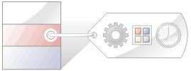
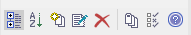

## [Tagged Values](https://sparxsystems.com/enterprise_architect_user_guide/15.1/modeling/thetaggedvaluestab.html)

Tagged Values are additional properties that can be assigned to UML elements and connectors. The UML defines properties such as name and description for elements and connectors, and Enterprise Architect adds a number of additional properties such as status, phase and author, but Tagged Values provide a means of defining your own properties (tags) and their values.

Значения с тегами - это дополнительные свойства, которые можно назначать элементам и соединителям UML. UML определяет такие свойства, как имя и описание для элементов и соединителей, а Enterprise Architect добавляет ряд дополнительных свойств, таких как статус, фаза и автор, но значения с тегами предоставляют средства для определения ваших собственных свойств (тегов) и их значений.

For example, a requirements modeler might want to record the owner of a set of requirements. The UML doesn’t specify this property, but it can be easily added as a tag. A tag named Requirement Owner could be created and then each Requirement element could be assigned a value for the owner. This information would also be available in documentation.

Например, разработчик моделей требований может захотеть записать владельца набора требований. В UML это свойство не указано, но его можно легко добавить как тег. Можно создать тег с именем «Владелец требования», а затем каждому элементу требования можно присвоить значение для владельца. Эта информация также будет доступна в документации.

Enterprise Architect has enriched the basic concept of Tagged Values with its powerful structured Tagged Value facility. To assist you when entering data, the values can be restricted using user interface controls such as drop down lists, spin controls, date selectors and many more.

Enterprise Architect обогатил базовую концепцию Tagged Values ​​своим мощным структурированным средством Tagged Value. Чтобы помочь вам при вводе данных, значения можно ограничить с помощью элементов управления пользовательского интерфейса, таких как раскрывающиеся списки, элементы управления прокруткой, селекторы даты и многое другое.

Tagged Values are widely used in profiles and technologies to add information that helps guide the presentation of elements or metadata for code or schema generation.

Значения с тегами широко используются в профилях и технологиях для добавления информации, которая помогает направлять представление элементов или метаданных для создания кода или схемы.

The Tagged Values tab

-- Вкладка Tagged Values

The 'Properties' dialog and Properties window both have 'Tag' tabs that you can use to view and modify Tagged Values for a modeling item selected either from the current diagram or in the Browser window. On the tab you can:

* Assign a Tagged Value to an Item
* Modify Tagged Values
* Assign Notes to a Tagged Value
* Perform advanced tag management

В диалоговом окне «Свойства» и в окне «Свойства» есть вкладки «Тег», которые можно использовать для просмотра и изменения значений с тегами для элемента моделирования, выбранного на текущей диаграмме или в окне браузера . На вкладке вы можете:

* Присвойте элементу значение с тегом
* Изменить значения с тегами
* Назначьте примечания к значению с тегом
* Выполните расширенное управление тегами

Note that Tagged Values from stereotypes are not displayed on the 'Tags' tab, but in the:

* Properties window, in a section of the main page underneath the 'General' page and
* 'Properties' dialog, on a separate \<extension name\> tab

Обратите внимание, что значения тегов из стереотипов отображаются не на вкладке «Теги», а в:

* Окно свойств в разделе главной страницы под страницей "Общие" и
* Диалог "Свойства" на отдельной вкладке \<extension name\>

Model Elements and Features with Tagged Values

These model components can use the 'Tagged Values' tab as a convenient way to quickly view and modify Tagged Values:

* Elements - display their own tags, along with any inherited values
* Object Instances - display their own tags and those obtained from their classifier
* Ports and Parts - display similar information to objects but show the Port/Part 'Type' instead of a classifier; tags are included for all parents and other structures of the Ports type
* Attributes - display their own tags and those received from attribute type classifiers, with the inclusion of any inherited tags
* Operations - display their own tags
* Connectors - display their own tags

-- Элементы и функции модели с помеченными значениями

Эти компоненты модели могут использовать вкладку «Значения с тегами» как удобный способ быстрого просмотра и изменения значений с тегами:

* Элементы - отображать собственные теги вместе с любыми унаследованными значениями.
* Экземпляры объектов - отображать собственные теги и теги, полученные из их классификатора
* Порты и детали - отображать информацию, аналогичную объектам, но отображать «Тип» порта / детали вместо классификатора; теги включены для всех родителей и других структур типа Порты
* Атрибуты - отображать собственные теги и теги, полученные от классификаторов типов атрибутов, с включением любых унаследованных тегов
* Операции - отображать собственные теги
* Коннекторы - отображать собственные теги

When over-riding an inherited property, the system copies the tag from the parent down to the child element and sets the new value, leaving the original tag unchanged.

При переопределении унаследованного свойства система копирует тег из родительского в дочерний элемент и устанавливает новое значение, оставляя исходный тег неизменным.

Tagged Values Toolbar Buttons

Using the buttons from the toolbar at the top of the 'Tags' tab in the Properties window or dialog, you can add, edit, sort, delete and rearrange the Tagged Values of model features.

-- Кнопки панели инструментов значений с тегами

Используя кнопки на панели инструментов в верхней части вкладки «Теги» в окне или диалоговом окне «Свойства », вы можете добавлять, редактировать, сортировать, удалять и переупорядочивать значения с тегами для элементов модели.

From left to right, the button functions are:

* Show in compartments - displays the Tagged Values in element compartments on diagrams
* Sort and Show Alphabetically - sorts the current Tagged Values alphabetically for the element
* New Tagged Value - adds a new tag, to which you assign a value
* Edit Tagged Value Notes - opens a note in which you type an explanation of the purpose of the Tagged Value
* Delete Tagged Value - removes the currently selected Tagged Value
* Default Tagged Value Types - provides quick access to tag definitions created using the 'Configure > Reference Data > UML Types > Tagged Value Types' ribbon option
* Tagged Value Options - provides options to show or hide the fully qualified paths for the Tagged Values in the window, and to show duplicate Tagged Values
* Help - displays information on the use of Tagged Values

Слева направо функции кнопок:

* Показать в отсеках - отображает значения с тегами в отсеках элементов на диаграммах.
* Сортировка и отображение по алфавиту - сортировка текущих значений с тегами для элемента по алфавиту.
* New Tagged Value - добавляет новый тег, которому вы присваиваете значение.
* Изменить примечания к помеченным значениям - открывает примечание, в котором вы вводите объяснение цели помеченного значения.
* Удалить значение с тегом - удаляет текущее выбранное значение с тегом.
* Типы значений с тегами по умолчанию - обеспечивает быстрый доступ к определениям тегов, созданным с помощью параметра ленты «Настроить> Справочные данные> Типы UML> Типы значений с тегами».
* Параметры значений с тегами - предоставляет параметры для отображения или скрытия полных путей для значений с тегами в окне и для отображения повторяющихся значений с тегами.
* Справка - отображает информацию об использовании значений с тегами.

Learn more
* Tagged Value Type
* Quick Start - Add Tagged Value to Elements
* Assign a Tagged Value to an Item
* Modify Tagged Values
* Assign Notes to a Tagged Value
* Perform Advanced Tag Management
* Custom Tagged Values
* Tagged Value Types

Выучить больше
* [Тип помеченного значения](https://sparxsystems.com/enterprise_architect_user_guide/15.1/model_repository/propertytypes.html)
* [Быстрый старт - добавление значений с тегами к элементам](https://sparxsystems.com/enterprise_architect_user_guide/15.1/modeling/addtaggedvalues.html)
* [Присвойте элементу значение с тегом](https://sparxsystems.com/enterprise_architect_user_guide/15.1/modeling/assigningdefinedtaggedvalue.html)
* [Изменить значения с тегами](https://sparxsystems.com/enterprise_architect_user_guide/15.1/modeling/modify_tagged_values.html)
* [Назначьте примечания к значению с тегом](https://sparxsystems.com/enterprise_architect_user_guide/15.1/modeling/assigninginformationtoatag.html)
* [Выполните расширенное управление тегами](https://sparxsystems.com/enterprise_architect_user_guide/15.1/modeling/advancedtagmanagement.html)
* [Пользовательские значения тегов](https://sparxsystems.com/enterprise_architect_user_guide/15.1/modeling/creatingacustomtaggedvalue.html)
* [Типы помеченных значений](https://sparxsystems.com/enterprise_architect_user_guide/15.1/modeling/tagged_value_types.html)

