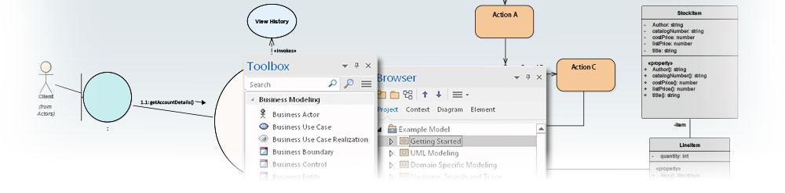

## [моделирование](https://sparxsystems.com/enterprise_architect_user_guide/15.1/modeling/uml.html)

Моделирование - это практика построения графического представления чего-то реального с целью изучения, документирования, рассуждений, тестирования или передачи этого другим. Полученные в результате модели можно сравнить с машинами, которые действительно работают, и часто дают мощное понимание того, как вещи в реальном мире структурированы или ведут себя. Enterprise Architect обычно используется для моделирования сложных корпоративных, бизнес-инженерных систем, систем реального времени и программных систем и представляет собой междисциплинарную платформу, которая помогает группам людей работать вместе для описания, визуализации, построения и тестирования сложных систем с помощью моделирования. , Платформа моделирования Enterprise Architect основана на унифицированном языке моделирования (UML),

-- Особенности моделирования

| Характерная черта                        | Описание                                 |
|------------------------------------------|------------------------------------------|
| 
модели
<a href="https://sparxsystems.com/enterprise_architect_user_guide/15.1/modeling/models.html" style="box-sizing: border-box; text-decoration: none; cursor: url(&quot;data:image/png;base64,iVBORw0KGgoAAAANSUhEUgAAABAAAAAQCAYAAAAf8/9hAAABaUlEQVQ4T2NkwAZY1f9DhP+lM/y+PQurGqggI6akisytj+ceg8TVREwZGH7fxKIGoQtTkk1F69brc1cpMEBV89brs9eoaMB/TQaGWzcYGKS4GBiefUP3MhYvqGncen3mOrJCZ5NAhr1n1jPs3LKbITc6H2jQk+8weaIMgCn++OEDw+H9xxmERAQZEgJyDjP8uWXHyMCqdiU+PVJ74cwVkBBnV1e/9eo00MmY4M+fPwwvX7wASzgaBILVAw1Q/3/rzWmwIDjamBg0cBkAUvP0yRPcBoBkvG3CGbYeWYk17fz5/Zvh5cuXaAaAuEiuwJfq3rx5w/Dzxw8sBhBpCMz5qGGAbCUel/z69Yvh9atXcNWOBgEXGH7fMsSMRqAh+y+sZ+AXEGDg4eEBa3j29CnD///Q/AXkBzjEM3x8fRqsF3tGYVF7Ud1eJO7iZYcRJPGBuQyPbl0BmvzyK24DYNpY1X+BghjFFLTcCQDviqMRO9+fjwAAAABJRU5ErkJggg==&quot;) 14 0, auto !important; color: rgb(0, 102, 221); outline: none; line-height: normal; margin: 0px; padding: 10px 0px;"></a> | 
Модели - это высший уровень проекта Enterprise Architect. В проекте может быть одна или несколько моделей.
 |
| 
Просмотры
<a href="https://sparxsystems.com/enterprise_architect_user_guide/15.1/modeling/manageviews.html" style="box-sizing: border-box; text-decoration: none; cursor: url(&quot;data:image/png;base64,iVBORw0KGgoAAAANSUhEUgAAABAAAAAQCAYAAAAf8/9hAAABaUlEQVQ4T2NkwAZY1f9DhP+lM/y+PQurGqggI6akisytj+ceg8TVREwZGH7fxKIGoQtTkk1F69brc1cpMEBV89brs9eoaMB/TQaGWzcYGKS4GBiefUP3MhYvqGncen3mOrJCZ5NAhr1n1jPs3LKbITc6H2jQk+8weaIMgCn++OEDw+H9xxmERAQZEgJyDjP8uWXHyMCqdiU+PVJ74cwVkBBnV1e/9eo00MmY4M+fPwwvX7wASzgaBILVAw1Q/3/rzWmwIDjamBg0cBkAUvP0yRPcBoBkvG3CGbYeWYk17fz5/Zvh5cuXaAaAuEiuwJfq3rx5w/Dzxw8sBhBpCMz5qGGAbCUel/z69Yvh9atXcNWOBgEXGH7fMsSMRqAh+y+sZ+AXEGDg4eEBa3j29CnD///Q/AXkBzjEM3x8fRqsF3tGYVF7Ud1eJO7iZYcRJPGBuQyPbl0BmvzyK24DYNpY1X+BghjFFLTcCQDviqMRO9+fjwAAAABJRU5ErkJggg==&quot;) 14 0, auto !important; color: rgb(0, 102, 221); outline: none; line-height: normal; margin: 0px; padding: 10px 0px;"></a> | 
Представления предоставляют уникальные окна и диалоги для изучения взаимосвязей элементов в вашей модели.
 |
| 
пакеты
<a href="https://sparxsystems.com/enterprise_architect_user_guide/15.1/modeling/packagetasks.html" style="box-sizing: border-box; text-decoration: none; cursor: url(&quot;data:image/png;base64,iVBORw0KGgoAAAANSUhEUgAAABAAAAAQCAYAAAAf8/9hAAABaUlEQVQ4T2NkwAZY1f9DhP+lM/y+PQurGqggI6akisytj+ceg8TVREwZGH7fxKIGoQtTkk1F69brc1cpMEBV89brs9eoaMB/TQaGWzcYGKS4GBiefUP3MhYvqGncen3mOrJCZ5NAhr1n1jPs3LKbITc6H2jQk+8weaIMgCn++OEDw+H9xxmERAQZEgJyDjP8uWXHyMCqdiU+PVJ74cwVkBBnV1e/9eo00MmY4M+fPwwvX7wASzgaBILVAw1Q/3/rzWmwIDjamBg0cBkAUvP0yRPcBoBkvG3CGbYeWYk17fz5/Zvh5cuXaAaAuEiuwJfq3rx5w/Dzxw8sBhBpCMz5qGGAbCUel/z69Yvh9atXcNWOBgEXGH7fMsSMRqAh+y+sZ+AXEGDg4eEBa3j29CnD///Q/AXkBzjEM3x8fRqsF3tGYVF7Ud1eJO7iZYcRJPGBuQyPbl0BmvzyK24DYNpY1X+BghjFFLTcCQDviqMRO9+fjwAAAABJRU5ErkJggg==&quot;) 14 0, auto !important; color: rgb(0, 102, 221); outline: none; line-height: normal; margin: 0px; padding: 10px 0px;"></a> | 
Пакеты - это контейнеры для ваших элементов и ваших диаграмм. Их содержимое можно просматривать разными способами в зависимости от ваших потребностей.
 |
| 
Диаграммы
<a href="https://sparxsystems.com/enterprise_architect_user_guide/15.1/modeling/umldiagram.html" style="box-sizing: border-box; text-decoration: none; cursor: url(&quot;data:image/png;base64,iVBORw0KGgoAAAANSUhEUgAAABAAAAAQCAYAAAAf8/9hAAABaUlEQVQ4T2NkwAZY1f9DhP+lM/y+PQurGqggI6akisytj+ceg8TVREwZGH7fxKIGoQtTkk1F69brc1cpMEBV89brs9eoaMB/TQaGWzcYGKS4GBiefUP3MhYvqGncen3mOrJCZ5NAhr1n1jPs3LKbITc6H2jQk+8weaIMgCn++OEDw+H9xxmERAQZEgJyDjP8uWXHyMCqdiU+PVJ74cwVkBBnV1e/9eo00MmY4M+fPwwvX7wASzgaBILVAw1Q/3/rzWmwIDjamBg0cBkAUvP0yRPcBoBkvG3CGbYeWYk17fz5/Zvh5cuXaAaAuEiuwJfq3rx5w/Dzxw8sBhBpCMz5qGGAbCUel/z69Yvh9atXcNWOBgEXGH7fMsSMRqAh+y+sZ+AXEGDg4eEBa3j29CnD///Q/AXkBzjEM3x8fRqsF3tGYVF7Ud1eJO7iZYcRJPGBuQyPbl0BmvzyK24DYNpY1X+BghjFFLTcCQDviqMRO9+fjwAAAABJRU5ErkJggg==&quot;) 14 0, auto !important; color: rgb(0, 102, 221); outline: none; line-height: normal; margin: 0px; padding: 10px 0px;"></a> | 
Диаграммы используются для визуального определения конкретных отношений между выбранным количеством элементов.
 |
| 
элементы
<a href="https://sparxsystems.com/enterprise_architect_user_guide/15.1/modeling/workingwithumlelements.html" style="box-sizing: border-box; text-decoration: none; cursor: url(&quot;data:image/png;base64,iVBORw0KGgoAAAANSUhEUgAAABAAAAAQCAYAAAAf8/9hAAABaUlEQVQ4T2NkwAZY1f9DhP+lM/y+PQurGqggI6akisytj+ceg8TVREwZGH7fxKIGoQtTkk1F69brc1cpMEBV89brs9eoaMB/TQaGWzcYGKS4GBiefUP3MhYvqGncen3mOrJCZ5NAhr1n1jPs3LKbITc6H2jQk+8weaIMgCn++OEDw+H9xxmERAQZEgJyDjP8uWXHyMCqdiU+PVJ74cwVkBBnV1e/9eo00MmY4M+fPwwvX7wASzgaBILVAw1Q/3/rzWmwIDjamBg0cBkAUvP0yRPcBoBkvG3CGbYeWYk17fz5/Zvh5cuXaAaAuEiuwJfq3rx5w/Dzxw8sBhBpCMz5qGGAbCUel/z69Yvh9atXcNWOBgEXGH7fMsSMRqAh+y+sZ+AXEGDg4eEBa3j29CnD///Q/AXkBzjEM3x8fRqsF3tGYVF7Ud1eJO7iZYcRJPGBuQyPbl0BmvzyK24DYNpY1X+BghjFFLTcCQDviqMRO9+fjwAAAABJRU5ErkJggg==&quot;) 14 0, auto !important; color: rgb(0, 102, 221); outline: none; line-height: normal; margin: 0px; padding: 10px 0px;"></a> | 
Элементы - это строительные блоки вашей модели; создавать и повторно использовать элементы для построения ваших систем.
 |
| 
Соединители
<a href="https://sparxsystems.com/enterprise_architect_user_guide/15.1/modeling/workingwithumlconnections.html" style="box-sizing: border-box; text-decoration: none; cursor: url(&quot;data:image/png;base64,iVBORw0KGgoAAAANSUhEUgAAABAAAAAQCAYAAAAf8/9hAAABaUlEQVQ4T2NkwAZY1f9DhP+lM/y+PQurGqggI6akisytj+ceg8TVREwZGH7fxKIGoQtTkk1F69brc1cpMEBV89brs9eoaMB/TQaGWzcYGKS4GBiefUP3MhYvqGncen3mOrJCZ5NAhr1n1jPs3LKbITc6H2jQk+8weaIMgCn++OEDw+H9xxmERAQZEgJyDjP8uWXHyMCqdiU+PVJ74cwVkBBnV1e/9eo00MmY4M+fPwwvX7wASzgaBILVAw1Q/3/rzWmwIDjamBg0cBkAUvP0yRPcBoBkvG3CGbYeWYk17fz5/Zvh5cuXaAaAuEiuwJfq3rx5w/Dzxw8sBhBpCMz5qGGAbCUel/z69Yvh9atXcNWOBgEXGH7fMsSMRqAh+y+sZ+AXEGDg4eEBa3j29CnD///Q/AXkBzjEM3x8fRqsF3tGYVF7Ud1eJO7iZYcRJPGBuQyPbl0BmvzyK24DYNpY1X+BghjFFLTcCQDviqMRO9+fjwAAAABJRU5ErkJggg==&quot;) 14 0, auto !important; color: rgb(0, 102, 221); outline: none; line-height: normal; margin: 0px; padding: 10px 0px;"></a> | 
Соединители определяют отношения между вашими элементами.
 |
| 
Помеченные значения
<a href="https://sparxsystems.com/enterprise_architect_user_guide/15.1/modeling/thetaggedvaluestab.html" style="box-sizing: border-box; text-decoration: none; cursor: url(&quot;data:image/png;base64,iVBORw0KGgoAAAANSUhEUgAAABAAAAAQCAYAAAAf8/9hAAABaUlEQVQ4T2NkwAZY1f9DhP+lM/y+PQurGqggI6akisytj+ceg8TVREwZGH7fxKIGoQtTkk1F69brc1cpMEBV89brs9eoaMB/TQaGWzcYGKS4GBiefUP3MhYvqGncen3mOrJCZ5NAhr1n1jPs3LKbITc6H2jQk+8weaIMgCn++OEDw+H9xxmERAQZEgJyDjP8uWXHyMCqdiU+PVJ74cwVkBBnV1e/9eo00MmY4M+fPwwvX7wASzgaBILVAw1Q/3/rzWmwIDjamBg0cBkAUvP0yRPcBoBkvG3CGbYeWYk17fz5/Zvh5cuXaAaAuEiuwJfq3rx5w/Dzxw8sBhBpCMz5qGGAbCUel/z69Yvh9atXcNWOBgEXGH7fMsSMRqAh+y+sZ+AXEGDg4eEBa3j29CnD///Q/AXkBzjEM3x8fRqsF3tGYVF7Ud1eJO7iZYcRJPGBuQyPbl0BmvzyK24DYNpY1X+BghjFFLTcCQDviqMRO9+fjwAAAABJRU5ErkJggg==&quot;) 14 0, auto !important; color: rgb(0, 102, 221); outline: none; line-height: normal; margin: 0px; padding: 10px 0px;"></a> | 
Расширьте свойства ваших элементов по умолчанию с помощью настраиваемых значений тегов.
 |
| 
Ноты
<a href="https://sparxsystems.com/enterprise_architect_user_guide/15.1/modeling/notetab.html" style="box-sizing: border-box; text-decoration: none; cursor: url(&quot;data:image/png;base64,iVBORw0KGgoAAAANSUhEUgAAABAAAAAQCAYAAAAf8/9hAAABaUlEQVQ4T2NkwAZY1f9DhP+lM/y+PQurGqggI6akisytj+ceg8TVREwZGH7fxKIGoQtTkk1F69brc1cpMEBV89brs9eoaMB/TQaGWzcYGKS4GBiefUP3MhYvqGncen3mOrJCZ5NAhr1n1jPs3LKbITc6H2jQk+8weaIMgCn++OEDw+H9xxmERAQZEgJyDjP8uWXHyMCqdiU+PVJ74cwVkBBnV1e/9eo00MmY4M+fPwwvX7wASzgaBILVAw1Q/3/rzWmwIDjamBg0cBkAUvP0yRPcBoBkvG3CGbYeWYk17fz5/Zvh5cuXaAaAuEiuwJfq3rx5w/Dzxw8sBhBpCMz5qGGAbCUel/z69Yvh9atXcNWOBgEXGH7fMsSMRqAh+y+sZ+AXEGDg4eEBa3j29CnD///Q/AXkBzjEM3x8fRqsF3tGYVF7Ud1eJO7iZYcRJPGBuQyPbl0BmvzyK24DYNpY1X+BghjFFLTcCQDviqMRO9+fjwAAAABJRU5ErkJggg==&quot;) 14 0, auto !important; color: rgb(0, 102, 221); outline: none; line-height: normal; margin: 0px; padding: 10px 0px;"></a> | 
Предоставьте текстовое описание конкретных элементов. Заметки могут отображаться на диаграмме, в элементе или в режиме заметок.
 |
| 
Гиперссылки
 | 
Гиперссылки добавляют невероятную гибкость как к навигации по вашей модели, так и к предоставлению информации с помощью различных методов коммуникации в рамках вашего проекта. При разработке своей модели вам неизбежно придется хранить информацию и структуры в разных местах для разных целей и в разных форматах. Создание гиперссылок помогает объединить отдельные объекты и документы, где это необходимо для определения или поддержки данного контекста.
 |
| 
Шаблоны и мастера
<a href="https://sparxsystems.com/enterprise_architect_user_guide/15.1/modeling/model_wizard.html" style="box-sizing: border-box; text-decoration: none; cursor: url(&quot;data:image/png;base64,iVBORw0KGgoAAAANSUhEUgAAABAAAAAQCAYAAAAf8/9hAAABaUlEQVQ4T2NkwAZY1f9DhP+lM/y+PQurGqggI6akisytj+ceg8TVREwZGH7fxKIGoQtTkk1F69brc1cpMEBV89brs9eoaMB/TQaGWzcYGKS4GBiefUP3MhYvqGncen3mOrJCZ5NAhr1n1jPs3LKbITc6H2jQk+8weaIMgCn++OEDw+H9xxmERAQZEgJyDjP8uWXHyMCqdiU+PVJ74cwVkBBnV1e/9eo00MmY4M+fPwwvX7wASzgaBILVAw1Q/3/rzWmwIDjamBg0cBkAUvP0yRPcBoBkvG3CGbYeWYk17fz5/Zvh5cuXaAaAuEiuwJfq3rx5w/Dzxw8sBhBpCMz5qGGAbCUel/z69Yvh9atXcNWOBgEXGH7fMsSMRqAh+y+sZ+AXEGDg4eEBa3j29CnD///Q/AXkBzjEM3x8fRqsF3tGYVF7Ud1eJO7iZYcRJPGBuQyPbl0BmvzyK24DYNpY1X+BghjFFLTcCQDviqMRO9+fjwAAAABJRU5ErkJggg==&quot;) 14 0, auto !important; color: rgb(0, 102, 221); outline: none; line-height: normal; margin: 0px; padding: 10px 0px;"></a> | 
Используйте шаблоны, шаблоны и мастера для быстрого создания ваших моделей. Используйте уже существующие или создайте свои собственные!
 |
| 
автоматизация
<a href="https://sparxsystems.com/enterprise_architect_user_guide/15.1/automation/automation_interface.html" style="box-sizing: border-box; text-decoration: none; cursor: url(&quot;data:image/png;base64,iVBORw0KGgoAAAANSUhEUgAAABAAAAAQCAYAAAAf8/9hAAABaUlEQVQ4T2NkwAZY1f9DhP+lM/y+PQurGqggI6akisytj+ceg8TVREwZGH7fxKIGoQtTkk1F69brc1cpMEBV89brs9eoaMB/TQaGWzcYGKS4GBiefUP3MhYvqGncen3mOrJCZ5NAhr1n1jPs3LKbITc6H2jQk+8weaIMgCn++OEDw+H9xxmERAQZEgJyDjP8uWXHyMCqdiU+PVJ74cwVkBBnV1e/9eo00MmY4M+fPwwvX7wASzgaBILVAw1Q/3/rzWmwIDjamBg0cBkAUvP0yRPcBoBkvG3CGbYeWYk17fz5/Zvh5cuXaAaAuEiuwJfq3rx5w/Dzxw8sBhBpCMz5qGGAbCUel/z69Yvh9atXcNWOBgEXGH7fMsSMRqAh+y+sZ+AXEGDg4eEBa3j29CnD///Q/AXkBzjEM3x8fRqsF3tGYVF7Ud1eJO7iZYcRJPGBuQyPbl0BmvzyK24DYNpY1X+BghjFFLTcCQDviqMRO9+fjwAAAABJRU5ErkJggg==&quot;) 14 0, auto !important; color: rgb(0, 102, 221); outline: none; line-height: normal; margin: 0px; padding: 10px 0px;"></a> | 
Расширьте возможности Enterprise Architect для создания собственных надстроек, скриптов и функций для конкретной предметной области.
 |

-- Структурные компоненты

Используя Enterprise Architect, вы можете быстро построить модель, используя иерархию пакетов для представления структуры и организации модели.

| Составная часть                          | Описание                                 | Смотрите также                           |
|------------------------------------------|------------------------------------------|------------------------------------------|
| 
модели
 | 
Модель - это высший концептуальный уровень, представляющий отчетливое и полное представление всей или части моделируемой системы.

Проект может содержать несколько моделей.
 | <a href="https://sparxsystems.com/enterprise_architect_user_guide/15.1/modeling/models.html" style="box-sizing: border-box; text-decoration: none; cursor: url(&quot;data:image/png;base64,iVBORw0KGgoAAAANSUhEUgAAABAAAAAQCAYAAAAf8/9hAAABaUlEQVQ4T2NkwAZY1f9DhP+lM/y+PQurGqggI6akisytj+ceg8TVREwZGH7fxKIGoQtTkk1F69brc1cpMEBV89brs9eoaMB/TQaGWzcYGKS4GBiefUP3MhYvqGncen3mOrJCZ5NAhr1n1jPs3LKbITc6H2jQk+8weaIMgCn++OEDw+H9xxmERAQZEgJyDjP8uWXHyMCqdiU+PVJ74cwVkBBnV1e/9eo00MmY4M+fPwwvX7wASzgaBILVAw1Q/3/rzWmwIDjamBg0cBkAUvP0yRPcBoBkvG3CGbYeWYk17fz5/Zvh5cuXaAaAuEiuwJfq3rx5w/Dzxw8sBhBpCMz5qGGAbCUel/z69Yvh9atXcNWOBgEXGH7fMsSMRqAh+y+sZ+AXEGDg4eEBa3j29CnD///Q/AXkBzjEM3x8fRqsF3tGYVF7Ud1eJO7iZYcRJPGBuQyPbl0BmvzyK24DYNpY1X+BghjFFLTcCQDviqMRO9+fjwAAAABJRU5ErkJggg==&quot;) 14 0, auto !important; color: rgb(0, 102, 221); outline: none; display: block; line-height: normal; margin: 0px; padding: 10px 0px;">Строительные модели</a><a href="https://sparxsystems.com/enterprise_architect_user_guide/15.1/model_domains/modeling_with_uml.html" style="box-sizing: border-box; text-decoration: none; cursor: url(&quot;data:image/png;base64,iVBORw0KGgoAAAANSUhEUgAAABAAAAAQCAYAAAAf8/9hAAABaUlEQVQ4T2NkwAZY1f9DhP+lM/y+PQurGqggI6akisytj+ceg8TVREwZGH7fxKIGoQtTkk1F69brc1cpMEBV89brs9eoaMB/TQaGWzcYGKS4GBiefUP3MhYvqGncen3mOrJCZ5NAhr1n1jPs3LKbITc6H2jQk+8weaIMgCn++OEDw+H9xxmERAQZEgJyDjP8uWXHyMCqdiU+PVJ74cwVkBBnV1e/9eo00MmY4M+fPwwvX7wASzgaBILVAw1Q/3/rzWmwIDjamBg0cBkAUvP0yRPcBoBkvG3CGbYeWYk17fz5/Zvh5cuXaAaAuEiuwJfq3rx5w/Dzxw8sBhBpCMz5qGGAbCUel/z69Yvh9atXcNWOBgEXGH7fMsSMRqAh+y+sZ+AXEGDg4eEBa3j29CnD///Q/AXkBzjEM3x8fRqsF3tGYVF7Ud1eJO7iZYcRJPGBuQyPbl0BmvzyK24DYNpY1X+BghjFFLTcCQDviqMRO9+fjwAAAABJRU5ErkJggg==&quot;) 14 0, auto !important; color: rgb(0, 102, 221); outline: none; display: block; line-height: normal; margin: 0px; padding: 10px 0px;">Модельные домены</a><a href="https://sparxsystems.com/enterprise_architect_user_guide/15.1/modeling/model_wizard.html" style="box-sizing: border-box; text-decoration: none; cursor: url(&quot;data:image/png;base64,iVBORw0KGgoAAAANSUhEUgAAABAAAAAQCAYAAAAf8/9hAAABaUlEQVQ4T2NkwAZY1f9DhP+lM/y+PQurGqggI6akisytj+ceg8TVREwZGH7fxKIGoQtTkk1F69brc1cpMEBV89brs9eoaMB/TQaGWzcYGKS4GBiefUP3MhYvqGncen3mOrJCZ5NAhr1n1jPs3LKbITc6H2jQk+8weaIMgCn++OEDw+H9xxmERAQZEgJyDjP8uWXHyMCqdiU+PVJ74cwVkBBnV1e/9eo00MmY4M+fPwwvX7wASzgaBILVAw1Q/3/rzWmwIDjamBg0cBkAUvP0yRPcBoBkvG3CGbYeWYk17fz5/Zvh5cuXaAaAuEiuwJfq3rx5w/Dzxw8sBhBpCMz5qGGAbCUel/z69Yvh9atXcNWOBgEXGH7fMsSMRqAh+y+sZ+AXEGDg4eEBa3j29CnD///Q/AXkBzjEM3x8fRqsF3tGYVF7Ud1eJO7iZYcRJPGBuQyPbl0BmvzyK24DYNpY1X+BghjFFLTcCQDviqMRO9+fjwAAAABJRU5ErkJggg==&quot;) 14 0, auto !important; color: rgb(0, 102, 221); outline: none; display: block; line-height: normal; margin: 0px; padding: 10px 0px;">Мастер моделей</a> |
| 
Просмотры
 | 
Представления являются вторым уровнем модели и определяют конкретную точку зрения на моделируемую систему - например, представление варианта использования, представление требований или динамическое (поведенческое) представление.

Представления - это просто пакеты, которые имеют дополнительное концептуальное значение.
 | <a href="https://sparxsystems.com/enterprise_architect_user_guide/15.1/modeling/manageviews.html" style="box-sizing: border-box; text-decoration: none; cursor: url(&quot;data:image/png;base64,iVBORw0KGgoAAAANSUhEUgAAABAAAAAQCAYAAAAf8/9hAAABaUlEQVQ4T2NkwAZY1f9DhP+lM/y+PQurGqggI6akisytj+ceg8TVREwZGH7fxKIGoQtTkk1F69brc1cpMEBV89brs9eoaMB/TQaGWzcYGKS4GBiefUP3MhYvqGncen3mOrJCZ5NAhr1n1jPs3LKbITc6H2jQk+8weaIMgCn++OEDw+H9xxmERAQZEgJyDjP8uWXHyMCqdiU+PVJ74cwVkBBnV1e/9eo00MmY4M+fPwwvX7wASzgaBILVAw1Q/3/rzWmwIDjamBg0cBkAUvP0yRPcBoBkvG3CGbYeWYk17fz5/Zvh5cuXaAaAuEiuwJfq3rx5w/Dzxw8sBhBpCMz5qGGAbCUel/z69Yvh9atXcNWOBgEXGH7fMsSMRqAh+y+sZ+AXEGDg4eEBa3j29CnD///Q/AXkBzjEM3x8fRqsF3tGYVF7Ud1eJO7iZYcRJPGBuQyPbl0BmvzyK24DYNpY1X+BghjFFLTcCQDviqMRO9+fjwAAAABJRU5ErkJggg==&quot;) 14 0, auto !important; color: rgb(0, 102, 221); outline: none; display: block; line-height: normal; margin: 0px; padding: 10px 0px;">Просмотры</a><a href="https://sparxsystems.com/enterprise_architect_user_guide/15.1/modeling/addadditionalviews.html" style="box-sizing: border-box; text-decoration: none; cursor: url(&quot;data:image/png;base64,iVBORw0KGgoAAAANSUhEUgAAABAAAAAQCAYAAAAf8/9hAAABaUlEQVQ4T2NkwAZY1f9DhP+lM/y+PQurGqggI6akisytj+ceg8TVREwZGH7fxKIGoQtTkk1F69brc1cpMEBV89brs9eoaMB/TQaGWzcYGKS4GBiefUP3MhYvqGncen3mOrJCZ5NAhr1n1jPs3LKbITc6H2jQk+8weaIMgCn++OEDw+H9xxmERAQZEgJyDjP8uWXHyMCqdiU+PVJ74cwVkBBnV1e/9eo00MmY4M+fPwwvX7wASzgaBILVAw1Q/3/rzWmwIDjamBg0cBkAUvP0yRPcBoBkvG3CGbYeWYk17fz5/Zvh5cuXaAaAuEiuwJfq3rx5w/Dzxw8sBhBpCMz5qGGAbCUel/z69Yvh9atXcNWOBgEXGH7fMsSMRqAh+y+sZ+AXEGDg4eEBa3j29CnD///Q/AXkBzjEM3x8fRqsF3tGYVF7Ud1eJO7iZYcRJPGBuQyPbl0BmvzyK24DYNpY1X+BghjFFLTcCQDviqMRO9+fjwAAAABJRU5ErkJggg==&quot;) 14 0, auto !important; color: rgb(0, 102, 221); outline: none; display: block; line-height: normal; margin: 0px; padding: 10px 0px;">Добавить просмотры</a> |
| 
пакеты
 | 
Базовые контейнеры, которые создают общую структуру модели. Пакеты содержат другие Пакеты, элементы, диаграммы и аналогичные конструкции модели.
 | <a href="https://sparxsystems.com/enterprise_architect_user_guide/15.1/modeling/packagetasks.html" style="box-sizing: border-box; text-decoration: none; cursor: url(&quot;data:image/png;base64,iVBORw0KGgoAAAANSUhEUgAAABAAAAAQCAYAAAAf8/9hAAABaUlEQVQ4T2NkwAZY1f9DhP+lM/y+PQurGqggI6akisytj+ceg8TVREwZGH7fxKIGoQtTkk1F69brc1cpMEBV89brs9eoaMB/TQaGWzcYGKS4GBiefUP3MhYvqGncen3mOrJCZ5NAhr1n1jPs3LKbITc6H2jQk+8weaIMgCn++OEDw+H9xxmERAQZEgJyDjP8uWXHyMCqdiU+PVJ74cwVkBBnV1e/9eo00MmY4M+fPwwvX7wASzgaBILVAw1Q/3/rzWmwIDjamBg0cBkAUvP0yRPcBoBkvG3CGbYeWYk17fz5/Zvh5cuXaAaAuEiuwJfq3rx5w/Dzxw8sBhBpCMz5qGGAbCUel/z69Yvh9atXcNWOBgEXGH7fMsSMRqAh+y+sZ+AXEGDg4eEBa3j29CnD///Q/AXkBzjEM3x8fRqsF3tGYVF7Ud1eJO7iZYcRJPGBuQyPbl0BmvzyK24DYNpY1X+BghjFFLTcCQDviqMRO9+fjwAAAABJRU5ErkJggg==&quot;) 14 0, auto !important; color: rgb(0, 102, 221); outline: none; display: block; line-height: normal; margin: 0px; padding: 10px 0px;">пакеты</a><a href="https://sparxsystems.com/enterprise_architect_user_guide/15.1/modeling/openpackage.html" style="box-sizing: border-box; text-decoration: none; cursor: url(&quot;data:image/png;base64,iVBORw0KGgoAAAANSUhEUgAAABAAAAAQCAYAAAAf8/9hAAABaUlEQVQ4T2NkwAZY1f9DhP+lM/y+PQurGqggI6akisytj+ceg8TVREwZGH7fxKIGoQtTkk1F69brc1cpMEBV89brs9eoaMB/TQaGWzcYGKS4GBiefUP3MhYvqGncen3mOrJCZ5NAhr1n1jPs3LKbITc6H2jQk+8weaIMgCn++OEDw+H9xxmERAQZEgJyDjP8uWXHyMCqdiU+PVJ74cwVkBBnV1e/9eo00MmY4M+fPwwvX7wASzgaBILVAw1Q/3/rzWmwIDjamBg0cBkAUvP0yRPcBoBkvG3CGbYeWYk17fz5/Zvh5cuXaAaAuEiuwJfq3rx5w/Dzxw8sBhBpCMz5qGGAbCUel/z69Yvh9atXcNWOBgEXGH7fMsSMRqAh+y+sZ+AXEGDg4eEBa3j29CnD///Q/AXkBzjEM3x8fRqsF3tGYVF7Ud1eJO7iZYcRJPGBuQyPbl0BmvzyK24DYNpY1X+BghjFFLTcCQDviqMRO9+fjwAAAABJRU5ErkJggg==&quot;) 14 0, auto !important; color: rgb(0, 102, 221); outline: none; display: block; line-height: normal; margin: 0px; padding: 10px 0px;">Открыть пакет в окне браузера</a> |
| 
Диаграммы
 | 
Диаграммы - это визуальные представления того, как элементы модели связаны или поведенчески связаны. Они также могут отображать характеристики элемента, такие как атрибуты, методы, примечания и значения с тегами, в удобном визуальном стиле.
 | <a href="https://sparxsystems.com/enterprise_architect_user_guide/15.1/modeling/umldiagram.html" style="box-sizing: border-box; text-decoration: none; cursor: url(&quot;data:image/png;base64,iVBORw0KGgoAAAANSUhEUgAAABAAAAAQCAYAAAAf8/9hAAABaUlEQVQ4T2NkwAZY1f9DhP+lM/y+PQurGqggI6akisytj+ceg8TVREwZGH7fxKIGoQtTkk1F69brc1cpMEBV89brs9eoaMB/TQaGWzcYGKS4GBiefUP3MhYvqGncen3mOrJCZ5NAhr1n1jPs3LKbITc6H2jQk+8weaIMgCn++OEDw+H9xxmERAQZEgJyDjP8uWXHyMCqdiU+PVJ74cwVkBBnV1e/9eo00MmY4M+fPwwvX7wASzgaBILVAw1Q/3/rzWmwIDjamBg0cBkAUvP0yRPcBoBkvG3CGbYeWYk17fz5/Zvh5cuXaAaAuEiuwJfq3rx5w/Dzxw8sBhBpCMz5qGGAbCUel/z69Yvh9atXcNWOBgEXGH7fMsSMRqAh+y+sZ+AXEGDg4eEBa3j29CnD///Q/AXkBzjEM3x8fRqsF3tGYVF7Ud1eJO7iZYcRJPGBuQyPbl0BmvzyK24DYNpY1X+BghjFFLTcCQDviqMRO9+fjwAAAABJRU5ErkJggg==&quot;) 14 0, auto !important; color: rgb(0, 102, 221); outline: none; display: block; line-height: normal; margin: 0px; padding: 10px 0px;">Диаграммы</a><a href="https://sparxsystems.com/enterprise_architect_user_guide/15.1/modeling/objecttoolbar.html" style="box-sizing: border-box; text-decoration: none; cursor: url(&quot;data:image/png;base64,iVBORw0KGgoAAAANSUhEUgAAABAAAAAQCAYAAAAf8/9hAAABaUlEQVQ4T2NkwAZY1f9DhP+lM/y+PQurGqggI6akisytj+ceg8TVREwZGH7fxKIGoQtTkk1F69brc1cpMEBV89brs9eoaMB/TQaGWzcYGKS4GBiefUP3MhYvqGncen3mOrJCZ5NAhr1n1jPs3LKbITc6H2jQk+8weaIMgCn++OEDw+H9xxmERAQZEgJyDjP8uWXHyMCqdiU+PVJ74cwVkBBnV1e/9eo00MmY4M+fPwwvX7wASzgaBILVAw1Q/3/rzWmwIDjamBg0cBkAUvP0yRPcBoBkvG3CGbYeWYk17fz5/Zvh5cuXaAaAuEiuwJfq3rx5w/Dzxw8sBhBpCMz5qGGAbCUel/z69Yvh9atXcNWOBgEXGH7fMsSMRqAh+y+sZ+AXEGDg4eEBa3j29CnD///Q/AXkBzjEM3x8fRqsF3tGYVF7Ud1eJO7iZYcRJPGBuQyPbl0BmvzyK24DYNpY1X+BghjFFLTcCQDviqMRO9+fjwAAAABJRU5ErkJggg==&quot;) 14 0, auto !important; color: rgb(0, 102, 221); outline: none; display: block; line-height: normal; margin: 0px; padding: 10px 0px;">Панель инструментов диаграммы</a><a href="https://sparxsystems.com/enterprise_architect_user_guide/15.1/modeling/quick_links.html" style="box-sizing: border-box; text-decoration: none; cursor: url(&quot;data:image/png;base64,iVBORw0KGgoAAAANSUhEUgAAABAAAAAQCAYAAAAf8/9hAAABaUlEQVQ4T2NkwAZY1f9DhP+lM/y+PQurGqggI6akisytj+ceg8TVREwZGH7fxKIGoQtTkk1F69brc1cpMEBV89brs9eoaMB/TQaGWzcYGKS4GBiefUP3MhYvqGncen3mOrJCZ5NAhr1n1jPs3LKbITc6H2jQk+8weaIMgCn++OEDw+H9xxmERAQZEgJyDjP8uWXHyMCqdiU+PVJ74cwVkBBnV1e/9eo00MmY4M+fPwwvX7wASzgaBILVAw1Q/3/rzWmwIDjamBg0cBkAUvP0yRPcBoBkvG3CGbYeWYk17fz5/Zvh5cuXaAaAuEiuwJfq3rx5w/Dzxw8sBhBpCMz5qGGAbCUel/z69Yvh9atXcNWOBgEXGH7fMsSMRqAh+y+sZ+AXEGDg4eEBa3j29CnD///Q/AXkBzjEM3x8fRqsF3tGYVF7Ud1eJO7iZYcRJPGBuQyPbl0BmvzyK24DYNpY1X+BghjFFLTcCQDviqMRO9+fjwAAAABJRU5ErkJggg==&quot;) 14 0, auto !important; color: rgb(0, 102, 221); outline: none; display: block; line-height: normal; margin: 0px; padding: 10px 0px;">Быстрый компоновщик</a><a href="https://sparxsystems.com/enterprise_architect_user_guide/15.1/modeling/diagramcontextmenu2.html" style="box-sizing: border-box; text-decoration: none; cursor: url(&quot;data:image/png;base64,iVBORw0KGgoAAAANSUhEUgAAABAAAAAQCAYAAAAf8/9hAAABaUlEQVQ4T2NkwAZY1f9DhP+lM/y+PQurGqggI6akisytj+ceg8TVREwZGH7fxKIGoQtTkk1F69brc1cpMEBV89brs9eoaMB/TQaGWzcYGKS4GBiefUP3MhYvqGncen3mOrJCZ5NAhr1n1jPs3LKbITc6H2jQk+8weaIMgCn++OEDw+H9xxmERAQZEgJyDjP8uWXHyMCqdiU+PVJ74cwVkBBnV1e/9eo00MmY4M+fPwwvX7wASzgaBILVAw1Q/3/rzWmwIDjamBg0cBkAUvP0yRPcBoBkvG3CGbYeWYk17fz5/Zvh5cuXaAaAuEiuwJfq3rx5w/Dzxw8sBhBpCMz5qGGAbCUel/z69Yvh9atXcNWOBgEXGH7fMsSMRqAh+y+sZ+AXEGDg4eEBa3j29CnD///Q/AXkBzjEM3x8fRqsF3tGYVF7Ud1eJO7iZYcRJPGBuQyPbl0BmvzyK24DYNpY1X+BghjFFLTcCQDviqMRO9+fjwAAAABJRU5ErkJggg==&quot;) 14 0, auto !important; color: rgb(0, 102, 221); outline: none; display: block; line-height: normal; margin: 0px; padding: 10px 0px;">Контекстное меню диаграммы</a><a href="https://sparxsystems.com/enterprise_architect_user_guide/15.1/modeling/diagramtabs.html" style="box-sizing: border-box; text-decoration: none; cursor: url(&quot;data:image/png;base64,iVBORw0KGgoAAAANSUhEUgAAABAAAAAQCAYAAAAf8/9hAAABaUlEQVQ4T2NkwAZY1f9DhP+lM/y+PQurGqggI6akisytj+ceg8TVREwZGH7fxKIGoQtTkk1F69brc1cpMEBV89brs9eoaMB/TQaGWzcYGKS4GBiefUP3MhYvqGncen3mOrJCZ5NAhr1n1jPs3LKbITc6H2jQk+8weaIMgCn++OEDw+H9xxmERAQZEgJyDjP8uWXHyMCqdiU+PVJ74cwVkBBnV1e/9eo00MmY4M+fPwwvX7wASzgaBILVAw1Q/3/rzWmwIDjamBg0cBkAUvP0yRPcBoBkvG3CGbYeWYk17fz5/Zvh5cuXaAaAuEiuwJfq3rx5w/Dzxw8sBhBpCMz5qGGAbCUel/z69Yvh9atXcNWOBgEXGH7fMsSMRqAh+y+sZ+AXEGDg4eEBa3j29CnD///Q/AXkBzjEM3x8fRqsF3tGYVF7Ud1eJO7iZYcRJPGBuQyPbl0BmvzyK24DYNpY1X+BghjFFLTcCQDviqMRO9+fjwAAAABJRU5ErkJggg==&quot;) 14 0, auto !important; color: rgb(0, 102, 221); outline: none; display: block; line-height: normal; margin: 0px; padding: 10px 0px;">Вкладки диаграмм</a><a href="https://sparxsystems.com/enterprise_architect_user_guide/15.1/modeling/commondiagramtasks.html" style="box-sizing: border-box; text-decoration: none; cursor: url(&quot;data:image/png;base64,iVBORw0KGgoAAAANSUhEUgAAABAAAAAQCAYAAAAf8/9hAAABaUlEQVQ4T2NkwAZY1f9DhP+lM/y+PQurGqggI6akisytj+ceg8TVREwZGH7fxKIGoQtTkk1F69brc1cpMEBV89brs9eoaMB/TQaGWzcYGKS4GBiefUP3MhYvqGncen3mOrJCZ5NAhr1n1jPs3LKbITc6H2jQk+8weaIMgCn++OEDw+H9xxmERAQZEgJyDjP8uWXHyMCqdiU+PVJ74cwVkBBnV1e/9eo00MmY4M+fPwwvX7wASzgaBILVAw1Q/3/rzWmwIDjamBg0cBkAUvP0yRPcBoBkvG3CGbYeWYk17fz5/Zvh5cuXaAaAuEiuwJfq3rx5w/Dzxw8sBhBpCMz5qGGAbCUel/z69Yvh9atXcNWOBgEXGH7fMsSMRqAh+y+sZ+AXEGDg4eEBa3j29CnD///Q/AXkBzjEM3x8fRqsF3tGYVF7Ud1eJO7iZYcRJPGBuQyPbl0BmvzyK24DYNpY1X+BghjFFLTcCQDviqMRO9+fjwAAAABJRU5ErkJggg==&quot;) 14 0, auto !important; color: rgb(0, 102, 221); outline: none; display: block; line-height: normal; margin: 0px; padding: 10px 0px;">Работа в диаграммах</a><a href="https://sparxsystems.com/enterprise_architect_user_guide/15.1/modeling/layout_diagrams.html" style="box-sizing: border-box; text-decoration: none; cursor: url(&quot;data:image/png;base64,iVBORw0KGgoAAAANSUhEUgAAABAAAAAQCAYAAAAf8/9hAAABaUlEQVQ4T2NkwAZY1f9DhP+lM/y+PQurGqggI6akisytj+ceg8TVREwZGH7fxKIGoQtTkk1F69brc1cpMEBV89brs9eoaMB/TQaGWzcYGKS4GBiefUP3MhYvqGncen3mOrJCZ5NAhr1n1jPs3LKbITc6H2jQk+8weaIMgCn++OEDw+H9xxmERAQZEgJyDjP8uWXHyMCqdiU+PVJ74cwVkBBnV1e/9eo00MmY4M+fPwwvX7wASzgaBILVAw1Q/3/rzWmwIDjamBg0cBkAUvP0yRPcBoBkvG3CGbYeWYk17fz5/Zvh5cuXaAaAuEiuwJfq3rx5w/Dzxw8sBhBpCMz5qGGAbCUel/z69Yvh9atXcNWOBgEXGH7fMsSMRqAh+y+sZ+AXEGDg4eEBa3j29CnD///Q/AXkBzjEM3x8fRqsF3tGYVF7Ud1eJO7iZYcRJPGBuQyPbl0BmvzyK24DYNpY1X+BghjFFLTcCQDviqMRO9+fjwAAAABJRU5ErkJggg==&quot;) 14 0, auto !important; color: rgb(0, 102, 221); outline: none; display: block; line-height: normal; margin: 0px; padding: 10px 0px;">Схемы компоновки</a> |
| 
элементы
 | 
Элементы являются основными строительными блоками моделей. Они представляют как структурные конструкции, такие как классы и интерфейсы, так и поведенческие конструкции, такие как действия, действия и состояния.
 | <a href="https://sparxsystems.com/enterprise_architect_user_guide/15.1/modeling/workingwithumlelements.html" style="box-sizing: border-box; text-decoration: none; cursor: url(&quot;data:image/png;base64,iVBORw0KGgoAAAANSUhEUgAAABAAAAAQCAYAAAAf8/9hAAABaUlEQVQ4T2NkwAZY1f9DhP+lM/y+PQurGqggI6akisytj+ceg8TVREwZGH7fxKIGoQtTkk1F69brc1cpMEBV89brs9eoaMB/TQaGWzcYGKS4GBiefUP3MhYvqGncen3mOrJCZ5NAhr1n1jPs3LKbITc6H2jQk+8weaIMgCn++OEDw+H9xxmERAQZEgJyDjP8uWXHyMCqdiU+PVJ74cwVkBBnV1e/9eo00MmY4M+fPwwvX7wASzgaBILVAw1Q/3/rzWmwIDjamBg0cBkAUvP0yRPcBoBkvG3CGbYeWYk17fz5/Zvh5cuXaAaAuEiuwJfq3rx5w/Dzxw8sBhBpCMz5qGGAbCUel/z69Yvh9atXcNWOBgEXGH7fMsSMRqAh+y+sZ+AXEGDg4eEBa3j29CnD///Q/AXkBzjEM3x8fRqsF3tGYVF7Ud1eJO7iZYcRJPGBuQyPbl0BmvzyK24DYNpY1X+BghjFFLTcCQDviqMRO9+fjwAAAABJRU5ErkJggg==&quot;) 14 0, auto !important; color: rgb(0, 102, 221); outline: none; display: block; line-height: normal; margin: 0px; padding: 10px 0px;">элементы</a><a href="https://sparxsystems.com/enterprise_architect_user_guide/15.1/modeling/elementcontextmenu2.html" style="box-sizing: border-box; text-decoration: none; cursor: url(&quot;data:image/png;base64,iVBORw0KGgoAAAANSUhEUgAAABAAAAAQCAYAAAAf8/9hAAABaUlEQVQ4T2NkwAZY1f9DhP+lM/y+PQurGqggI6akisytj+ceg8TVREwZGH7fxKIGoQtTkk1F69brc1cpMEBV89brs9eoaMB/TQaGWzcYGKS4GBiefUP3MhYvqGncen3mOrJCZ5NAhr1n1jPs3LKbITc6H2jQk+8weaIMgCn++OEDw+H9xxmERAQZEgJyDjP8uWXHyMCqdiU+PVJ74cwVkBBnV1e/9eo00MmY4M+fPwwvX7wASzgaBILVAw1Q/3/rzWmwIDjamBg0cBkAUvP0yRPcBoBkvG3CGbYeWYk17fz5/Zvh5cuXaAaAuEiuwJfq3rx5w/Dzxw8sBhBpCMz5qGGAbCUel/z69Yvh9atXcNWOBgEXGH7fMsSMRqAh+y+sZ+AXEGDg4eEBa3j29CnD///Q/AXkBzjEM3x8fRqsF3tGYVF7Ud1eJO7iZYcRJPGBuQyPbl0BmvzyK24DYNpY1X+BghjFFLTcCQDviqMRO9+fjwAAAABJRU5ErkJggg==&quot;) 14 0, auto !important; color: rgb(0, 102, 221); outline: none; display: block; line-height: normal; margin: 0px; padding: 10px 0px;">Работа с контекстным меню элемента</a><a href="https://sparxsystems.com/enterprise_architect_user_guide/15.1/modeling/visual_representation.html" style="box-sizing: border-box; text-decoration: none; cursor: url(&quot;data:image/png;base64,iVBORw0KGgoAAAANSUhEUgAAABAAAAAQCAYAAAAf8/9hAAABaUlEQVQ4T2NkwAZY1f9DhP+lM/y+PQurGqggI6akisytj+ceg8TVREwZGH7fxKIGoQtTkk1F69brc1cpMEBV89brs9eoaMB/TQaGWzcYGKS4GBiefUP3MhYvqGncen3mOrJCZ5NAhr1n1jPs3LKbITc6H2jQk+8weaIMgCn++OEDw+H9xxmERAQZEgJyDjP8uWXHyMCqdiU+PVJ74cwVkBBnV1e/9eo00MmY4M+fPwwvX7wASzgaBILVAw1Q/3/rzWmwIDjamBg0cBkAUvP0yRPcBoBkvG3CGbYeWYk17fz5/Zvh5cuXaAaAuEiuwJfq3rx5w/Dzxw8sBhBpCMz5qGGAbCUel/z69Yvh9atXcNWOBgEXGH7fMsSMRqAh+y+sZ+AXEGDg4eEBa3j29CnD///Q/AXkBzjEM3x8fRqsF3tGYVF7Ud1eJO7iZYcRJPGBuQyPbl0BmvzyK24DYNpY1X+BghjFFLTcCQDviqMRO9+fjwAAAABJRU5ErkJggg==&quot;) 14 0, auto !important; color: rgb(0, 102, 221); outline: none; display: block; line-height: normal; margin: 0px; padding: 10px 0px;">Визуальное представление</a> |
| 
Соединители
 | 
Соединители представляют собой различные виды отношений между элементами в модели, включая поведенческие отношения, ассоциации, таксономические отношения и т.п.
 | <a href="https://sparxsystems.com/enterprise_architect_user_guide/15.1/modeling/workingwithumlconnections.html" style="box-sizing: border-box; text-decoration: none; cursor: url(&quot;data:image/png;base64,iVBORw0KGgoAAAANSUhEUgAAABAAAAAQCAYAAAAf8/9hAAABaUlEQVQ4T2NkwAZY1f9DhP+lM/y+PQurGqggI6akisytj+ceg8TVREwZGH7fxKIGoQtTkk1F69brc1cpMEBV89brs9eoaMB/TQaGWzcYGKS4GBiefUP3MhYvqGncen3mOrJCZ5NAhr1n1jPs3LKbITc6H2jQk+8weaIMgCn++OEDw+H9xxmERAQZEgJyDjP8uWXHyMCqdiU+PVJ74cwVkBBnV1e/9eo00MmY4M+fPwwvX7wASzgaBILVAw1Q/3/rzWmwIDjamBg0cBkAUvP0yRPcBoBkvG3CGbYeWYk17fz5/Zvh5cuXaAaAuEiuwJfq3rx5w/Dzxw8sBhBpCMz5qGGAbCUel/z69Yvh9atXcNWOBgEXGH7fMsSMRqAh+y+sZ+AXEGDg4eEBa3j29CnD///Q/AXkBzjEM3x8fRqsF3tGYVF7Ud1eJO7iZYcRJPGBuQyPbl0BmvzyK24DYNpY1X+BghjFFLTcCQDviqMRO9+fjwAAAABJRU5ErkJggg==&quot;) 14 0, auto !important; color: rgb(0, 102, 221); outline: none; display: block; line-height: normal; margin: 0px; padding: 10px 0px;">Соединители</a><a href="https://sparxsystems.com/enterprise_architect_user_guide/15.1/modeling/connectioncontextmenu.html" style="box-sizing: border-box; text-decoration: none; cursor: url(&quot;data:image/png;base64,iVBORw0KGgoAAAANSUhEUgAAABAAAAAQCAYAAAAf8/9hAAABaUlEQVQ4T2NkwAZY1f9DhP+lM/y+PQurGqggI6akisytj+ceg8TVREwZGH7fxKIGoQtTkk1F69brc1cpMEBV89brs9eoaMB/TQaGWzcYGKS4GBiefUP3MhYvqGncen3mOrJCZ5NAhr1n1jPs3LKbITc6H2jQk+8weaIMgCn++OEDw+H9xxmERAQZEgJyDjP8uWXHyMCqdiU+PVJ74cwVkBBnV1e/9eo00MmY4M+fPwwvX7wASzgaBILVAw1Q/3/rzWmwIDjamBg0cBkAUvP0yRPcBoBkvG3CGbYeWYk17fz5/Zvh5cuXaAaAuEiuwJfq3rx5w/Dzxw8sBhBpCMz5qGGAbCUel/z69Yvh9atXcNWOBgEXGH7fMsSMRqAh+y+sZ+AXEGDg4eEBa3j29CnD///Q/AXkBzjEM3x8fRqsF3tGYVF7Ud1eJO7iZYcRJPGBuQyPbl0BmvzyK24DYNpY1X+BghjFFLTcCQDviqMRO9+fjwAAAABJRU5ErkJggg==&quot;) 14 0, auto !important; color: rgb(0, 102, 221); outline: none; display: block; line-height: normal; margin: 0px; padding: 10px 0px;">Параметры управления соединителем</a><a href="https://sparxsystems.com/enterprise_architect_user_guide/15.1/modeling/commonconnectiontasks2.html" style="box-sizing: border-box; text-decoration: none; cursor: url(&quot;data:image/png;base64,iVBORw0KGgoAAAANSUhEUgAAABAAAAAQCAYAAAAf8/9hAAABaUlEQVQ4T2NkwAZY1f9DhP+lM/y+PQurGqggI6akisytj+ceg8TVREwZGH7fxKIGoQtTkk1F69brc1cpMEBV89brs9eoaMB/TQaGWzcYGKS4GBiefUP3MhYvqGncen3mOrJCZ5NAhr1n1jPs3LKbITc6H2jQk+8weaIMgCn++OEDw+H9xxmERAQZEgJyDjP8uWXHyMCqdiU+PVJ74cwVkBBnV1e/9eo00MmY4M+fPwwvX7wASzgaBILVAw1Q/3/rzWmwIDjamBg0cBkAUvP0yRPcBoBkvG3CGbYeWYk17fz5/Zvh5cuXaAaAuEiuwJfq3rx5w/Dzxw8sBhBpCMz5qGGAbCUel/z69Yvh9atXcNWOBgEXGH7fMsSMRqAh+y+sZ+AXEGDg4eEBa3j29CnD///Q/AXkBzjEM3x8fRqsF3tGYVF7Ud1eJO7iZYcRJPGBuQyPbl0BmvzyK24DYNpY1X+BghjFFLTcCQDviqMRO9+fjwAAAABJRU5ErkJggg==&quot;) 14 0, auto !important; color: rgb(0, 102, 221); outline: none; display: block; line-height: normal; margin: 0px; padding: 10px 0px;">Коннектор Задачи</a><a href="https://sparxsystems.com/enterprise_architect_user_guide/15.1/modeling/connectiondetails.html" style="box-sizing: border-box; text-decoration: none; cursor: url(&quot;data:image/png;base64,iVBORw0KGgoAAAANSUhEUgAAABAAAAAQCAYAAAAf8/9hAAABaUlEQVQ4T2NkwAZY1f9DhP+lM/y+PQurGqggI6akisytj+ceg8TVREwZGH7fxKIGoQtTkk1F69brc1cpMEBV89brs9eoaMB/TQaGWzcYGKS4GBiefUP3MhYvqGncen3mOrJCZ5NAhr1n1jPs3LKbITc6H2jQk+8weaIMgCn++OEDw+H9xxmERAQZEgJyDjP8uWXHyMCqdiU+PVJ74cwVkBBnV1e/9eo00MmY4M+fPwwvX7wASzgaBILVAw1Q/3/rzWmwIDjamBg0cBkAUvP0yRPcBoBkvG3CGbYeWYk17fz5/Zvh5cuXaAaAuEiuwJfq3rx5w/Dzxw8sBhBpCMz5qGGAbCUel/z69Yvh9atXcNWOBgEXGH7fMsSMRqAh+y+sZ+AXEGDg4eEBa3j29CnD///Q/AXkBzjEM3x8fRqsF3tGYVF7Ud1eJO7iZYcRJPGBuQyPbl0BmvzyK24DYNpY1X+BghjFFLTcCQDviqMRO9+fjwAAAABJRU5ErkJggg==&quot;) 14 0, auto !important; color: rgb(0, 102, 221); outline: none; display: block; line-height: normal; margin: 0px; padding: 10px 0px;">Свойства соединителя</a> |
| 
Помеченные значения
 | 
Помеченные значения - это настраиваемые, определяемые профилем или пользователем свойства, которые обычно связаны со стереотипом и определяют дополнительные атрибуты и характеристики элемента. Они являются одним из основных средств расширения UML на более предметные области.
 | <a href="https://sparxsystems.com/enterprise_architect_user_guide/15.1/modeling/thetaggedvaluestab.html" style="box-sizing: border-box; text-decoration: none; cursor: url(&quot;data:image/png;base64,iVBORw0KGgoAAAANSUhEUgAAABAAAAAQCAYAAAAf8/9hAAABaUlEQVQ4T2NkwAZY1f9DhP+lM/y+PQurGqggI6akisytj+ceg8TVREwZGH7fxKIGoQtTkk1F69brc1cpMEBV89brs9eoaMB/TQaGWzcYGKS4GBiefUP3MhYvqGncen3mOrJCZ5NAhr1n1jPs3LKbITc6H2jQk+8weaIMgCn++OEDw+H9xxmERAQZEgJyDjP8uWXHyMCqdiU+PVJ74cwVkBBnV1e/9eo00MmY4M+fPwwvX7wASzgaBILVAw1Q/3/rzWmwIDjamBg0cBkAUvP0yRPcBoBkvG3CGbYeWYk17fz5/Zvh5cuXaAaAuEiuwJfq3rx5w/Dzxw8sBhBpCMz5qGGAbCUel/z69Yvh9atXcNWOBgEXGH7fMsSMRqAh+y+sZ+AXEGDg4eEBa3j29CnD///Q/AXkBzjEM3x8fRqsF3tGYVF7Ud1eJO7iZYcRJPGBuQyPbl0BmvzyK24DYNpY1X+BghjFFLTcCQDviqMRO9+fjwAAAABJRU5ErkJggg==&quot;) 14 0, auto !important; color: rgb(0, 102, 221); outline: none; display: block; line-height: normal; margin: 0px; padding: 10px 0px;">Помеченные значения</a><a href="https://sparxsystems.com/enterprise_architect_user_guide/15.1/modeling/addtaggedvalues.html" style="box-sizing: border-box; text-decoration: none; cursor: url(&quot;data:image/png;base64,iVBORw0KGgoAAAANSUhEUgAAABAAAAAQCAYAAAAf8/9hAAABaUlEQVQ4T2NkwAZY1f9DhP+lM/y+PQurGqggI6akisytj+ceg8TVREwZGH7fxKIGoQtTkk1F69brc1cpMEBV89brs9eoaMB/TQaGWzcYGKS4GBiefUP3MhYvqGncen3mOrJCZ5NAhr1n1jPs3LKbITc6H2jQk+8weaIMgCn++OEDw+H9xxmERAQZEgJyDjP8uWXHyMCqdiU+PVJ74cwVkBBnV1e/9eo00MmY4M+fPwwvX7wASzgaBILVAw1Q/3/rzWmwIDjamBg0cBkAUvP0yRPcBoBkvG3CGbYeWYk17fz5/Zvh5cuXaAaAuEiuwJfq3rx5w/Dzxw8sBhBpCMz5qGGAbCUel/z69Yvh9atXcNWOBgEXGH7fMsSMRqAh+y+sZ+AXEGDg4eEBa3j29CnD///Q/AXkBzjEM3x8fRqsF3tGYVF7Ud1eJO7iZYcRJPGBuQyPbl0BmvzyK24DYNpY1X+BghjFFLTcCQDviqMRO9+fjwAAAABJRU5ErkJggg==&quot;) 14 0, auto !important; color: rgb(0, 102, 221); outline: none; display: block; line-height: normal; margin: 0px; padding: 10px 0px;">Быстрый старт - добавление значений с тегами к элементам</a><a href="https://sparxsystems.com/enterprise_architect_user_guide/15.1/modeling/modify_tagged_values.html" style="box-sizing: border-box; text-decoration: none; cursor: url(&quot;data:image/png;base64,iVBORw0KGgoAAAANSUhEUgAAABAAAAAQCAYAAAAf8/9hAAABaUlEQVQ4T2NkwAZY1f9DhP+lM/y+PQurGqggI6akisytj+ceg8TVREwZGH7fxKIGoQtTkk1F69brc1cpMEBV89brs9eoaMB/TQaGWzcYGKS4GBiefUP3MhYvqGncen3mOrJCZ5NAhr1n1jPs3LKbITc6H2jQk+8weaIMgCn++OEDw+H9xxmERAQZEgJyDjP8uWXHyMCqdiU+PVJ74cwVkBBnV1e/9eo00MmY4M+fPwwvX7wASzgaBILVAw1Q/3/rzWmwIDjamBg0cBkAUvP0yRPcBoBkvG3CGbYeWYk17fz5/Zvh5cuXaAaAuEiuwJfq3rx5w/Dzxw8sBhBpCMz5qGGAbCUel/z69Yvh9atXcNWOBgEXGH7fMsSMRqAh+y+sZ+AXEGDg4eEBa3j29CnD///Q/AXkBzjEM3x8fRqsF3tGYVF7Ud1eJO7iZYcRJPGBuQyPbl0BmvzyK24DYNpY1X+BghjFFLTcCQDviqMRO9+fjwAAAABJRU5ErkJggg==&quot;) 14 0, auto !important; color: rgb(0, 102, 221); outline: none; display: block; line-height: normal; margin: 0px; padding: 10px 0px;">Изменить значения с тегами</a> |
| 
Ноты
 | 
Примечания - это стандартные общие языковые описания того, для чего предназначен элемент, диаграмма, функция или взаимосвязь и как они используются в модели. Примечания часто используются в качестве первого шага к выяснению значения и использования элемента, который позже превращается в нечто более конкретное и точно определенное.
 | <a href="https://sparxsystems.com/enterprise_architect_user_guide/15.1/modeling/notetab.html" style="box-sizing: border-box; text-decoration: none; cursor: url(&quot;data:image/png;base64,iVBORw0KGgoAAAANSUhEUgAAABAAAAAQCAYAAAAf8/9hAAABaUlEQVQ4T2NkwAZY1f9DhP+lM/y+PQurGqggI6akisytj+ceg8TVREwZGH7fxKIGoQtTkk1F69brc1cpMEBV89brs9eoaMB/TQaGWzcYGKS4GBiefUP3MhYvqGncen3mOrJCZ5NAhr1n1jPs3LKbITc6H2jQk+8weaIMgCn++OEDw+H9xxmERAQZEgJyDjP8uWXHyMCqdiU+PVJ74cwVkBBnV1e/9eo00MmY4M+fPwwvX7wASzgaBILVAw1Q/3/rzWmwIDjamBg0cBkAUvP0yRPcBoBkvG3CGbYeWYk17fz5/Zvh5cuXaAaAuEiuwJfq3rx5w/Dzxw8sBhBpCMz5qGGAbCUel/z69Yvh9atXcNWOBgEXGH7fMsSMRqAh+y+sZ+AXEGDg4eEBa3j29CnD///Q/AXkBzjEM3x8fRqsF3tGYVF7Ud1eJO7iZYcRJPGBuQyPbl0BmvzyK24DYNpY1X+BghjFFLTcCQDviqMRO9+fjwAAAABJRU5ErkJggg==&quot;) 14 0, auto !important; color: rgb(0, 102, 221); outline: none; display: block; line-height: normal; margin: 0px; padding: 10px 0px;">Ноты</a><a href="https://sparxsystems.com/enterprise_architect_user_guide/15.1/modeling/rich_text_notes_toolbar.html" style="box-sizing: border-box; text-decoration: none; cursor: url(&quot;data:image/png;base64,iVBORw0KGgoAAAANSUhEUgAAABAAAAAQCAYAAAAf8/9hAAABaUlEQVQ4T2NkwAZY1f9DhP+lM/y+PQurGqggI6akisytj+ceg8TVREwZGH7fxKIGoQtTkk1F69brc1cpMEBV89brs9eoaMB/TQaGWzcYGKS4GBiefUP3MhYvqGncen3mOrJCZ5NAhr1n1jPs3LKbITc6H2jQk+8weaIMgCn++OEDw+H9xxmERAQZEgJyDjP8uWXHyMCqdiU+PVJ74cwVkBBnV1e/9eo00MmY4M+fPwwvX7wASzgaBILVAw1Q/3/rzWmwIDjamBg0cBkAUvP0yRPcBoBkvG3CGbYeWYk17fz5/Zvh5cuXaAaAuEiuwJfq3rx5w/Dzxw8sBhBpCMz5qGGAbCUel/z69Yvh9atXcNWOBgEXGH7fMsSMRqAh+y+sZ+AXEGDg4eEBa3j29CnD///Q/AXkBzjEM3x8fRqsF3tGYVF7Ud1eJO7iZYcRJPGBuQyPbl0BmvzyK24DYNpY1X+BghjFFLTcCQDviqMRO9+fjwAAAABJRU5ErkJggg==&quot;) 14 0, auto !important; color: rgb(0, 102, 221); outline: none; display: block; line-height: normal; margin: 0px; padding: 10px 0px;">Панель инструментов Notes</a> |
| 
Справочная информация
 | 
Разнообразные базовые типы информации, которые используются в конкретной модели, например стереотипы или значения с тегами.
 | <a href="https://sparxsystems.com/enterprise_architect_user_guide/15.1/model_repository/referencedata.html" style="box-sizing: border-box; text-decoration: none; cursor: url(&quot;data:image/png;base64,iVBORw0KGgoAAAANSUhEUgAAABAAAAAQCAYAAAAf8/9hAAABaUlEQVQ4T2NkwAZY1f9DhP+lM/y+PQurGqggI6akisytj+ceg8TVREwZGH7fxKIGoQtTkk1F69brc1cpMEBV89brs9eoaMB/TQaGWzcYGKS4GBiefUP3MhYvqGncen3mOrJCZ5NAhr1n1jPs3LKbITc6H2jQk+8weaIMgCn++OEDw+H9xxmERAQZEgJyDjP8uWXHyMCqdiU+PVJ74cwVkBBnV1e/9eo00MmY4M+fPwwvX7wASzgaBILVAw1Q/3/rzWmwIDjamBg0cBkAUvP0yRPcBoBkvG3CGbYeWYk17fz5/Zvh5cuXaAaAuEiuwJfq3rx5w/Dzxw8sBhBpCMz5qGGAbCUel/z69Yvh9atXcNWOBgEXGH7fMsSMRqAh+y+sZ+AXEGDg4eEBa3j29CnD///Q/AXkBzjEM3x8fRqsF3tGYVF7Ud1eJO7iZYcRJPGBuQyPbl0BmvzyK24DYNpY1X+BghjFFLTcCQDviqMRO9+fjwAAAABJRU5ErkJggg==&quot;) 14 0, auto !important; color: rgb(0, 102, 221); outline: none; display: block; line-height: normal; margin: 0px; padding: 10px 0px;">Справочные данные</a><a href="https://sparxsystems.com/enterprise_architect_user_guide/15.1/model_repository/uml2.html" style="box-sizing: border-box; text-decoration: none; cursor: url(&quot;data:image/png;base64,iVBORw0KGgoAAAANSUhEUgAAABAAAAAQCAYAAAAf8/9hAAABaUlEQVQ4T2NkwAZY1f9DhP+lM/y+PQurGqggI6akisytj+ceg8TVREwZGH7fxKIGoQtTkk1F69brc1cpMEBV89brs9eoaMB/TQaGWzcYGKS4GBiefUP3MhYvqGncen3mOrJCZ5NAhr1n1jPs3LKbITc6H2jQk+8weaIMgCn++OEDw+H9xxmERAQZEgJyDjP8uWXHyMCqdiU+PVJ74cwVkBBnV1e/9eo00MmY4M+fPwwvX7wASzgaBILVAw1Q/3/rzWmwIDjamBg0cBkAUvP0yRPcBoBkvG3CGbYeWYk17fz5/Zvh5cuXaAaAuEiuwJfq3rx5w/Dzxw8sBhBpCMz5qGGAbCUel/z69Yvh9atXcNWOBgEXGH7fMsSMRqAh+y+sZ+AXEGDg4eEBa3j29CnD///Q/AXkBzjEM3x8fRqsF3tGYVF7Ud1eJO7iZYcRJPGBuQyPbl0BmvzyK24DYNpY1X+BghjFFLTcCQDviqMRO9+fjwAAAABJRU5ErkJggg==&quot;) 14 0, auto !important; color: rgb(0, 102, 221); outline: none; display: block; line-height: normal; margin: 0px; padding: 10px 0px;">Типы UML</a> |

* Для получения информации о UML см [Стандарт UML Models](https://sparxsystems.com/enterprise_architect_user_guide/15.1/model_domains/whatisuml.html) тему
* В разделе " [Краткое руководство](https://sparxsystems.com/enterprise_architect_user_guide/15.1/user_interface/quick_start.html)" кратко показано, как создать схему в пакете, содержащую элементы и соединители.
* Sparx Systems также предоставляет демонстрацию быстрой разработки мо
дели варианта использования ([Интернет-ресурс](https://sparxsystems.com/resources/demos/basicusecase/BasicUseCase2.htm))