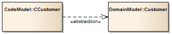

##### [Abstraction](https://sparxsystems.com/enterprise_architect_user_guide/15.1/model_domains/abstraction.html)

Description
An 'Abstraction' is a relationship between two elements that represent the same concept, either at different levels of abstraction or from different viewpoints. This diagram shows that two different customer Classes from different models (the Domain model and the Code model) represent the same concept.

Описание
«Абстракция» - это отношения между двумя элементами, которые представляют одно и то же понятие, либо на разных уровнях абстракции, либо с разных точек зрения. Эта диаграмма показывает, что два разных класса клиентов из разных моделей (модель предметной области и модель кода) представляют одну и ту же концепцию.

The 'Abstraction' relationship is a subtype of a 'Dependency' relationship.

Отношение «Абстракция» - это подтип отношения «Зависимость».

Toolbox icon

Learn more
* [Class Diagram](https://sparxsystems.com/enterprise_architect_user_guide/15.1/model_domains/classdiagram.html)
* [Dependency](https://sparxsystems.com/enterprise_architect_user_guide/15.1/model_domains/dependency.html)
