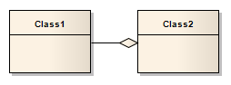

##### [Aggregation](https://sparxsystems.com/enterprise_architect_user_guide/15.1/model_domains/aggregate.html) агрегирование

Description
An Aggregation connector is a type of association that shows that an element contains or is composed of other elements. It is used in Class models, Package models and Object models to show how more complex elements (aggregates) are built from a collection of simpler elements (component parts; for example, a car from wheels, tires, motor and so on).

Описание
Соединитель агрегации - это тип ассоциации, который показывает, что элемент содержит или состоит из других элементов. Он используется в моделях классов, моделях пакетов и моделях объектов, чтобы показать, как более сложные элементы (агрегаты) построены из набора более простых элементов (составных частей; например, автомобиль из колес, шин, двигателя и т. Д.).

A stronger form of aggregation, known as Composite Aggregation, is used to indicate ownership of the whole over its parts. The part can belong to only one Composite Aggregation at a time. If the composite is deleted, all of its parts are deleted with it.

Более сильная форма агрегирования, известная как составное агрегирование, используется для обозначения владения целым над его частями. Деталь может принадлежать только одному составному агрегату одновременно. Если композит удаляется, все его части удаляются вместе с ним.

Toolbox icon

Learn more
* [Class Diagram](https://sparxsystems.com/enterprise_architect_user_guide/15.1/model_domains/classdiagram.html)
* [Package Diagram](https://sparxsystems.com/enterprise_architect_user_guide/15.1/model_domains/packagediagram.html)
* [Object Diagram](https://sparxsystems.com/enterprise_architect_user_guide/15.1/model_domains/objectdiagram.html)
* [Change Aggregation Connector For](https://sparxsystems.com/enterprise_architect_user_guide/15.1/model_domains/changeaggregationlinkform.html)m
