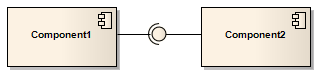

##### [Assembly](https://sparxsystems.com/enterprise_architect_user_guide/15.1/model_domains/assembly.html) сборочный

Description
An Assembly connector bridges a component's required interface (Component1) with the provided interface of another component (Component2), typically in a Component diagram.

Описание
Коннектор Assembly соединяет требуемый интерфейс компонента (Component1) с предоставленным интерфейсом другого компонента (Component2), как правило, на диаграмме компонентов.

Toolbox icon

Learn more
* [Component Diagram](https://sparxsystems.com/enterprise_architect_user_guide/15.1/model_domains/componentdiagram.html)

OMG UML Specification:
The OMG UML specification (UML Superstructure Specification, v2.1.1, p.156) states:

An assembly connector is a connector between two components that defines that one component provides the services that another component requires. An assembly connector is a connector that is defined from a required interface or Port to a provided interface or Port.

Спецификация OMG UML:
Спецификация OMG UML (Спецификация надстройки UML, v2.1.1, стр.156) гласит:

Соединитель сборки - это соединитель между двумя компонентами, который определяет, что один компонент предоставляет услуги, которые требуются другому компоненту. Коннектор сборки - это коннектор, который определяется от требуемого интерфейса или порта к предоставленному интерфейсу или порту.
