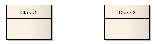
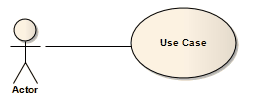

##### [Association](https://sparxsystems.com/enterprise_architect_user_guide/15.1/model_domains/associate.html)

-- Description

An Association implies that two model elements have a relationship, usually implemented as an instance variable in one or both Classes. The connector can include named roles at each end, multiplicity, direction and constraints. You can also indicate the reading direction by adding a Name Direction Indicator arrow to the name-label on the connector (see the Manage Object Labels Help topic), and define template binding parameters for an Association connector between a binding Class and a parameterized Class.

Описание
Ассоциация подразумевает, что два элемента модели имеют отношение, обычно реализуемое как переменная экземпляра в одном или обоих классах. Соединитель может включать именованные роли на каждом конце, множестве, направлении и ограничениях. Вы также можете указать направление чтения, добавив стрелку индикатора направления имени к метке имени на коннекторе (см. Раздел справки « Управление метками объектов» ) и определить параметры привязки шаблона для коннектора ассоциации между классом привязки и параметризованным классом.

Associations act as the keys in providing possible classifiers for a structure of instance elements, and for automatically generating Property (Part) elements on the source SysML Block element in the Association.

Ассоциации действуют как ключи при предоставлении возможных классификаторов для структуры элементов экземпляра и для автоматического создания элементов свойств (частей) в исходном элементе блока SysML в ассоциации.

When code is generated for Class diagrams, Associations become member variables in the target Class. The relationship is also used in Package, Object, Communication, Data Modeling and Deployment diagrams.

Когда код создается для диаграмм классов, ассоциации становятся переменными-членами в целевом классе. Связь также используется в диаграммах пакета, объекта, связи, моделирования данных и развертывания.

'Association' is the general relationship type between two elements; to connect more than two elements in an Association, you can use the N-Ary Association element. An Association connector can also be integrated with a Class element to form an Association Class, to allow the connector to have operations and attributes that define certain types of UML relationship.

«Ассоциация» - это общий тип отношений между двумя элементами; чтобы соединить более двух элементов в ассоциации, вы можете использовать элемент N-Ary Association. Соединитель ассоциации также может быть интегрирован с элементом Class для формирования класса ассоциации, чтобы позволить соединителю иметь операции и атрибуты, которые определяют определенные типы отношений UML.

Toolbox icon

Learn more
* [N-Ary Association](https://sparxsystems.com/enterprise_architect_user_guide/15.1/model_domains/n-aryassociation.html)
* [Association Class](https://sparxsystems.com/enterprise_architect_user_guide/15.1/model_domains/associationclass.html)
* [Class Diagrams](https://sparxsystems.com/enterprise_architect_user_guide/15.1/model_domains/classdiagram.html)
* [Template Binding](https://sparxsystems.com/enterprise_architect_user_guide/15.1/model_domains/template_binding.html)
* [Qualifiers](https://sparxsystems.com/enterprise_architect_user_guide/15.1/model_domains/qualifiers.html)
* [Manage Object Labels](https://sparxsystems.com/enterprise_architect_user_guide/15.1/modeling/labelmenusection.html)
* [Classify Object Via Classifier Associations](https://sparxsystems.com/enterprise_architect_user_guide/15.1/modeling/classify_object_via_associatio.html)
* [Generate Properties From Block Associations](https://sparxsystems.com/enterprise_architect_user_guide/15.1/model_domains/parts_from_association.html)

Выучить больше
* Н-арная ассоциация
* Класс ассоциации
* Диаграммы классов
* Привязка шаблона
* Отборочные
* Управление метками объектов
* Классифицируйте объект с помощью ассоциаций классификаторов
* Создание свойств из ассоциаций блоков

OMG UML Specification:
The OMG UML specification (UML Superstructure Specification, v2.1.1, p.41) states:

'An association specifies a semantic relationship that can occur between typed instances. It has at least two ends represented by properties, each of which is connected to the type of the end. More than one end of the association may have the same type.

Спецификация OMG UML:
Спецификация OMG UML (Спецификация надстройки UML, v2.1.1, стр. 41) гласит:

'Ассоциация определяет семантическую связь, которая может возникать между типизированными экземплярами. У него есть как минимум два конца, представленные свойствами, каждое из которых связано с типом конца. Один и тот же тип может иметь более одного конца ассоциации.

An end property of an association that is owned by an end class or that is a navigable owned end of the association indicates that the association is navigable from the opposite ends; otherwise, the association is not navigable from the opposite ends.'

Свойство конца ассоциации, которой владеет конечный класс или которая является управляемой концом ассоциации, указывает, что по ассоциации можно перемещаться с противоположных концов; в противном случае по ассоциации невозможно судоходство с противоположных концов ».