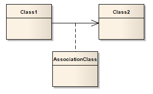
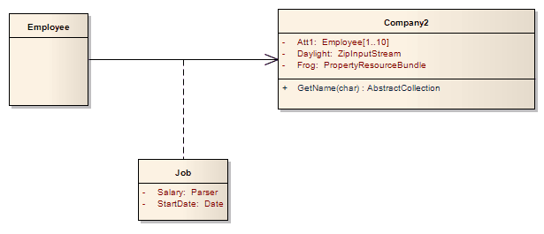

##### [Association Class](https://sparxsystems.com/enterprise_architect_user_guide/15.1/model_domains/associationclass.html) Класс ассоциации

Description
An Association Class is a UML construct that enables an Association to have attributes and operations (features). This results in a hybrid relation with the characteristics of an Association and a Class.

Описание
Класс ассоциации - это конструкция UML, которая позволяет ассоциации иметь атрибуты и операции (функции). Это приводит к гибридному отношению с характеристиками ассоциации и класса.

When you add an Association Class connection, Enterprise Architect also creates a Class that is automatically connected to the Association. When you hide or delete the Association, the Class is also hidden or deleted.

Когда вы добавляете соединение класса ассоциации, Enterprise Architect также создает класс, который автоматически подключается к ассоциации. Когда вы скрываете или удаляете ассоциацию, класс также скрывается или удаляется.

To add an Association Class to a Class or Deployment diagram, click on the 'Association Class' icon in the Toolbox. Click and hold on the source object in the diagram while you drag the line to the target element, then release the mouse button. Enterprise Architect draws the connector and adds the Class, then prompts you to add the Class name. Note that the names of the Class and the connector are the same. You can also connect a new Class to an existing Association.

Чтобы добавить класс ассоциации к диаграмме классов или развертывания, щелкните значок «Класс ассоциации» на панели инструментов. Щелкните и удерживайте исходный объект на схеме, перетаскивая линию к целевому элементу, затем отпустите кнопку мыши. Enterprise Architect рисует соединитель и добавляет класс, а затем предлагает вам добавить имя класса. Обратите внимание, что имена класса и соединителя совпадают. Вы также можете подключить новый класс к существующей ассоциации.

You can highlight the Class part of an Association Class in the Browser window, by selecting the 'Find Association Class' context menu option on the Association connector.

Вы можете выделить часть класса класса ассоциации в окне браузера , выбрав пункт контекстного меню «Найти класс ассоциации» в соединителе ассоциации.

Example
This diagram illustrates an Association Class between model elements. Note the dotted line from the Class to the Association. You cannot move or delete this line.

пример
Эта диаграмма иллюстрирует класс ассоциации между элементами модели. Обратите внимание на пунктирную линию от класса к ассоциации. Вы не можете переместить или удалить эту строку.

Notes
* If you are applying a stereotype with a Shape Script to an Association Class, be aware that the Shape Script is applied to both the Class part and the Association part; therefore, you might have to include logic in the shape main that tests the type of the element so that you can give separate drawing instructions for Class and for Association
* Such logic is not necessary in the:
     -  Shape source or shape target, which are ignored by Classes, or the
     -  Decoration shapes, which are ignored by Association connectors
* If you dissociate the Class from the Association connector, both parts keep their Shape Scripts until the stereotypes are removed

Ноты
* Если вы применяете стереотип с помощью сценария формы к классу ассоциации, имейте в виду, что сценарий формы применяется как к части класса, так и к части ассоциации; поэтому вам может потребоваться включить логику в основную фигуру, которая проверяет тип элемента, чтобы вы могли давать отдельные инструкции по рисованию для класса и для ассоциации
* Такая логика не требуется в:
     - источнике формы или цели формы, которые игнорируются классами, или
     - фигурах украшения, которые игнорируются соединителями ассоциации.
* Если вы отделите класс от соединителя Association, обе части сохранят свои сценарии формы до тех пор, пока стереотипы не будут удалены.

Toolbox icon

Learn more
* [Class Diagram](https://sparxsystems.com/enterprise_architect_user_guide/15.1/model_domains/classdiagram.html)
* [Connect New Class to Association](https://sparxsystems.com/enterprise_architect_user_guide/15.1/model_domains/linkanewclasstoanexistin.html)

OMG UML Specification:
The OMG UML specification (UML Superstructure Specification, v2.1.1, p.49) states:

'A model element that has both association and class properties. An AssociationClass can be seen as an association that also has class properties, or as a class that also has association properties. It not only connects a set of classifiers but also defines a set of features that belong to the relationship itself and not to any of the classifiers.'

Спецификация OMG UML:
Спецификация OMG UML (Спецификация надстройки UML, v2.1.1, стр.49) гласит:

'Элемент модели, который имеет свойства как ассоциации, так и класса. AssociationClass можно рассматривать как ассоциацию, которая также имеет свойства класса, или как класс, который также имеет свойства ассоциации. Он не только связывает набор классификаторов, но также определяет набор функций, которые принадлежат самому отношению, а не какому-либо из классификаторов ».