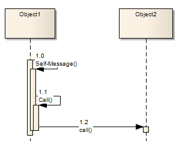

##### [Call](https://sparxsystems.com/enterprise_architect_user_guide/15.1/model_domains/call.html)

A Call is a type of Message connector that extends the level of activation from the previous Message. All Self-Messages create a new activation level, but this focus of control usually ends with the next Message (unless activation levels are manually adjusted). Self-Message Calls, as depicted in the image of the first Call, indicate a nested invocation; new activation levels are added with each Call. Unlike a regular Message between elements, a Call between elements continues the existing activation in the source element, implying that the Call was initiated within the previous Message's activation scope.

Вызов - это тип соединителя сообщений, который увеличивает уровень активации по сравнению с предыдущим сообщением. Все собственные сообщения создают новый уровень активации, но этот фокус управления обычно заканчивается следующим сообщением (если уровни активации не настраиваются вручную). Вызовы с собственными сообщениями, изображенные на изображении первого Вызова, указывают на вложенный вызов; новые уровни активации добавляются с каждым звонком. В отличие от обычного сообщения между элементами, вызов между элементами продолжает существующую активацию в исходном элементе, подразумевая, что вызов был инициирован в пределах области активации предыдущего сообщения.

Toolbox icon

Learn more
* [Message (Sequence Diagram)](https://sparxsystems.com/enterprise_architect_user_guide/15.1/model_domains/sequencemessage.html)
* [Self-Message](https://sparxsystems.com/enterprise_architect_user_guide/15.1/model_domains/self-message.html)
* [Sequence Element Activation](https://sparxsystems.com/enterprise_architect_user_guide/15.1/model_domains/sequenceelementactivation.html)

Выучить больше
* Сообщение (диаграмма последовательности)
* Само-сообщение
* Активация элемента последовательности

