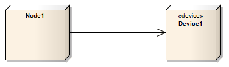

##### [Communication Path](https://sparxsystems.com/enterprise_architect_user_guide/15.1/model_domains/communication_path.html)  Путь коммуникации

Description
A Communication Path defines the path through which two DeploymentTargets are able to exchange signals and messages. Communication Path is a specialization of Association. A DeploymentTarget is the target for a deployed Artifact and can be a Node, Property or InstanceSpecification in a Deployment diagram.

Описание
Коммуникационный путь определяет путь, по которому два объекта DeploymentTarget могут обмениваться сигналами и сообщениями. Коммуникационный путь - это специализация Ассоциации. DeploymentTarget - это цель для развернутого артефакта и может быть Node, Property или InstanceSpecification на диаграмме развертывания.

Toolbox icon

Learn more
* [Deployment Diagram](https://sparxsystems.com/enterprise_architect_user_guide/15.1/model_domains/deploymentdiagram.html)
* [Association](https://sparxsystems.com/enterprise_architect_user_guide/15.1/model_domains/associate.html)