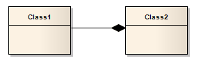
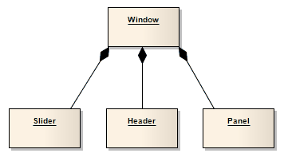

##### [Composition](https://sparxsystems.com/enterprise_architect_user_guide/15.1/model_domains/compose.html)

Direction:
A Composition is used to depict an element that is made up of smaller components, typically in a Class or Package diagram. A component - or part instance - can be included in a maximum of one composition at a time. If a composition is deleted, usually all of its parts are deleted with it; however, a part can be individually removed from a composition without having to delete the entire composition. Compositions are transitive, asymmetric relationships and can be recursive.

Направление:
Композиция используется для изображения элемента, состоящего из более мелких компонентов, обычно на диаграмме классов или пакетов. Компонент - или экземпляр детали - может быть включен максимум в одну композицию за раз. Если композиция удаляется, обычно вместе с ней удаляются все ее части; однако часть может быть по отдельности удалена из композиции без удаления всей композиции. Композиции являются транзитивными, асимметричными отношениями и могут быть рекурсивными.

Example

Toolbox icon

Learn more
* [Aggregation](https://sparxsystems.com/enterprise_architect_user_guide/15.1/model_domains/aggregate.html)
* [Class Diagram](https://sparxsystems.com/enterprise_architect_user_guide/15.1/model_domains/classdiagram.html)

OMG UML Specification:
The OMG UML specification (UML Superstructure Specification, v2.1.1, p.43) states:

Composite aggregation is a strong form of aggregation that requires a part instance be included in at most one composite at a time. If a composite is deleted, all of its parts are normally deleted with it.

Спецификация OMG UML:
Спецификация OMG UML (Спецификация надстройки UML, v2.1.1, стр. 43) гласит:

Составная агрегация - это сильная форма агрегации, которая требует включения экземпляра части не более чем в один состав за раз. Если композит удаляется, все его части обычно удаляются вместе с ним.