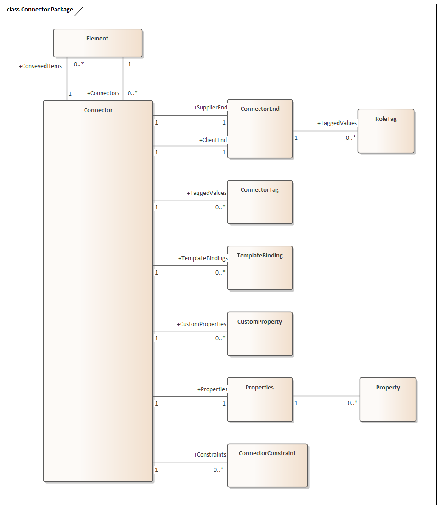

##### [Connector Package](https://sparxsystems.com/enterprise_architect_user_guide/15.1/automation/connector.html) Коннектор Пакет

The Connector Package details how connectors between elements are accessed and managed. 

В пакете соединителей подробно описано, как осуществляется доступ к соединителям между элементами и управление ими. 

This diagram shows the Connector Class, its collections and its relationships to the Element Class. Association Target roles correspond to member variable names in the source interface. The associated Classes represent the object type used in each collection.

На этой диаграмме показан класс коннектора, его коллекции и его отношения с классом элемента. Целевые роли ассоциации соответствуют именам переменных-членов в исходном интерфейсе. Связанные классы представляют тип объекта, используемый в каждой коллекции.

