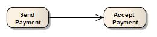

##### [Control Flow](https://sparxsystems.com/enterprise_architect_user_guide/15.1/model_domains/controlflow.html)

-- Description
The Control Flow is a connector connecting two nodes in an Activity diagram, modeling an active transition. Control Flow connectors bridge the flow between Activity nodes, by directing the flow to the target node once the source node's activity is completed.

Описание
Поток управления - это соединитель, соединяющий два узла на диаграмме действий, моделирующий активный переход. Соединители Control Flow соединяют поток между узлами Activity, направляя поток к целевому узлу после завершения активности исходного узла.

Control Flows and Object Flows can define a Guard and a Weight condition.

Потоки управления и потоки объектов могут определять условие защиты и веса.

A Guard defines a condition that must be True before control passes along that activity edge. A practical example of this is where two or more activity edges (Control Flows) exit from a Decision element. Each flow should have a Guard condition that is exclusive of the other and defines which edge is taken under what conditions. The Control Flow 'Properties' dialog enables you to set up Guard conditions on Control Flows and on Object Flows.

Страж определяет условие, которое должно быть истинным, прежде чем управление перейдет по этому краю активности. Практическим примером этого является ситуация, когда две или более границы активности (потоки управления) выходят из элемента Decision. Каждый поток должен иметь условие Guard, которое исключает другое и определяет, какое ребро и при каких условиях берется. Диалоговое окно «Свойства» потока управления позволяет вам устанавливать условия защиты для потоков управления и потоков объектов.

A Weight defines the number of tokens that can flow along a Control or Object Flow connection when that edge is traversed. Weight can also be defined on the Control Flow and Object Flow 'Properties' dialogs.

Вес определяет количество токенов, которые могут проходить по соединению Control или Object Flow при прохождении этого ребра. Вес также можно определить в диалоговых окнах «Поток управления» и «Свойства» потока управления.

-- Toolbox icon

Learn more
* [Activity diagram](https://sparxsystems.com/enterprise_architect_user_guide/15.1/model_domains/activitydiagram.html)
* [Object Flow](https://sparxsystems.com/enterprise_architect_user_guide/15.1/model_domains/objectflow.html)
* [Decision Node](https://sparxsystems.com/enterprise_architect_user_guide/15.1/model_domains/decision.html)

Выучить больше
* Диаграмма деятельности
* Поток объектов
* Узел принятия решения

OMG UML specification:
The OMG UML specification (UML Superstructure Specification, v2.1.1, p.356) states:

A control flow is an edge that starts an activity node after the previous one is finished.

Спецификация OMG UML:
Спецификация OMG UML (Спецификация надстройки UML, v2.1.1, стр.356) гласит:

Поток управления - это граница, которая запускает узел активности после завершения предыдущего.

