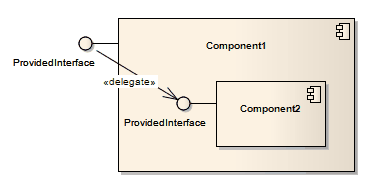

##### [Delegate](https://sparxsystems.com/enterprise_architect_user_guide/15.1/model_domains/delegate.html) 

Description
A Delegate connector defines the internal assembly of a component's external Ports and Interfaces, on a Component diagram. Using a Delegate connector wires the internal workings of the system to the outside world, by a delegation of the external interfaces' connections.

Описание
Соединитель делегата определяет внутреннюю сборку внешних портов и интерфейсов компонента на диаграмме компонентов. Использование соединителя Delegate связывает внутреннюю работу системы с внешним миром путем делегирования соединений внешних интерфейсов.

Toolbox icon

Learn more
* [Component Diagram](https://sparxsystems.com/enterprise_architect_user_guide/15.1/model_domains/componentdiagram.html)

OMG UML Specification:
The OMG UML specification (UML Superstructure Specification, v2.1.1, p.156) states:

A delegation connector is a connector that links the external contract of a component (as specified by its Ports) to the internal realization of that behavior by the component's parts. It represents the forwarding of signals (operation requests and events): a signal that arrives at a Port that has a delegation connector to a part or to another Port will be passed on to that target for handling.

Спецификация OMG UML:
Спецификация OMG UML (Спецификация надстройки UML, v2.1.1, стр.156) гласит:

Соединитель делегирования - это соединитель, который связывает внешний контракт компонента (как указано его портами) с внутренней реализацией этого поведения частями компонента. Он представляет собой пересылку сигналов (запросов операций и событий): сигнал, который поступает в порт, который имеет соединитель делегирования для части или другого порта, будет передан этой цели для обработки.