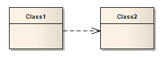

#####  [Dependency](https://sparxsystems.com/enterprise_architect_user_guide/15.1/model_domains/dependency.html)  зависимость

Description
Dependency relationships are used to model a wide range of dependent relationships between model elements in Use Case, Activity and Structural diagrams, and even between models themselves. You can create the Dependency from the Common page of the Toolbox. The Dependencies Package as defined in UML 2.5 has many derivatives, such as Realize, Deployment and Use. Once you create a Dependency you can further refine its meaning by applying a specialized stereotype.

Описание
Отношения зависимости используются для моделирования широкого диапазона зависимых отношений между элементами модели в схемах вариантов использования, действий и структурных схем и даже между самими моделями. Вы можете создать зависимость на общей странице панели инструментов. Пакет зависимостей, как определено в UML 2.5, имеет множество производных, таких как реализация, развертывание и использование. Создав зависимость, вы можете дополнительно уточнить ее значение, применив специализированный стереотип.

Toolbox icon

Learn more
* [Realization](https://sparxsystems.com/enterprise_architect_user_guide/15.1/model_domains/realise.html)
* [Deployment](https://sparxsystems.com/enterprise_architect_user_guide/15.1/model_domains/deployment.html)
* [Use](https://sparxsystems.com/enterprise_architect_user_guide/15.1/model_domains/use.html)
* [Apply a Stereotype](https://sparxsystems.com/enterprise_architect_user_guide/15.1/model_domains/applyingastereotype.html)

OMG UML Specification:
The OMG UML specification (UML Superstructure Specification, v2.1.1, p.64) states:

A dependency is a relationship that signifies that a single or a set of model elements requires other model elements for their specification or implementation. This means that the complete semantics of the depending elements is either semantically or structurally dependent on the definition of the supplier element(s).

Спецификация OMG UML:
Спецификация OMG UML (Спецификация надстройки UML, v2.1.1, стр.64) гласит:

Зависимость - это отношение, которое означает, что один или несколько элементов модели требуют других элементов модели для их спецификации или реализации. Это означает, что полная семантика зависимых элементов либо семантически, либо структурно зависит от определения элемента (ов) поставщика.

