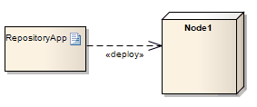

##### [Deployment](https://sparxsystems.com/enterprise_architect_user_guide/15.1/model_domains/deployment.html) развертывание

Description
A Deployment is a type of Dependency relationship that indicates the deployment of an artifact onto a node or executable target, typically in a Deployment diagram. A Deployment can be made at type and instance levels. At the type level, a Deployment would be made for every instance of the node. Deployment can also be specified for an instance of a node, so that a node's instances can have varied deployed artifacts. With composite structures modeled with nodes defined as Parts, Parts can also serve as targets of a Deployment relationship.

Описание
Развертывание - это тип отношения зависимости, который указывает развертывание артефакта на узле или исполняемой цели, как правило, на схеме развертывания. Развертывание может быть выполнено на уровне типа и экземпляра. На уровне типа развертывание будет выполняться для каждого экземпляра узла. Развертывание также можно указать для экземпляра узла, так что экземпляры узла могут иметь различные развернутые артефакты. С составными структурами, смоделированными с узлами, определенными как части, части также могут служить целями отношения развертывания.

Toolbox icon

Learn more
* [Deployment Diagram](https://sparxsystems.com/enterprise_architect_user_guide/15.1/model_domains/deploymentdiagram.html)
