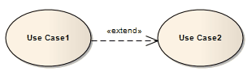
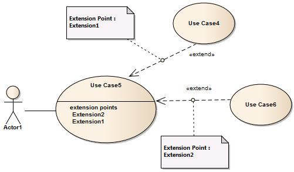
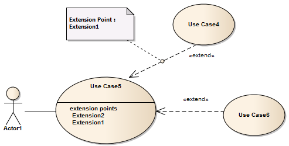

##### [Extend](https://sparxsystems.com/enterprise_architect_user_guide/15.1/model_domains/extend.html) расширять

Description
An Extend connector is used to indicate that an element extends the behavior of another, mainly in Use Case models where one Use Case (optionally) extends the behavior of another Use Case. An extending Use Case often expresses alternative flows that are integrated with the behavior of the extended Use Case, at a specific point in the behavior flow identified within the element by an extension point. The extension point is represented by a text string such as 'on startup' or 'before connection is established'.

Описание
Соединитель расширения используется, чтобы указать, что элемент расширяет поведение другого, в основном в моделях вариантов использования, где один вариант использования (необязательно) расширяет поведение другого варианта использования. Расширяемый вариант использования часто выражает альтернативные потоки, которые интегрированы с поведением расширенного варианта использования, в определенной точке потока поведения, идентифицированной в элементе точкой расширения. Точка расширения представлена ​​текстовой строкой, например «при запуске» или «до установления соединения».

A Use Case can have more than one extension point, and can extend or be extended by more than one other Use Case. The precise relationship between the extending Use case, extended Use Case and the point at which the extension applies can be identified on the Extend relationship, as shown.

Вариант использования может иметь более одной точки расширения и может расширяться или расширяться более чем одним другим вариантом использования. Точная связь между расширяющимся вариантом использования, расширенным вариантом использования и точкой, в которой применяется расширение, может быть определена в отношении расширения, как показано.

-- Identify Extension Point

| Step                                     | Action                                   | See also |
|------------------------------------------|------------------------------------------|----------|
|  			
 				1 			
 		 |  			
Right-click on the Extend connector and select the 'Advanced > Extension Point > Set Extension Point' option. 
 			
The 'Element Usage' dialog displays, listing the Extension Points currently defined in the target Use Case element.
 		 |  		   |
|  			
 				2 			
 		 |  			
Click on the Extension Point on which the source Use Case acts, and click on the Open button. 
 			
The dialog closes and the Extend connector shows a small circle at the mid-point, with a Notelink to a Note element that identifies the selected Extension Point. 
 			
 
 			

 			
(The Note might not initially display close to the Extend connector - check the upper left corner of the diagram and drag the Note to the position you want it to occupy.) 
 			
Use these same steps to change the extension point identified in the Note.
 		 |  		   |

| шаг                                      | действие                                 | Смотрите также |
|------------------------------------------|------------------------------------------|----------------|
|  			
 				1 			
 		 |  			
Щелкните правой кнопкой мыши соединитель «Расширить» и выберите «Дополнительно > Точка расширения > Установить точку расширения ».
 			
Отобразится диалоговое окно «Использование элемента», в котором перечислены точки расширения, определенные в настоящее время в целевом элементе варианта использования.
 		 |  		         |
|  			
 				2 			
 		 |  			
Щелкните точку расширения, в которой действует исходный вариант использования, и нажмите кнопку « Открыть» .
 			
Диалоговое окно закроется, и на соединителе «Расширить» в середине появится небольшой кружок со ссылкой на элемент примечания, который идентифицирует выбранную точку расширения. 
 			
 
 			

 			
(Примечание может изначально не отображаться рядом с соединителем расширения - проверьте левый верхний угол диаграммы и перетащите заметку в то место, которое вы хотите, чтобы оно занимало.) 
 			
Используйте те же шаги, чтобы изменить точку расширения, указанную в примечании.
 		 |  		         |

Show/Hide Extension Point Note

| Step                                     | Action                                   | See also |
|------------------------------------------|------------------------------------------|----------|
|  			
 				1 			
 		 |  			
Right-click on the Extend connector and select the 'Advanced > Extension Point > Show Extension Point' option. 
 			
If there are any Extension Points identified on the selected Extend connector, they are displayed as shown.
 		 |  		   |
|  			
 				2 			
 		 |  			
Right-click on the Extend connector and deselect the 'Advanced > Extension Point > Show Extension Point' option. 
 			
Any Extension Points identified on the selected Extend connector are hidden, as shown: 
 			

 			

 		 |  		   |

| шаг                                      | действие                                 | Смотрите также |
|------------------------------------------|------------------------------------------|----------------|
|  			
 				1 			
 		 |  			
Щелкните правой кнопкой мыши соединитель «Расширить» и выберите «Дополнительно > Точка расширения>Показать точку расширения ».
 			
Если на выбранном соединителе расширения обнаружены какие-либо точки расширения, они отображаются, как показано.
 		 |  		         |
|  			
 				2 			
 		 |  			
Щелкните правой кнопкой мыши соединитель «Расширить» и снимите флажок «Дополнительно > Точка расширения >Показать точку расширения ».
 			
Все точки расширения, определенные на выбранном соединителе расширения, скрыты, как показано: 
 			

 			

 		 |  		         |

Toolbox icon

Notes
The Extend connector is not the same as the Extension connector, which is used in Profile diagrams to indicate that a Stereotype element extends a Metaclass or another Stereotype element; the two types of connector have different appearances

Ноты
Соединитель Extend - это не то же самое, что соединитель Extension, который используется на диаграммах профиля, чтобы указать, что элемент Stereotype расширяет Metaclass или другой элемент Stereotype; два типа разъема имеют разный внешний вид

Learn more
* [Use Case Diagram](https://sparxsystems.com/enterprise_architect_user_guide/15.1/model_domains/usecasediagram.html)
* [Use Case](https://sparxsystems.com/enterprise_architect_user_guide/15.1/model_domains/usecase.html)
* [Use Case Extension Points](https://sparxsystems.com/enterprise_architect_user_guide/15.1/model_domains/extensionpoint.html)
* [Profile Toolbox](https://sparxsystems.com/enterprise_architect_user_guide/15.1/modeling/profilegroup.html) (Extension connector)

Выучить больше
* Диаграмма вариантов использования
* Пример использования
* Точки расширения варианта использования
* Панель инструментов профиля (удлинитель)

OMG UML Specification:
The OMG UML specification (UML Superstructure Specification, v2.1.1, p.587) states:

This relationship specifies that the behavior of a Use Case may be extended by the behavior of another (usually supplementary) Use Case. The extension takes place at one or more specific extension points defined in the extended Use Case. Note, however, that the extended Use Case is defined independently of the extending Use Case and is meaningful independently of the extending Use Case. On the other hand, the extending Use Case typically defines behavior that may not necessarily be meaningful by itself. Instead, the extending Use Case defines a set of modular behavior increments that augment an execution of the extended Use Case under specific conditions.

Спецификация OMG UML (Спецификация надстройки UML, v2.1.1, стр.587) гласит:

Это отношение указывает, что поведение варианта использования может быть расширено поведением другого (обычно дополнительного) варианта использования. Расширение происходит в одной или нескольких точках расширения, определенных в расширенном варианте использования. Однако обратите внимание, что расширенный вариант использования определяется независимо от расширяемого варианта использования и имеет смысл независимо от расширяемого варианта использования. С другой стороны, расширяемый вариант использования обычно определяет поведение, которое само по себе не обязательно имеет смысл. Вместо этого расширенный вариант использования определяет набор модульных приращений поведения, которые дополняют выполнение расширенного варианта использования при определенных условиях.

Note that the same extending Use Case can extend more than one Use Case. Furthermore, an extending Use Case may itself be extended.

Обратите внимание, что один и тот же расширяющий вариант использования может распространяться на несколько вариантов использования. Более того, расширяющийся вариант использования может быть расширен.

