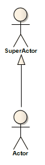

##### [Generalization](https://sparxsystems.com/enterprise_architect_user_guide/15.1/model_domains/generalize.html) Inheritance Обобщение

Description
A Generalization is used to indicate inheritance. Drawn from the specific classifier to a general classifier, the generalization's implication is that the source inherits the target's characteristics. It is used typically in Class, Component, Object, Package, Use Case and Requirements diagrams

Описание
Обобщение используется для обозначения наследования. Построенное из конкретного классификатора в общий классификатор, обобщение подразумевает, что источник наследует характеристики цели. Обычно он используется в диаграммах классов, компонентов, объектов, пакетов, вариантов использования и требований.

You can also define template binding parameters for a Generalize connector between a binding Class and a parameterized Class.

Вы также можете определить параметры привязки шаблона для соединителя Generalize между классом привязки и параметризованным классом.

Toolbox icon

OMG UML Specification:
The OMG UML specification (UML Superstructure Specification, v2.1.1, p.73) states:

A generalization is a taxonomic relationship between a more general classifier and a more specific classifier. Each instance of the specific classifier is also an indirect instance of the general classifier. Thus, the specific classifier inherits the features of the more general classifier.

Спецификация OMG UML:
Спецификация OMG UML (Спецификация надстройки UML, v2.1.1, стр.73) гласит:

Обобщение - это таксономическая связь между более общим классификатором и более конкретным классификатором. Каждый экземпляр конкретного классификатора также является косвенным экземпляром общего классификатора. Таким образом, конкретный классификатор наследует особенности более общего классификатора.

Learn more
* [Template Binding](https://sparxsystems.com/enterprise_architect_user_guide/15.1/model_domains/template_binding.html)
* [Parameterized Class](https://sparxsystems.com/enterprise_architect_user_guide/15.1/model_domains/parameterisedclassestemplate.html)
* [Binding](https://sparxsystems.com/enterprise_architect_user_guide/15.1/modeling/binding.html)

Выучить больше
* Привязка шаблона
* Параметризованный класс
* переплет

