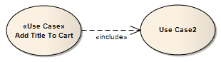

##### [Include](https://sparxsystems.com/enterprise_architect_user_guide/15.1/model_domains/include.html)  содержать в себе

Description
An Include connection indicates that the source element includes the functionality of the target element. Include connections are used in Use Case models to reflect that one Use Case includes the behavior of another. Use an Include relationship to avoid having the same subset of behavior in many Use Cases; this is similar to delegation used in Class models.

Описание
Соединение «Включить» указывает, что исходный элемент включает в себя функциональные возможности целевого элемента. Подключения включения используются в моделях вариантов использования, чтобы отразить, что один вариант использования включает поведение другого. Используйте отношение "Включить", чтобы избежать одного и того же подмножества поведения во многих случаях использования; это похоже на делегирование, используемое в моделях классов.

Toolbox icon

Learn more
* [Use Case Diagram](https://sparxsystems.com/enterprise_architect_user_guide/15.1/model_domains/usecasediagram.html)

Выучить больше
* Диаграмма вариантов использования

OMG UML Specification:
The OMG UML specification (UML Superstructure Specification, v2.1.1, p.591) states:

Include is a DirectedRelationship between two Use Cases, implying that the behavior of the included Use Case is inserted into the behavior of the including Use Case. It is also a kind of NamedElement so that it can have a name in the context of its owning Use Case. The including Use Case may only depend on the result (value) of the included Use Case. This value is obtained as a result of the execution of the included Use Case.

Спецификация OMG UML:
Спецификация OMG UML (Спецификация надстройки UML, v2.1.1, стр.591) гласит:

Include - это DirectedRelationship между двумя вариантами использования, подразумевающее, что поведение включенного варианта использования вставляется в поведение включающего варианта использования. Это также разновидность NamedElement, так что у него может быть имя в контексте его собственного варианта использования. Включенный вариант использования может зависеть только от результата (значения) включенного варианта использования. Это значение получается в результате выполнения включенного варианта использования.

