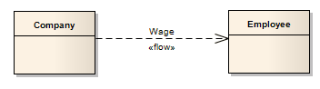

##### [Information Flow](https://sparxsystems.com/enterprise_architect_user_guide/15.1/model_domains/informationflow.html)  Поток информации

Description
An Information Flow represents the flow of Information Items (either Information Item elements or classifiers) between two elements in any diagram. The connector is available from:

* The 'Common' page of the Toolbox
* Every Quick Link menu, and
* Automatically whilst directly defining

Information Item realization
When you create the Information Flow connector, Enterprise Architect automatically prompts you to identify which information items are conveyed.

Описание
Информационный поток представляет собой поток информационных единиц (либо элементов информационных единиц, либо классификаторов) между двумя элементами на любой диаграмме. Разъем доступен по адресу:

* Страница "Общие" панели инструментов
* Каждое меню быстрых ссылок и
* Автоматически при непосредственном определении реализации информационного элемента

Когда вы создаете коннектор информационных потоков, Enterprise Architect автоматически предлагает вам определить, какие элементы информации передаются.

You can have more than one Information Flow connector between the same two elements, identifying which items flow between the elements under differing conditions. The connectors can flow in the same direction, or opposite directions. You can locate the items conveyed in any Information Flow, by right-clicking on the connector and selecting the 'Find Items Conveyed' option

Между одними и теми же двумя элементами может быть несколько соединителей информационного потока, определяющих, какие элементы передаются между элементами в разных условиях. Соединители могут течь в одном или противоположных направлениях. Вы можете найти элементы, передаваемые в любом информационном потоке, щелкнув правой кнопкой мыши соединитель и выбрав опцию «Найти переданные элементы».

Toolbox icon

Learn more
* [Information Item](https://sparxsystems.com/enterprise_architect_user_guide/15.1/model_domains/informationitem.html)
* [Using Information Flows](https://sparxsystems.com/enterprise_architect_user_guide/15.1/model_domains/using_information_flows.html)
* [Convey Information on a Flow](https://sparxsystems.com/enterprise_architect_user_guide/15.1/model_domains/informationitemsconvey.html)
* [Realize an Information Flow](https://sparxsystems.com/enterprise_architect_user_guide/15.1/model_domains/informationitemsrealized.html)

Выучить больше
* Информационный элемент
* Использование информационных потоков
* Передавать информацию о потоке
* Осознайте информационный поток

OMG UML Specification:
The OMG UML specification (UML Superstructure Specification, v2.1.1, p.606) states:

An InformationFlow specifies that one or more information items circulates from its sources to its targets.

The OMG UML specification (UML Superstructure Specification, v2.1.1, p.607) also states:

An information flow is an abstraction of the communication of an information item from its sources to its targets. It is used to abstract the communication of information between entities of a system. Sources or targets of an information flow designate sets of objects that can send or receive the conveyed information item.

Спецификация OMG UML:
Спецификация OMG UML (Спецификация надстройки UML, v2.1.1, p.606) гласит:

InformationFlow указывает, что один или несколько информационных элементов циркулируют от своих источников к своим целям.

В спецификации OMG UML (UML Superstructure Specification, v2.1.1, p.607) также говорится:

Информационный поток - это абстракция передачи информационного элемента от его источников к его целям. Он используется для абстрагирования передачи информации между объектами системы. Источники или цели информационного потока обозначают наборы объектов, которые могут отправлять или получать переданный информационный элемент.