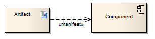

##### [Manifest](https://sparxsystems.com/enterprise_architect_user_guide/15.1/model_domains/manifest.html) 

Description
A Manifest relationship indicates that the Artifact source embodies the target model element, typically in Component and Deployment diagrams. Stereotypes can be added to Enterprise Architect to classify the type of manifestation of the model element.

Описание
Связь Manifest указывает, что источник артефакта воплощает целевой элемент модели, обычно в схемах компонентов и развертываний. В Enterprise Architect можно добавлять стереотипы для классификации типа проявления элемента модели.

Toolbox icon

Learn more
* [Artifact Element](https://sparxsystems.com/enterprise_architect_user_guide/15.1/model_domains/artifact_element.html)
* [Component Diagram](https://sparxsystems.com/enterprise_architect_user_guide/15.1/model_domains/componentdiagram.html)
* [Deployment Diagram](https://sparxsystems.com/enterprise_architect_user_guide/15.1/model_domains/deploymentdiagram.html)

OMG UML Specification:
The OMG UML specification (UML Superstructure Specification, v2.1.1, p.212) states:

An artifact embodies or manifests a number of model elements. The artifact owns the manifestations, each representing the utilization of a packageable element.

Спецификация OMG UML:
Спецификация OMG UML (Спецификация надстройки UML, v2.1.1, стр. 212) гласит:

Артефакт воплощает или проявляет ряд элементов модели. Артефакту принадлежат проявления, каждое из которых представляет использование упаковываемого элемента.

Specific profiles are expected to stereotype the manifestation relationship to indicate particular forms of manifestation, e.g. «tool generated» and «custom code» might be two manifestations for different classes embodied in an artifact.

Ожидается, что определенные профили будут стереотипизировать отношения проявления для обозначения конкретных форм проявления, например, «созданный инструмент» и «пользовательский код» могут быть двумя проявлениями для разных классов, воплощенных в артефакте.
