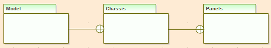

##### [Nesting](https://sparxsystems.com/enterprise_architect_user_guide/15.1/model_domains/nesting.html) Соединитель вложенности

Description
The Nesting Connector is an alternative graphical notation for expressing containment or nesting of elements within other elements. It is most appropriately used for displaying Package nesting in a Package diagram.

Описание
Соединитель вложенности - это альтернативное графическое обозначение для выражения включения или вложения элементов в другие элементы. Его лучше всего использовать для отображения вложенности пакетов на диаграмме пакетов.

Toolbox icon

Learn more
[Package Diagram](https://sparxsystems.com/enterprise_architect_user_guide/15.1/model_domains/packagediagram.html)