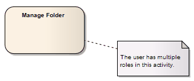

##### [Notelink](https://sparxsystems.com/enterprise_architect_user_guide/15.1/model_domains/notelink_connector.html)

Description
A Notelink connector connects a Note to one or more other elements of any other type.

Both Note and Notelink are available in any category of the Toolbox, in the Common page. You can also select them from the UML Elements toolbar.

Описание
Коннектор Notelink соединяет заметку с одним или несколькими другими элементами любого другого типа.

И Note, и Notelink доступны в любой категории панели инструментов на общей странице. Вы также можете выбрать их на панели инструментов UML Elements.

Toolbox icon

