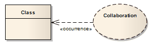

##### [Occurrence](https://sparxsystems.com/enterprise_architect_user_guide/15.1/model_domains/occurrence.html) Вхождение

Description
An Occurrence relationship indicates that a Collaboration represents a classifier, in a Composite Structure diagram. An Occurrence connector is drawn from the Collaboration to the classifier.

Описание
Связь "Вхождение" указывает, что сотрудничество представляет классификатор на диаграмме составной структуры . Соединитель "Происшествие" рисуется от Сотрудничества к классификатору.

Toolbox icon

Learn more
* [Collaboration](https://sparxsystems.com/enterprise_architect_user_guide/15.1/model_domains/collaboration2.html)
* [Composite Structure Diagram](https://sparxsystems.com/enterprise_architect_user_guide/15.1/model_domains/compositestructurediagram.html)

