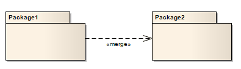

##### [Package Merge](https://sparxsystems.com/enterprise_architect_user_guide/15.1/model_domains/pkgmerge.html) Слияние пакетов

Description
In a Package diagram, a Package Merge indicates a relationship between two Packages whereby the contents of the target Package are merged with those of the source Package. Private contents of a target Package are not merged. The applicability of a Package Merge addresses any situation where multiple Packages contain identically-named elements, representing the same thing. A Package Merge merges all matching elements across its merged Packages, along with their relationships and behaviors. Note that a Package Merge essentially performs generalizations and redefinitions of all matching elements, but the merged Packages and their independent element representations still exist and are not affected.

Описание
На диаграмме пакетов слияние пакетов указывает на взаимосвязь между двумя пакетами, посредством которой содержимое целевого пакета объединяется с содержимым исходного пакета. Частное содержимое целевого пакета не объединяется. Применимость слияния пакетов решает любую ситуацию, когда несколько пакетов содержат элементы с одинаковыми именами, представляющие одно и то же. Слияние пакетов объединяет все совпадающие элементы в объединенных пакетах вместе с их отношениями и поведением. Обратите внимание, что слияние пакетов по существу выполняет обобщение и переопределение всех совпадающих элементов, но объединенные пакеты и их независимые представления элементов все еще существуют и не затрагиваются.

The Package Merge serves a graphical purpose in Enterprise Architect, but creates an ordered Package relationship applied to related Packages (which can be seen under the 'Link' tab in the Package's 'Properties' dialog). Such relationships can be reflected in XMI exports or Enterprise Architect Automation Interface scripts for code generation or other Model Driven Architecture (MDA) interests.

Слияние пакетов служит графическим целям в Enterprise Architect, но создает упорядоченные отношения пакетов, применяемые к связанным пакетам (которые можно увидеть на вкладке «Ссылка» в диалоговом окне «Свойства» пакета). Такие отношения могут быть отражены в экспорте XMI или сценариях интерфейса автоматизации корпоративного архитектора для генерации кода или в других интересах архитектуры, управляемой моделями (MDA).

Package Merge relationships are useful to reflect situations where existing architectures contain functionalities involving similar elements, which are merged in a developing architecture. Merging doesn't affect the merged objects, and supports the common situation of product progression.

Отношения слияния пакетов полезны для отражения ситуаций, когда существующие архитектуры содержат функции, включающие аналогичные элементы, которые объединяются в развивающейся архитектуре. Слияние не влияет на объединенные объекты и поддерживает обычную ситуацию развития продукта.

Toolbox icon

Learn more
* [Package Diagram](https://sparxsystems.com/enterprise_architect_user_guide/15.1/model_domains/packagediagram.html)
* [Package](https://sparxsystems.com/enterprise_architect_user_guide/15.1/model_domains/package.html)

OMG UML Specification:
The OMG UML specification (UML Superstructure Specification, v2.1.1, p. 113-114) states:

A package merge is a directed relationship between two packages that indicates that the contents of the two packages are to be combined. It is very similar to Generalization in the sense that the source element conceptually adds the characteristics of the target element to its own characteristics resulting in an element that combines the characteristics of both.

Спецификация OMG UML:
Спецификация OMG UML (Спецификация надстройки UML, v2.1.1, стр. 113-114) гласит:

Слияние пакетов - это прямая связь между двумя пакетами, которая указывает, что содержимое двух пакетов должно быть объединено. Это очень похоже на обобщение в том смысле, что исходный элемент концептуально добавляет характеристики целевого элемента к своим собственным характеристикам, в результате чего получается элемент, сочетающий в себе характеристики обоих.

This mechanism should be used when elements defined in different packages have the same name and are intended to represent the same concept. Most often it is used to provide different definitions of a given concept for different purposes, starting from a common base definition. A given base concept is extended in increments, with each increment defined in a separate merged package. By selecting which increments to merge, it is possible to obtain a custom definition of a concept for a specific end. Package merge is particularly useful in meta-modeling and is extensively used in the definition of the UML metamodel.

Этот механизм следует использовать, когда элементы, определенные в разных пакетах, имеют одинаковое имя и предназначены для представления одной и той же концепции. Чаще всего он используется для предоставления разных определений данного понятия для разных целей, начиная с общего базового определения. Данная базовая концепция расширяется пошагово, причем каждое приращение определяется в отдельном объединенном пакете. Выбирая приращения для объединения, можно получить индивидуальное определение концепции для конкретной цели. Слияние пакетов особенно полезно в мета-моделировании и широко используется в определении метамодели UML.

Conceptually, a package merge can be viewed as an operation that takes the contents of two packages and produces a new package that combines the contents of the packages involved in the merge. In terms of model semantics, there is no difference between a model with explicit package merges, and a model in which all the merges have been performed.

Концептуально слияние пакетов можно рассматривать как операцию, которая берет содержимое двух пакетов и создает новый пакет, который объединяет содержимое пакетов, участвующих в слиянии. С точки зрения семантики модели, нет разницы между моделью с явным слиянием пакетов и моделью, в которой все слияния были выполнены.

