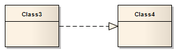

##### [Realization](https://sparxsystems.com/enterprise_architect_user_guide/15.1/model_domains/realise.html)

-- Description
A source object implements or Realizes its destination object. Realize connectors are used in a Use Case, Component or Requirements diagram to express traceability and completeness in the model. A business process or Requirement is realized by one or more Use Cases, which in turn are realized by some Classes, which in turn are realized by a Component, and so on. Mapping Requirements, Classes and such across the design of your system, up through the levels of modeling abstraction, ensures the big picture of your system remembers and reflects all the little pictures and details that constrain and define it.

Описание
Исходный объект реализует или реализует свой целевой объект. Соединители Realize используются в диаграммах вариантов использования, компонентов или требований, чтобы выразить прослеживаемость и полноту модели. Бизнес-процесс или требование реализуется одним или несколькими вариантами использования, которые, в свою очередь, реализуются некоторыми классами, которые, в свою очередь, реализуются компонентом и т. Д. Сопоставление требований, классов и т. Д. По всей конструкции вашей системы, вплоть до уровней абстракции моделирования, гарантирует, что общая картина вашей системы запоминает и отражает все маленькие изображения и детали, которые ограничивают и определяют ее.

You can also define template binding parameters for a Realize connector between a binding Class and a parameterized Class.

Вы также можете определить параметры привязки шаблона для соединителя Realize между классом привязки и параметризованным классом.

Toolbox icon

OMG UML Specification:
The OMG UML specification (UML Superstructure Specification, v2.1.1, p.131) states:

A Realization signifies that the client set of elements are an implementation of the supplier set, which serves as the specification. The meaning of 'implementation' is not strictly defined, but rather implies a more refined or elaborate form in respect to a certain modeling context. It is possible to specify a mapping between the specification and implementation elements, although it is not necessarily computable.

Спецификация OMG UML:
Спецификация OMG UML (Спецификация надстройки UML, v2.1.1, стр.131) гласит:

Реализация означает, что набор элементов клиента является реализацией набора поставщиков, который служит спецификацией. Значение слова «реализация» строго не определено, а скорее подразумевает более утонченную или детально проработанную форму по отношению к определенному контексту моделирования. Можно указать отображение между элементами спецификации и реализации, хотя это не обязательно вычислимо.