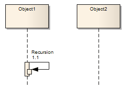

##### [Recursion](https://sparxsystems.com/enterprise_architect_user_guide/15.1/model_domains/recursion.html)

Description
A Recursion is a type of Message used in Sequence diagrams to indicate a recursive function.

Описание
Рекурсия - это тип сообщения, используемый в диаграммах последовательности для обозначения рекурсивной функции.

Toolbox icon

Learn more
* [Message](https://sparxsystems.com/enterprise_architect_user_guide/15.1/model_domains/sequencemessage.html)
* [Sequence Diagram](https://sparxsystems.com/enterprise_architect_user_guide/15.1/model_domains/sequencediagram.html)

Выучить больше
* Сообщение
* Схема последовательности