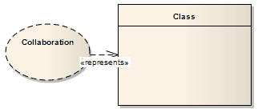

##### [Represents](https://sparxsystems.com/enterprise_architect_user_guide/15.1/model_domains/represents.html) Представляет

Description
The Represents connector indicates that a Collaboration is used in a classifier, typically in a Composite Structure diagram. The connector is drawn from the Collaboration to its owning classifier.

Описание
Соединитель "Представляет" указывает, что совместная работа используется в классификаторе, обычно на диаграмме составной структуры . Соединитель тянется от Collaboration к собственному классификатору.

Toolbox icon

Learn more
* [Collaboration](https://sparxsystems.com/enterprise_architect_user_guide/15.1/model_domains/collaboration2.html)
* [Composite Structure Diagram](https://sparxsystems.com/enterprise_architect_user_guide/15.1/model_domains/compositestructurediagram.html)

Выучить больше
* сотрудничество
* Схема составной структуры

