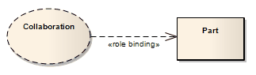

##### [Role Binding](https://sparxsystems.com/enterprise_architect_user_guide/15.1/model_domains/rolebinding.html) Привязка ролей

Description
Role Binding is the mapping between a Collaboration Use's internal roles and the respective Parts required to implement a specific situation, typically in a Composite Structure diagram. The associated Parts can have properties defined to enable the binding to occur, and the Collaboration to take place.

Описание
Привязка ролей - это сопоставление внутренних ролей объекта совместной работы с соответствующими частями, необходимыми для реализации конкретной ситуации, как правило, на диаграмме составной структуры . Связанные части могут иметь свойства, определенные для обеспечения привязки и совместной работы.

A Role Binding connector is drawn between a Collaboration and the classifier's fulfilling roles, with the Collaboration's internal binding roles labeled on the classifier end of the connector.

Соединитель привязки ролей рисуется между Collaboration и исполняющими ролями классификатора, причем внутренние роли привязки Collaboration помечены на конце классификатора соединителя.

Toolbox icon

Learn more
* [Collaboration Use](https://sparxsystems.com/enterprise_architect_user_guide/15.1/model_domains/colloccurrence.html)
* [Composite Structure Diagram](https://sparxsystems.com/enterprise_architect_user_guide/15.1/model_domains/compositestructurediagram.html)
* [Collaboration](https://sparxsystems.com/enterprise_architect_user_guide/15.1/model_domains/collaboration2.html)

Выучить больше
* Совместное использование
* Схема составной структуры
* сотрудничество

OMG UML Specification:
The OMG UML specification (UML Superstructure Specification, v2.1.1, p.174) states:

A mapping between features of the collaboration type and features of the classifier or operation. This mapping indicates which connectable element of the classifier or operation plays which role(s) in the collaboration. A connectable element may be bound to multiple roles in the same collaboration use (that is, it may play multiple roles).

Спецификация OMG UML:
Спецификация OMG UML (Спецификация надстройки UML, v2.1.1, стр.174) гласит:

Отображение между функциями типа сотрудничества и функциями классификатора или операции. Это сопоставление указывает, какой подключаемый элемент классификатора или операции играет какую роль (роли) в сотрудничестве. Подключаемый элемент может быть привязан к нескольким ролям в одном и том же совместном использовании (то есть, он может играть несколько ролей).