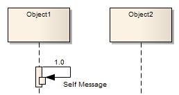
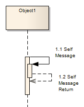

##### [Self-Message](https://sparxsystems.com/enterprise_architect_user_guide/15.1/model_domains/self-message.html)

A Self-Message reflects a new process or method invoked within the calling lifeline's operation. It is a specification of a Message, typically in a Sequence diagram.

Самостоятельное сообщение отражает новый процесс или метод, вызванный в рамках операции вызывающей линии жизни. Это спецификация сообщения, обычно в виде диаграммы последовательности.

Self-Message Calls indicate a nested invocation; new activation levels are added with each Call.

Вызовы с собственными сообщениями указывают на вложенный вызов; новые уровни активации добавляются с каждым звонком.

-- Self-Message as Return

It is possible to depict a return from a Self Message call.

Самостоятельное сообщение в качестве возврата
Можно изобразить возврат от вызова с собственным сообщением.

Create a Self Message return

| Step                                     | Action                                   |
|------------------------------------------|------------------------------------------|
| 
1
 | 
Create a second Self Message at the end of execution.
 |
| 
2
 | 
Double-click on the Message name to open the 'Message Properties' dialog.
 |
| 
3
 | 
Select the 'Is Return' checkbox.
 |
| 
4
 | 
Raise the Activation level of the return.
 |

| шаг                                      | действие                                 |
|------------------------------------------|------------------------------------------|
| 
1
 | 
Создайте второе собственное сообщение в конце выполнения.
 |
| 
2
 | 
Дважды щелкните имя сообщения, чтобы открыть диалоговое окно «Свойства сообщения».
 |
| 
3
 | 
Установите флажок "Возврат".
 |
| 
4
 | 
Поднимите уровень активации возврата.
 |

Toolbox icon

Learn more
* [Sequence Diagram](https://sparxsystems.com/enterprise_architect_user_guide/15.1/model_domains/sequencediagram.html)
* [Message](https://sparxsystems.com/enterprise_architect_user_guide/15.1/model_domains/message.html)
* [Raise the Activation Level](https://sparxsystems.com/enterprise_architect_user_guide/15.1/model_domains/lifelineself-messagehierarch.html)
* [Call](https://sparxsystems.com/enterprise_architect_user_guide/15.1/model_domains/call.html)

Выучить больше
* Схема последовательности
* Сообщение
* Поднимите уровень активации
* Вызов

