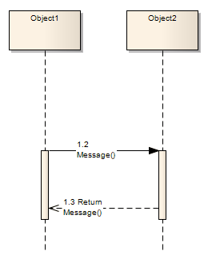

##### [Message (Sequence Diagram)](https://sparxsystems.com/enterprise_architect_user_guide/15.1/model_domains/sequencemessage.html)

Sequence diagrams depict workflow or activity over time using Messages passed from element to element. In the software model. These Messages correspond to Class operations and behavior. When you display a Sequence diagram, the Diagram Toolbox automatically switches to the 'Interaction' pages of the Diagram Toolbox, containing the 'Message' icon.

Диаграммы последовательности отображают рабочий процесс или активность во времени с помощью сообщений, передаваемых от элемента к элементу. В программной модели. Эти сообщения соответствуют операциям и поведению класса. Когда вы отображаете диаграмму последовательности, панель инструментов диаграммы автоматически переключается на страницы «Взаимодействие» панели инструментов диаграммы, содержащие значок «Сообщение».

Toolbox icon

Access

| Diagram Toolbox | Click on the 'Message' icon, click on the source object and drag the cursor to the target object(If the 'Message Properties' dialog does not display, right-click on the Message and on the 'Message Properties' menu option) |
|-----------------|------------------------------------------|

доступ

| Панель инструментов диаграммы | Щелкните значок «Сообщение», щелкните исходный объект и перетащите курсор к целевому объекту.(Если диалоговое окно «Свойства сообщения» не отображается, щелкните правой кнопкой мыши сообщение и выберите пункт меню «Свойства сообщения») |
|-------------------------------|------------------------------------------|

Create a Message on a Sequence diagram

| Option                                   | Action                                   | See also                                 |
|------------------------------------------|------------------------------------------|------------------------------------------|
|  			
 				Message 			
 		 |  			
Type the Message name. 
 			
If the Message flow is towards a Class element (dropped in from a Class diagram) or a Lifeline element having a classifier, and the destination Class has defined operations, you can click on the drop-down arrow and select an appropriate operation name; the Message then reflects the destination Class operations.
 			
You can also include operations that the element's classifier has inherited, in the list. To do this, select the 'Show Inherited Methods' checkbox.
 		 |  			<a href="../model_domains/class.html">Class</a> 			<a href="../model_domains/lifeline.html">Lifeline</a> 		 |
|  			
 				Operations 			
 		 |  			
If the available operations on the destination Class are not appropriate, click on this button and define a new operation in the destination element, using the 'Operations' dialog. 
 			
If you create a Message without making reference to the target Class operations, no new operation is added to the target Class.
 		 |  			<a href="../modeling/operationsmainpage.html">Define Properties of Operations</a> 		 |
|  			
 				Parameters 			
 		 |  			
Type any parameters that the Message has, as a comma-separated list.
 		 |  		                                   |
|  			
 				Argument(s) 			
 		 |  			
(Optional) Type the actual value that corresponds to each parameter, as a comma-separated list.
 		 |  		                                   |
|  			
 				Return Value 			
 		 |  			
If the Message has a return value or type, specify it in this field.
 		 |  		                                   |
|  			
 				Show Inherited Methods 			
 		 |  			
Select this checkbox to include operations that the destination element's classifier has inherited, in the drop-down list of operations available in the 'Message' field. 
 			
Clear the checkbox to show only operations from the classifier itself.
 		 |  		                                   |
|  			
 				Assign to 			
 		 |  			
If the Message flow is from a Class element or Lifeline element with classifier that has defined attributes, click on the drop-down arrow and select an appropriate attribute name. 
 			
The Message reflects the attributes from the source Class; you cannot add further attributes to the source Class here - if no appropriate attribute is listed, open the Class element 'Properties' dialog and add the required attribute. 
 			
Otherwise, optionally type the name of the object to assign the message flow to.
 		 |  		                                   |
|  			
 				Stereotype 			
 		 |  			
(Optional) Type or select a stereotype for the connector (this is displayed on the diagram, if entered).
 		 |  		                                   |
|  			
 				Alias 			
 		 |  			
(Optional) Type an alias for the name of the Message. 
 			
On the diagram, the alias displays instead of the Message name if the 'Use Alias if Available' checkbox is selected on the 'Diagram' tab of the 'Properties' dialog for the diagram.
 		 |  			<a href="../user_interface/diagrambehavoir.html">Diagram Behavior Options</a> 		 |
|  			
 				Condition 			
 		 |  			
Type any conditions that must be true in order for the Message to be sent.
 		 |  		                                   |
|  			
 				Constraint 			
 		 |  			
Type any constraints that might exist on when the Message is sent.
 		 |  		                                   |
|  			
 				Is Iteration 			
 		 |  			
Select the checkbox to indicate that the Message will iterate until the specified condition takes the value false. The condition statement on the diagram is prefixed by an asterisk (*).
 			
Clear the checkbox to indicate that the Message will only be sent once within the process cycle, if the specified condition is true.
 		 |  		                                   |
|  			
 				Start New Group 			
 		 |  			
(For Communication diagram Messages). Select this checkbox to reset the Message (and all subsequent Messages) to a separate group with a new initial number.
 		 |  			<a href="../model_domains/reordercommmessages.html">Re-Order Messages</a> 		 |
|  			
 				Synch 			
 		 |  			
Click on the drop-down arrow and select 'Synchronous' or 'Asynchronous' as appropriate.
 			
The value 'Synchronous' disables the 'Kind' field; synchronous Messages are always Calls.
 		 |  			<a href="../model_domains/call.html">Call</a> 			<a href="../model_domains/asynchronous_signal_message.html">Asynchronous Signal Message</a> 		 |
|  			
 				Kind 			
 		 |  			
This field is enabled when the 'Synch' field is set to Asynchronous.
 			
Click on the drop-down arrow and select either 'Call' or 'Signal', as appropriate.
 		 |  		                                   |
|  			
 				Lifecycle 			
 		 |  			
Select 'New' to create a new element at the end of the Message, or 'Delete' to terminate the message flow at the end of the Message.
 			
If neither case applies, set the field to '&lt;none&gt;'.
 		 |  		                                   |
|  			
 				Is Return 			
 		 |  			
If the Message you have created is a return message, select this checkbox.
 		 |  		                                   |
|  			
 				Notes 			
 		 |  			
(Optional) Type any explanatory notes, formatted if you prefer.
 		 |  		                                   |
|  			
 				OK 			
 		 |  			
Click on this button to save the Message definition. 
 <ul> 	<li>You can change the timing details of a message on the 'Timing Details' dialog, and emphasize the sequence of closely-ordered messages using General Ordering</li> </ul> <ul> 	<li>To toggle the numbering of messages on a Sequence diagram, select or deselect the 'Show Sequence Numbering' checkbox on the 'Preferences' dialog</li> </ul> 		 |  			<a href="../model_domains/changing_the_timing_details.html">Change the Timing Details</a> 			<a href="../model_domains/general_ordering.html">General Ordering</a> 			<a href="../model_domains/sequencediagram.html">Sequence Diagram</a> 		 |
|  			
 				Cancel 			
 		 |  			
Click on this button to close the dialog without saving any data you have entered.
 		 |  		                                   |

Создание сообщения на диаграмме последовательности

| вариант                                  | действие                                 | Смотрите также                           |
|------------------------------------------|------------------------------------------|------------------------------------------|
|  			
 				Сообщение 			
 		 |  			
Введите имя сообщения. 
 			
Если поток сообщений направлен к элементу класса (выброшенному из диаграммы классов) или элементу Lifeline, имеющему классификатор, а целевой класс имеет определенные операции, вы можете щелкнуть стрелку раскрывающегося списка и выбрать соответствующее имя операции; Сообщение затем отражает операции класса назначения.
 			
Вы также можете включить в список операции, унаследованные классификатором элемента. Для этого установите флажок «Показать унаследованные методы».
 		 |  			<a href="../model_domains/class.html">Класс</a> 			<a href="../model_domains/lifeline.html">дорога жизни</a> 		 |
|  			
 				операции 			
 		 |  			
Если доступные операции в целевом классе не подходят, нажмите эту кнопку и определите новую операцию в целевом элементе, используя диалоговое окно «Операции». 
 			
Если вы создаете сообщение без ссылки на операции целевого класса, в целевой класс не добавляется новая операция.
 		 |  			<a href="../modeling/operationsmainpage.html">Определить свойства операций</a> 		 |
|  			
 				параметры 			
 		 |  			
Введите любые параметры, которые есть в сообщении, в виде списка, разделенного запятыми.
 		 |  		                                   |
|  			
 				Аргумент (ы) 			
 		 |  			
(Необязательно) Введите фактическое значение, соответствующее каждому параметру, в виде списка, разделенного запятыми.
 		 |  		                                   |
|  			
 				Возвращаемое значение 			
 		 |  			
Если Сообщение имеет возвращаемое значение или тип, укажите его в этом поле.
 		 |  		                                   |
|  			
 				Показать унаследованные методы 			
 		 |  			
Установите этот флажок, чтобы включить операции, унаследованные классификатором целевого элемента, в раскрывающийся список операций, доступных в поле «Сообщение». 
 			
Снимите флажок, чтобы отображать только операции из самого классификатора.
 		 |  		                                   |
|  			
 				Назначить в 			
 		 |  			
Если поток сообщений исходит из элемента класса или элемента Lifeline с классификатором, который имеет определенные атрибуты, щелкните стрелку раскрывающегося списка и выберите соответствующее имя атрибута. 
 			
The Message reflects the attributes from the source Class; you cannot add further attributes to the source Class here - if no appropriate attribute is listed, open the Class element 'Properties' dialog and add the required attribute. 
 			
Otherwise, optionally type the name of the object to assign the message flow to.
 		 |  		                                   |
|  			
 				Stereotype 			
 		 |  			
(Optional) Type or select a stereotype for the connector (this is displayed on the diagram, if entered).
 		 |  		                                   |
|  			
 				Alias 			
 		 |  			
(Optional) Type an alias for the name of the Message. 
 			
On the diagram, the alias displays instead of the Message name if the 'Use Alias if Available' checkbox is selected on the 'Diagram' tab of the 'Properties' dialog for the diagram.
 		 |  			<a href="../user_interface/diagrambehavoir.html">Diagram Behavior Options</a> 		 |
|  			
 				Condition 			
 		 |  			
Type any conditions that must be true in order for the Message to be sent.
 		 |  		                                   |
|  			
 				Constraint 			
 		 |  			
Type any constraints that might exist on when the Message is sent.
 		 |  		                                   |
|  			
 				Is Iteration 			
 		 |  			
Select the checkbox to indicate that the Message will iterate until the specified condition takes the value false. The condition statement on the diagram is prefixed by an asterisk (*).
 			
Clear the checkbox to indicate that the Message will only be sent once within the process cycle, if the specified condition is true.
 		 |  		                                   |
|  			
 				Start New Group 			
 		 |  			
(For Communication diagram Messages). Select this checkbox to reset the Message (and all subsequent Messages) to a separate group with a new initial number.
 		 |  			<a href="../model_domains/reordercommmessages.html">Re-Order Messages</a> 		 |
|  			
 				Synch 			
 		 |  			
Click on the drop-down arrow and select 'Synchronous' or 'Asynchronous' as appropriate.
 			
The value 'Synchronous' disables the 'Kind' field; synchronous Messages are always Calls.
 		 |  			<a href="../model_domains/call.html">Call</a> 			<a href="../model_domains/asynchronous_signal_message.html">Asynchronous Signal Message</a> 		 |
|  			
 				Kind 			
 		 |  			
This field is enabled when the 'Synch' field is set to Asynchronous.
 			
Click on the drop-down arrow and select either 'Call' or 'Signal', as appropriate.
 		 |  		                                   |
|  			
 				Lifecycle 			
 		 |  			
Select 'New' to create a new element at the end of the Message, or 'Delete' to terminate the message flow at the end of the Message.
 			
If neither case applies, set the field to '&lt;none&gt;'.
 		 |  		                                   |
|  			
 				Is Return 			
 		 |  			
If the Message you have created is a return message, select this checkbox.
 		 |  		                                   |
|  			
 				Notes 			
 		 |  			
(Optional) Type any explanatory notes, formatted if you prefer.
 		 |  		                                   |
|  			
 				OK 			
 		 |  			
Click on this button to save the Message definition. 
 <ul> 	<li>You can change the timing details of a message on the 'Timing Details' dialog, and emphasize the sequence of closely-ordered messages using General Ordering</li> </ul> <ul> 	<li>Чтобы переключить нумерацию сообщений на диаграмме последовательности, установите или снимите флажок «Показать нумерацию последовательностей» в диалоговом окне «Параметры».</li> </ul> 		 |  			<a href="../model_domains/changing_the_timing_details.html">Изменить детали времени</a> 			<a href="../model_domains/general_ordering.html">Общий заказ</a> 			<a href="../model_domains/sequencediagram.html">Схема последовательности</a> 		 |
|  			
 				Отмена 			
 		 |  			
Нажмите эту кнопку, чтобы закрыть диалоговое окно без сохранения введенных вами данных.
 		 |  		                                   |

Notes
You can also use the Message connector as an Information Flow, and realize information flows on the Message

Ноты
Вы также можете использовать соединитель сообщений в качестве информационного потока и реализовывать информационные потоки в сообщении.

Learn more
* [Message Examples](https://sparxsystems.com/enterprise_architect_user_guide/15.1/model_domains/message_examples.html)
* [Co-Region Notation](https://sparxsystems.com/enterprise_architect_user_guide/15.1/model_domains/co-region_notation.html)
* [Realize an Information Flow](https://sparxsystems.com/enterprise_architect_user_guide/15.1/model_domains/informationitemsrealized.html)

Выучить больше
* Примеры сообщений
* Обозначение ко-региона
* Осознайте информационный поток

