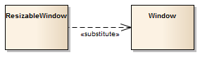

##### [Substitution](https://sparxsystems.com/enterprise_architect_user_guide/15.1/model_domains/substitution.html) подмена

Description
A Substitution is a relationship between two Classifiers, signifying that the substituting Classifier complies with the contract specified by the contract Classifier. This implies that instances of the substituting Classifier are runtime-substitutable, where instances of the contract Classifier are expected. In the example, the Class named ResizableWindow has a Substitution connector to the Class named Window, meaning that wherever you are asked for a window you can use a resizable window.

Описание
Замена - это связь между двумя классификаторами, означающая, что заменяющий классификатор соответствует контракту, указанному классификатором контракта. Это подразумевает, что экземпляры заменяющего классификатора могут быть заменены во время выполнения, в то время как экземпляры контрактного классификатора ожидаются. В этом примере класс с именем ResizableWindow имеет соединитель подстановки с классом с именем Window, что означает, что везде, где вас просят открыть окно, вы можете использовать окно с изменяемым размером.

The Substitution relationship is a subtype of a Dependency relationship.

Отношение замещения - это подтип отношения зависимости.

Toolbox icon

Learn more
* [Class Diagram](https://sparxsystems.com/enterprise_architect_user_guide/15.1/model_domains/classdiagram.html)
* [Dependency](https://sparxsystems.com/enterprise_architect_user_guide/15.1/model_domains/dependency.html)