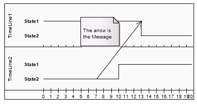
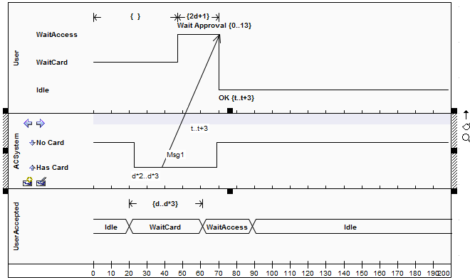

##### [Message (Timing Diagram)](https://sparxsystems.com/enterprise_architect_user_guide/15.1/model_domains/timingmessage.html)

Messages are the communication links between Lifelines in a Timing diagram. In the case of a Timeline, a Message is a connection between two Timeline objects.

Сообщения - это каналы связи между линиями жизни на временной диаграмме. В случае временной шкалы сообщение - это связь между двумя объектами временной шкалы.

For example:

See UML Superstructure Specification, v2.1.1, figures 14.30 and 14.31, p.520.

Toolbox icon

Learn more
* [Timing Diagram](https://sparxsystems.com/enterprise_architect_user_guide/15.1/model_domains/timingdiagram.html)
* [Lifeline](https://sparxsystems.com/enterprise_architect_user_guide/15.1/model_domains/lifeline.html)
* [Create a Timing Message](https://sparxsystems.com/enterprise_architect_user_guide/15.1/model_domains/createatimingmessage.html)

Выучить больше
* Временная диаграмма
* дорога жизни
* Создать синхронизирующее сообщение
