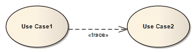

##### [Trace](https://sparxsystems.com/enterprise_architect_user_guide/15.1/model_domains/trace.html)

   

Description
The Trace relationship is a specialization of an Abstraction, connecting model elements or sets of elements that represent the same concept across models. Traces are often used to track requirements and model changes, typically in a Traceability diagram, or in a Class, Use Case, Object or Composite Structure diagram.

Описание
Отношение трассировки - это специализация абстракции, соединяющая элементы модели или наборы элементов, которые представляют одну и ту же концепцию во всех моделях. Трассировки часто используются для отслеживания требований и изменений модели, обычно в диаграмме трассируемости или в диаграмме классов, вариантов использования, объектов или составных структур .

As changes can occur in both directions, the order of this Trace is usually ignored. The relationship's properties can specify the trace mapping, but the trace is usually bi-directional, informal and rarely computable.

Поскольку изменения могут происходить в обоих направлениях, порядок этой трассировки обычно игнорируется. Свойства отношения могут определять отображение трассировки, но трасса обычно является двунаправленной, неформальной и редко вычислимой.

Toolbox icon

Learn more
* [Abstraction](https://sparxsystems.com/enterprise_architect_user_guide/15.1/model_domains/abstraction.html)
* [Example Traceability Diagram](https://sparxsystems.com/enterprise_architect_user_guide/15.1/model_navigation/create_traceability_diagrams.html)