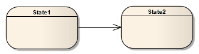
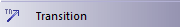

##### [Transition](https://sparxsystems.com/enterprise_architect_user_guide/15.1/model_domains/transition.html)  переход

Description
If you need to define the logical movement from one State to another in a StateMachine diagram, you can drag a Transition connector from the Toolbox onto the diagram. You control the Transition through the connector 'Properties' dialog.

Описание
Если вам нужно определить логическое перемещение из одного состояния в другое на диаграмме StateMachine , вы можете перетащить соединитель перехода из панели инструментов на диаграмму. Вы управляете переходом через диалоговое окно «Свойства» коннектора.

| Field                                    | Action                                   | See also                                 |
|------------------------------------------|------------------------------------------|------------------------------------------|
|  			
 				Guard 			
 		 |  			
Type in the expression to be evaluated after an Event is dispatched but before the corresponding Transition is triggered. 
 			
If the guard is true at that time, the Transition is enabled; otherwise, it is disabled.
 		 |  		                                   |
|  			
 				Effect is a Behavior 			
 		 |  			
Convert the 'Effect' field from a free-text field to the definition of a specific Activity or behavior. 
 			
The 'Select &lt;Item&gt;' dialog displays, prompting you to select the Activity or behavior element from the model.
 		 |  			<a href="../modeling/instanceclassifier.html">Select <item> Dialog</item></a> 		 |
|  			
 				Effect 			
 		 |  			
Either:
 <ul> 	<li>Type a description of the effect of the Transition, or</li> 	<li>If you have selected the 'Effect is a Behavior' checkbox, select an Activity or behavior to be performed during the Transition (to change this subsequently, click on the  button to redisplay the 'Select &lt;Item&gt;' dialog)</li> </ul> 		 |  		                                   |
|  			
 				Trigger Name 			
 		 |  			
Specify the name of the trigger; either:
 <ul> 	<li>Type the name, or</li> 	<li>Select an existing trigger in the model from the Select &lt;Item&gt; dialog, which you display by clicking on the  button</li> </ul> 		 |  		                                   |
|  			
 				Trigger Type 			
 		 |  			
Specify the type of trigger:
 <ul> 	<li>Call - specifies that the event is a CallEvent, which sends a message to the associated object by invoking an operation</li> 	<li>Change - specifies that the event is a ChangeEvent, which indicates that the transition is the result of a change in value of an attribute</li> 	<li>Signal - specifies that the event is a SignalEvent, which corresponds to the receipt of an asynchronous signal instance</li> 	<li>Time - corresponds to a TimeEvent; which specifies a moment in time</li> </ul> 			
Code generation for StateMachines expects a specification value for any of the four types.
  		 |  		                                   |
|  			
 				Specification 			
 		 |  			
Specify the event instigating the Transition; either:
 <ul> 	<li>Type the event (time or change), or</li> 	<li>Select an existing specification in the model using the 'Select &lt;Item&gt;' dialog, which you display by clicking on the  button</li> </ul> 		 |  		                                   |
|  			
 				New 			
 		 |  			
Clear the fields ready to begin defining a new trigger.
 		 |  		                                   |
|  			
 				Save 			
 		 |  			
Save the newly created or edited trigger.
 		 |  		                                   |
|  			
 				Delete 			
 		 |  			
Remove the selected trigger from the list.
 		 |  		                                   |
|  			
 				<trigger list=""></trigger> 			
 		 |  			
List the existing triggers, which might or might not have names and types, and which can include triggers created in older models.
 		 |  		                                   |

| поле                                     | действие                                 | Смотрите также                           |
|------------------------------------------|------------------------------------------|------------------------------------------|
|  			
 				охрана 			
 		 |  			
Введите выражение, которое будет оцениваться после отправки события, но до запуска соответствующего перехода. 
 			
Если в это время защита верна, переход включен; в противном случае он отключен.
 		 |  		                                   |
|  			
 				Эффект - это поведение 			
 		 |  			
Преобразуйте поле «Эффект» из поля с произвольным текстом в определение определенного действия или поведения. 
 			
Откроется диалоговое окно «Выбрать &lt;Item&gt;», в котором вам будет предложено выбрать элемент Activity или поведения из модели.
 		 |  			<a href="../modeling/instanceclassifier.html">Выбрать <item> диалог</item></a> 		 |
|  			
 				эффект 			
 		 |  			
Либо:
 <ul> 	<li>Введите описание эффекта Перехода или</li> 	<li>Если вы установили флажок «Эффект - это поведение», выберите действие или поведение, которое будет выполняться во время перехода (чтобы впоследствии изменить это, нажмите кнопку, чтобы снова отобразить диалоговое окно «Выбрать &lt;элемент&gt;»).</li> </ul> 		 |  		                                   |
|  			
 				Имя триггера 			
 		 |  			
Укажите название триггера; либо:
 <ul> 	<li>Введите имя или</li> 	<li>Выберите существующий триггер в модели из диалогового окна Select &lt;Item&gt;, которое отображается при нажатии кнопки</li> </ul> 		 |  		                                   |
|  			
 				Тип триггера 			
 		 |  			
Укажите тип триггера:
 <ul> 	<li>Вызов - указывает, что событие является CallEvent, которое отправляет сообщение связанному объекту, вызывая операцию.</li> 	<li>Change - указывает, что событие является ChangeEvent, которое указывает, что переход является результатом изменения значения атрибута.</li> 	<li>Signal - указывает, что событие является SignalEvent, что соответствует получению экземпляра асинхронного сигнала.</li> 	<li>Время - соответствует TimeEvent; который указывает момент времени</li> </ul> 			
Генерация кода для StateMachines предполагает значение спецификации для любого из четырех типов.
  		 |  		                                   |
|  			
 				Технические характеристики 			
 		 |  			
Укажите событие, инициирующее Переход; либо:
 <ul> 	<li>Введите событие (время или изменение), или</li> 	<li>Выберите существующую спецификацию в модели, используя диалоговое окно «Выбрать &lt;элемент&gt;», которое отображается при нажатии кнопки</li> </ul> 		 |  		                                   |
|  			
 				новый 			
 		 |  			
Очистите поля, чтобы начать определение нового триггера.
 		 |  		                                   |
|  			
 				Сохранить 			
 		 |  			
Сохраните вновь созданный или отредактированный триггер.
 		 |  		                                   |
|  			
 				Удалить 			
 		 |  			
Удалите выбранный триггер из списка.
 		 |  		                                   |
|  			
 				<trigger list=""></trigger> 			
 		 |  			
Перечислите существующие триггеры, которые могут иметь или не иметь имена и типы и которые могут включать триггеры, созданные в более старых моделях.
 		 |  		                                   |

Notes
* Fork and Join segments can have neither triggers nor guards
* You can identify hidden triggers and locate triggers in the Browser window, using the 'Find Triggers Associated' option on the Transition connector context menu; if one trigger exists for the Transition it is immediately highlighted in the Browser window, if more than one trigger exists the 'Element Usage' dialog displays - select the required trigger and click on the Open button to highlight the trigger in the Browser window
* You can define a self-Transition as an Internal Transition, and represent the connector and its properties in a compartment of the State element

Ноты
* Сегменты разветвления и соединения не могут иметь ни триггеров, ни предохранителей.
* Вы можете определить скрытые триггеры и найти триггеры в окне браузера , используя параметр «Найти связанные триггеры» в контекстном меню соединителя перехода; если для перехода существует один триггер, он немедленно выделяется в окне браузера, если существует более одного триггера, отображается диалоговое окно «Использование элемента» - выберите требуемый триггер и нажмите кнопку « Открыть», чтобы выделить триггер в окне браузера.
* Вы можете определить самопереход как внутренний переход и представить соединитель и его свойства в разделе элемента состояния.

Toolbox icon

Learn more
* [StateMachine Diagrams](https://sparxsystems.com/enterprise_architect_user_guide/15.1/model_domains/statediagram.html)
* [Internal Transition](https://sparxsystems.com/enterprise_architect_user_guide/15.1/model_domains/internal_transition.html)

Выучить больше
* Диаграммы StateMachine
* Внутренний переход

OMG UML Specification:
The OMG UML specification (UML Superstructure Specification, v2.1.1, p.568) states:

A transition is a directed relationship between a source vertex and a target vertex. It may be part of a compound transition, which takes the state machine from one state configuration to another, representing the complete response of the state machine to an occurrence of an event of a particular type.

Спецификация OMG UML:
Спецификация OMG UML (Спецификация надстройки UML, v2.1.1, стр.568) гласит:

Переход - это направленное отношение между исходной вершиной и целевой вершиной. Это может быть часть составного перехода, который переводит конечный автомат из одной конфигурации состояний в другую, представляя полный ответ конечного автомата на возникновение события определенного типа.
