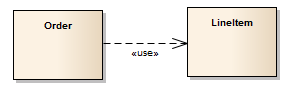

##### [Usage](https://sparxsystems.com/enterprise_architect_user_guide/15.1/model_domains/usage.html) использование

Description
A 'Usage' is a Class diagram relationship in which one element requires another element for its full implementation or operation. The example diagram shows that the Class Order requires the Class LineItem for its full implementation.

«Использование» - это отношение диаграммы классов, в котором один элемент требует другого элемента для его полной реализации или работы. На диаграмме примера показано, что для полной реализации Class Order требуется Class LineItem.

The 'Usage' relationship is a subtype of a 'Dependency' relationship.

Отношение «Использование» - это подтип отношения «Зависимость».

Toolbox icon

Learn more
* [Class Diagram](https://sparxsystems.com/enterprise_architect_user_guide/15.1/model_domains/classdiagram.html)
* [Dependency](https://sparxsystems.com/enterprise_architect_user_guide/15.1/model_domains/dependency.html)

